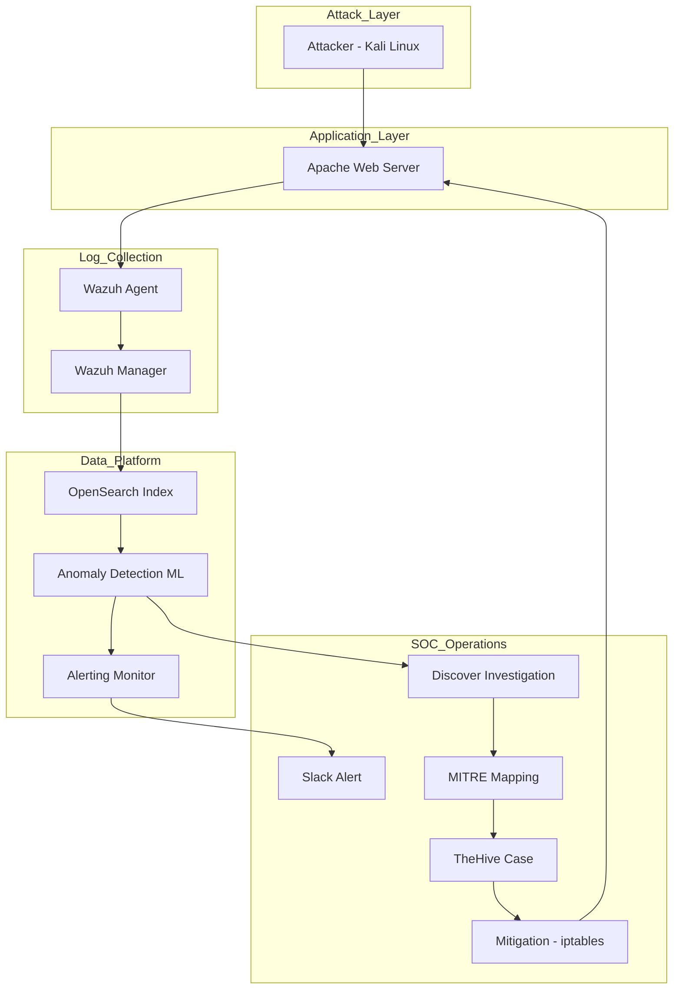

```mermaid
flowchart LR

%% --- Attack Layer ---
A[Attacker<br>Kali Linux<br>HTTP Enumeration] --> B[Apache Web Server<br>Client Machine<br>Access Logs Generated]

%% --- Log Collection ---
B --> C[Wazuh Agent<br>Log Collection]
C --> D[Wazuh Manager<br>Rule Parsing & Enrichment<br>rule.groups = web]
D --> E[OpenSearch Index<br>wazuh-alerts-*]

%% --- ML Detection ---
E --> F[OpenSearch Anomaly Detection<br>Feature: http_error_count<br>Baseline Learning]

%% --- Alerting ---
F --> G[Alerting Monitor<br>Trigger: Grade > Threshold]
G --> H[Slack SOC Channel<br>Real-Time Notification]

%% --- Investigation ---
F --> I[OpenSearch Discover<br>Log Investigation]
I --> J[MITRE ATT&CK Mapping<br>TA0043 - Reconnaissance<br>T1595 - Active Scanning]

%% --- Incident Response ---
J --> K[TheHive<br>Case Creation & Tracking]
K --> L[Containment Action<br>iptables Block Attacker IP]

%% --- Verification Loop ---
L --> M[Attack Verification<br>Kali Retest]
M -->|Blocked| N[Incident Closed]
```

```mermaid
flowchart TD

subgraph Attack_Layer
A[Attacker - Kali Linux]
end

subgraph Application_Layer
B[Apache Web Server]
end

subgraph Log_Collection
C[Wazuh Agent]
D[Wazuh Manager]
end

subgraph Data_Platform
E[OpenSearch Index]
F[Anomaly Detection ML]
G[Alerting Monitor]
end

subgraph SOC_Operations
H[Slack Alert]
I[Discover Investigation]
J[MITRE Mapping]
K[TheHive Case]
L[Mitigation - iptables]
end

A --> B
B --> C
C --> D
D --> E
E --> F
F --> G
G --> H
F --> I
I --> J
J --> K
K --> L
L --> B
```
