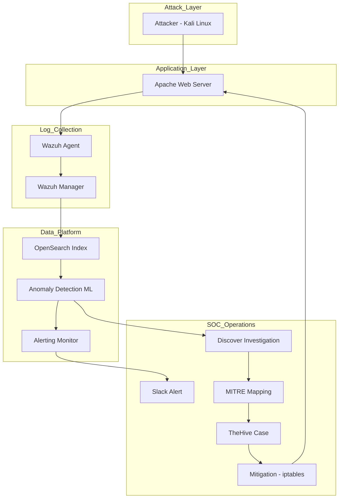

```mermaid
flowchart LR

%% --- Attack Layer ---
A[Attacker<br>Kali Linux<br>HTTP Enumeration] --> B[Apache Web Server<br>Client Machine<br>Access Logs Generated]

%% --- Log Collection ---
B --> C[Wazuh Agent<br>Log Collection]
C --> D[Wazuh Manager<br>Rule Parsing & Enrichment<br>rule.groups = web]
D --> E[OpenSearch Index<br>wazuh-alerts-*]

%% --- ML Detection ---
E --> F[OpenSearch Anomaly Detection<br>Feature: http_error_count<br>Baseline Learning]

%% --- Alerting ---
F --> G[Alerting Monitor<br>Trigger: Grade > Threshold]
G --> H[Slack SOC Channel<br>Real-Time Notification]

%% --- Investigation ---
F --> I[OpenSearch Discover<br>Log Investigation]
I --> J[MITRE ATT&CK Mapping<br>TA0043 - Reconnaissance<br>T1595 - Active Scanning]

%% --- Incident Response ---
J --> K[TheHive<br>Case Creation & Tracking]
K --> L[Containment Action<br>iptables Block Attacker IP]

%% --- Verification Loop ---
L --> M[Attack Verification<br>Kali Retest]
M -->|Blocked| N[Incident Closed]
```

```mermaid
flowchart TD

subgraph Attack_Layer
A[Attacker - Kali Linux]
end

subgraph Application_Layer
B[Apache Web Server]
end

subgraph Log_Collection
C[Wazuh Agent]
D[Wazuh Manager]
end

subgraph Data_Platform
E[OpenSearch Index]
F[Anomaly Detection ML]
G[Alerting Monitor]
end

subgraph SOC_Operations
H[Slack Alert]
I[Discover Investigation]
J[MITRE Mapping]
K[TheHive Case]
L[Mitigation - iptables]
end

A --> B
B --> C
C --> D
D --> E
E --> F
F --> G
G --> H
F --> I
I --> J
J --> K
K --> L
L --> B
```

```mermaid
%%{init: {
  "theme": "base",
  "themeVariables": {
    "background": "#0d1117",
    "primaryColor": "#161b22",
    "primaryTextColor": "#e6edf3",
    "primaryBorderColor": "#30363d",
    "lineColor": "#58a6ff",
    "secondaryColor": "#1f6feb",
    "tertiaryColor": "#21262d",
    "fontSize": "14px"
  }
}}%%

flowchart TD

%% --- Attack Layer ---
subgraph ATTACK["🚨 Attack Layer"]
A["Attacker (Kali Linux)<br>HTTP Enumeration / Scanning"]
end

%% --- Application Layer ---
subgraph APP["🌐 Application Layer"]
B["Apache Web Server<br>Access Logs Generated"]
end

%% --- Log Collection ---
subgraph LOG["📥 Log Collection & Processing"]
C["Wazuh Agent<br>Log Collection"]
D["Wazuh Manager<br>Rule Parsing<br>rule.groups = web"]
end

%% --- Data & ML Layer ---
subgraph ML["🤖 Behavioral Detection Layer"]
E["OpenSearch Index<br>wazuh-alerts-*"]
F["Anomaly Detection (ML)<br>Feature: http_error_count<br>Baseline Learning"]
G["Alerting Monitor<br>Trigger: Grade > Threshold"]
end

%% --- SOC Operations ---
subgraph SOC["🛡 SOC Operations"]
H["Slack Alert<br>Real-Time Notification"]
I["Discover Investigation"]
J["MITRE ATT&CK Mapping<br>TA0043 - Recon"]
K["TheHive Case Management"]
L["Mitigation<br>iptables Block IP"]
M["Verification & Case Closure"]
end

%% --- Flow Connections ---
A --> B
B --> C
C --> D
D --> E
E --> F
F --> G
G --> H
F --> I
I --> J
J --> K
K --> L
L --> M

%% --- Style Enhancements ---
style A fill:#3b1f1f,stroke:#ff4d4f,stroke-width:2px
style F fill:#1f3b4d,stroke:#58a6ff,stroke-width:2px
style H fill:#1f4d3b,stroke:#2ea043,stroke-width:2px
style K fill:#4b3b1f,stroke:#d29922,stroke-width:2px
style L fill:#3b1f3b,stroke:#a371f7,stroke-width:2px
```
