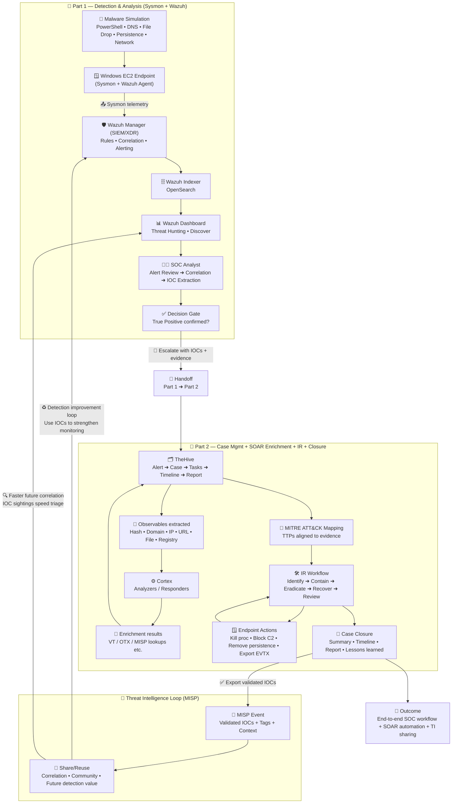

# 🛡️ SOC + SOAR Capstone Project (AWS) — Malware Detection ➜ Incident Response ➜ Threat Intelligence Sharing

<p align="center">
  
</p>

<p align="center">
  <a href="https://github.com/abdul4rehman215/SOC-SOAR-ECOSYSTEM-AWS/tree/main/00-installation-and-setup-guide">📌 Click here for the full SOC stack installation & integration setup guide (Wazuh + TheHive + Cortex + MISP)</a>
</p>

---

## 🎯 Project Summary (What this capstone proves)

This capstone is the **largest, end-to-end project** in my AWS SOC ecosystem portfolio.

Instead of stopping at “alerts in a SIEM”, this project demonstrates a **real SOC analyst workflow**:

✅ Detect suspicious endpoint behavior  
✅ Correlate and validate telemetry (Sysmon + Wazuh)  
✅ Escalate into a case (TheHive)  
✅ Extract & enrich observables using SOAR automation (Cortex)  
✅ Map the incident to MITRE ATT&CK (TTPs)  
✅ Perform **full incident response lifecycle** (tasks, evidence, timeline)  
✅ Share validated IOCs as threat intelligence (MISP)  
✅ Close case + export incident report + review metrics (MTTD/MTTR-style)

This is a **portfolio-grade SOC + SOAR capstone**, built to reflect **real-world analyst operations**.

---

## 🧠 What Makes This Different (Not “just a lab”)

Most projects stop at:
- “I generated alerts”
- “I installed tools”

This project goes further:
- **Investigation + decision making**
- **Case management discipline**
- **SOAR-assisted enrichment (with analyst control)**
- **IR workflow execution (containment → eradication → recovery)**
- **Threat intel sharing with validation**
- **Reporting + timeline + metrics review**

---

## 🧩 SOC + SOAR Architecture (How the system works)

<p align="center">
  
</p>

### 🧭 Workflow view (Detection → Intelligence → Response)

<p align="center">
  
</p>

### 🔁 Logical pipeline (high level)

```text
Windows Endpoint (AWS EC2)
   ↓  Sysmon telemetry + endpoint events
Wazuh SIEM/XDR (Detection + correlation + MITRE-mapped alerts)
   ↓  Alerts forwarded / investigated
TheHive (Triage + Case creation + Tasks + Timeline + Report)
   ↓  Enrichment requests
Cortex (Analyzers / Responders — VT, OTX, MISP, etc.)
   ↓  Validated intelligence export
MISP (IOC sharing + correlation + MITRE galaxy mapping)
````



---

## 🧰 Tools Used (and what each one contributes)

| Tool                           | Role in SOC                 | What it contributes in this capstone                                       |
| ------------------------------ | --------------------------- | -------------------------------------------------------------------------- |
| **Wazuh (SIEM/XDR)**           | Detection + correlation     | Sysmon telemetry, correlated alerts, threat hunting, MITRE mapping         |
| **TheHive (Case Management)**  | Investigation + IR workflow | Alert triage, case creation, tasks, observables, timeline, report export   |
| **Cortex (SOAR Automation)**   | Enrichment + automation     | One-click analyzers for domain/hash/IP/file + faster decision support      |
| **MISP (Threat Intelligence)** | Intel sharing + reuse       | IOC/event creation from validated cases, correlation, MITRE galaxy mapping |

---

## 💡 Why This Matters in Real SOC Work

### 📉 Reduces Alert Fatigue

* Wazuh detects **signals**
* TheHive organizes them into a **case**
* Cortex enriches observables so analysts don’t “Google everything”
* MISP ensures validated IOCs become **future detection value**

### ⏱️ Improves MTTD / MTTR

* Faster triage (structured case view)
* Faster enrichment (Cortex analyzers)
* Faster response tracking (task-based IR lifecycle)

### 🧾 Builds audit-ready documentation

* Every action becomes:

  * traceable tasks,
  * timeline events,
  * evidence attachments,
  * final incident report.

---

## 📁 Repository Structure

> This capstone is intentionally split into **Part 1** and **Part 2** because the workflow is large and mirrors real SOC phases.

```text
19-capstone-soc-soar-malware-incident-response/
├── README.md
├── architecture-notes.txt
├── interview_qna.md
├── commands.sh
├── part01-windows-malware-detection-and-analysis/
│   ├── README.md
│   ├── commands.sh
│   ├── architecture-notes.txt
│   ├── interview_qna.md
│   ├── troubleshooting.md
│   ├── artifacts/
│   │   └── SOC SOAR Capstone Project Part1 Windows Malware Detection and Analysis.pdf
│   └── notes/
│       ├── alert-notes.md
│       ├── analysis-finding.md
│       ├── timeline-notes.md
│       └── ioc-extraction-notes.md
└── part02-incident-response-case-management-threat-intel/
    ├── README.md
    ├── commands.sh
    ├── architecture-notes.txt
    ├── interview_qna.md
    ├── troubleshooting.md
    ├── artifacts/
    │   ├── SOC SOAR Capstone Project Part2 Incident Response, Case Management.pdf
    │   └── thehive-case-template-used(windows-malware-case).json
    └── notes/
        ├── ir-checklist.md
        ├── lessons-learned.md
        ├── case-timeline-summary.md
        ├── containment-actions-log.md
        └── ioc-validation-notes.md
```

---

## 🧪 Capstone Breakdown (Two Parts)

## ✅ Part 1 — Malware Detection & Analysis (SOC detection phase)

**Goal:** Prove that suspicious activity is real, correlated, and worth escalation.

This phase focuses on:

* Windows EC2 endpoint preparation (enterprise-like endpoint)
* Sysmon telemetry generation
* Malware-like behavior simulation
* Wazuh alerting + correlation
* Analyst validation (signal → story)
* Decision point: **“This is real. Create a case.”**

#### 📌 Go to Part 1 folder: **`part01-windows-malware-detection-and-analysis/`** 

**or [click here](https://github.com/abdul4rehman215/SOC-SOAR-ECOSYSTEM-AWS/tree/main/capstone-soc-soar-malware-incident-response/part01-windows-malware-detection-and-analysis)**

---

## ✅ Part 2 — Incident Response + Case Management + Threat Intelligence Sharing (SOC response phase)

**Goal:** Execute the full IR lifecycle like a SOC analyst using TheHive + Cortex + MISP.

This phase focuses on:

* Alert triage and case scoping (TheHive)
* Merging correlated alerts into a single case
* Extracting observables (hash, domain, dropped file, command)
* Running Cortex analyzers (VT/OTX/MISP)
* Mapping MITRE ATT&CK techniques
* Executing IR tasks (Preparation → Identification → Containment → Eradication → Recovery → Post-IR)
* Exporting validated intelligence to MISP
* Closing the case + metrics review + report export

#### 📌 Go to Part 2 folder: **`part02-incident-response-case-management-threat-intel/`** 

**or [click here](https://github.com/abdul4rehman215/SOC-SOAR-ECOSYSTEM-AWS/tree/main/capstone-soc-soar-malware-incident-response/part02-incident-response-case-management-threat-intel)**


---

## 🧠 Skills Demonstrated (What I can do after this project)

### 🟦 SOC Analyst Skills (Tier 1 / Tier 2)

* Alert triage & validation
* Evidence-driven investigation
* Correlation across multiple signals
* IOC extraction and enrichment
* Incident classification (True Positive)
* IR lifecycle execution
* Reporting, audit trail, metrics review

### 🟩 Detection + SIEM Engineering

* Sysmon telemetry understanding
* Wazuh search/hunting for correlation
* Detection confirmation via multiple events
* MITRE ATT&CK mapping awareness

### 🟨 SOAR + Automation Thinking

* Enrichment automation (Cortex analyzers)
* Analyst-controlled automation workflows
* Efficient incident handling with tooling

### 🟥 Threat Intelligence Operations

* IOC validation before sharing
* MISP event creation/export from real incidents
* MITRE galaxy mapping alignment
* Intelligence lifecycle thinking (detect → validate → share → reuse)

---

## 📌 Case Template Used (TheHive)

This project uses a structured incident response workflow template (public reference):

🔗 <a href="https://github.com/StrangeBeeCorp/thehive-templates/blob/main/Case%20Templates/CERT-SG%20IRM/IRM-7-windows-malware-detection.json">TheHive Windows Malware Incident Response Case Template (CERT-SG IRM)</a>

---

## 📎 References (official)

* 🔗 <a href="https://wazuh.com/blog/">Wazuh official blog (use cases, integrations, detection engineering)</a>
* 🔗 <a href="https://strangebee.com/thehive/">TheHive (StrangeBee) — case management platform</a>
* 🔗 <a href="https://strangebee.com/cortex/">Cortex (StrangeBee) — analyzers & responders</a>
* 🔗 <a href="https://www.misp-project.org/">MISP — threat intelligence platform</a>

---

## ✅ Project Outcome 

* Built a full SOC + SOAR pipeline on AWS
* Simulated a realistic malware execution story on a Windows endpoint
* Validated multi-stage behavior using SIEM correlation
* Handled the incident end-to-end in TheHive (tasks + timeline + report)
* Enriched evidence with Cortex analyzers
* Shared validated indicators to MISP for reuse and correlation

---

## 🚀 Future Enhancements

* Automate alert → case creation (webhook-based pipeline)
* Add responder actions (isolate endpoint / block domain / disable user)
* Create detection hardening playbooks (PowerShell policy, AMSI, AppLocker/WDAC)
* Add SOC metrics dashboard (MTTD/MTTR trends across incidents)
* Add additional malware scenarios (persistence variants, C2 simulation, lateral movement)

---

## 🧭 Next Files to Read (in this folder)

* **`architecture-notes.txt`** — how the system flows end-to-end
* **`interview_qna.md`** — SOC/SOAR interview Q&A based on this capstone
* Part folders:

  * `part01-malware-detection-and-analysis/`
  * `part02-incident-response-case-management-threat-intel/`

---

## 🌐 Project Posts on LinkedIn

I also shared this project on LinkedIn through multiple posts covering the implementation, workflow, and key outcomes.

<p align="left">
  <a href="https://www.linkedin.com/posts/abdul4rehman215_soc-capstone-project-malware-detection-and-activity-7430280092578172943-Avqu?utm_source=share&utm_medium=member_desktop&rcm=ACoAAEuho14BQnjOksWA5iihN6dnsE3C-o3yBUU"></a>
  <a href="https://www.linkedin.com/posts/abdul4rehman215_soc-capstone-project-incident-response-activity-7430997244033658880-uzzZ?utm_source=share&utm_medium=member_desktop&rcm=ACoAAEuho14BQnjOksWA5iihN6dnsE3C-o3yBUU"></a>
  <a href="https://www.linkedin.com/posts/abdul4rehman215_soc-soar-cybersecurity-activity-7431722094020816896-UKtd?utm_source=share&utm_medium=member_desktop&rcm=ACoAAEuho14BQnjOksWA5iihN6dnsE3C-o3yBUU"></a>
  <a href="https://www.linkedin.com/posts/abdul4rehman215_socarchitecture-soar-securityengineering-activity-7431359622495510528-ZYVd?utm_source=share&utm_medium=member_desktop&rcm=ACoAAEuho14BQnjOksWA5iihN6dnsE3C-o3yBUU"></a>
  <a href="https://www.linkedin.com/posts/abdul4rehman215_soc-soar-blueteam-activity-7432088167048167424-7xns?utm_source=share&utm_medium=member_desktop&rcm=ACoAAEuho14BQnjOksWA5iihN6dnsE3C-o3yBUU"></a>
  <a href="https://www.linkedin.com/posts/abdul4rehman215_soc-capstone-project-malware-detection-activity-7431953077693440000-KWbW?utm_source=share&utm_medium=member_desktop&rcm=ACoAAEuho14BQnjOksWA5iihN6dnsE3C-o3yBUU"></a>
</p>

---

## ⭐ Final Note

This project reflects **real hands-on implementation** focused on practical security workflow execution, technical depth, and portfolio-grade documentation.

It demonstrates the ability to:

> **Build → Validate → Investigate → Document → Present**

If this project adds value, consider starring the repository ⭐

---

## 👨‍💻 Author

**Abdul Rehman**  
SOC • SIEM • Detection Engineering • Incident Response • Threat Intelligence • Security Automation

---

### 📧 Reach Out

  <a href="https://github.com/abdul4rehman215">
    
  </a>
  <a href="https://linkedin.com/in/abdul4rehman215">
    
  </a>
  <a href="mailto:abdul4rehman215@gmail.com">
    
  </a>

---
