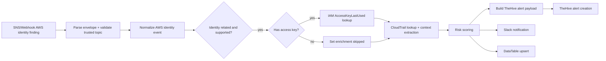

# 🛡️ Flow A — AWS Identity Triage and Enrichment

Flow A is the front door of the capstone. It receives AWS identity findings, validates the event source, enriches the finding with IAM and CloudTrail context, scores risk, updates analyst channels, and opens a TheHive alert in the ticketing-enabled variant.

## Problem this flow solves
Raw identity findings are not enough for fast analyst action. Without enrichment, the analyst still has to answer which principal is involved, whether the key is valid, what it was last used for, whether CloudTrail supports the story, and how severe the finding should be treated in workflow context.

## Main workflow logic

## Why it matters
This flow reduces the “open six tabs and pivot manually” problem. It packages IAM and CloudTrail context into one decision-ready triage output.
