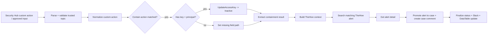

# 🧯 Flow B — AWS Identity Containment and Case Promotion

Flow B operationalizes the incident. It receives an approved containment event or Security Hub custom action, disables the exposed IAM access key when appropriate, updates analyst channels, finds the matching TheHive alert from Flow A, promotes it into a case, and leaves a case comment documenting the action.

## Main workflow logic

## Why it matters
This is where the project stops being notification-only and becomes operational. The workflow proves that a validated cloud identity issue can trigger a controlled response and a real case-management handoff.
