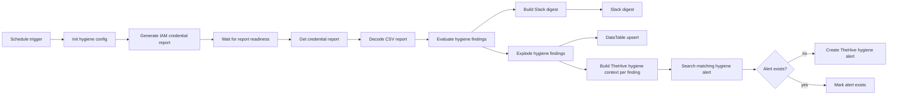

# 🧹 Flow C — AWS IAM Hygiene Monitoring and Alerting

Flow C is the proactive side of the capstone. It runs on a schedule, generates the AWS IAM credential report, evaluates hygiene issues such as missing MFA or unused keys, sends a Slack digest, updates DataTable, and creates TheHive alerts for actionable hygiene findings.

## Main workflow logic

## Why it matters
Flow C moves the project beyond reactive incident response into preventative identity security operations.
