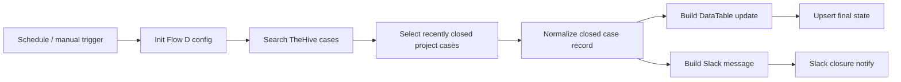

# ✅ Flow D — TheHive Case Closure Sync

Flow D closes the lifecycle loop. It polls TheHive for recently closed or resolved cases, normalizes the closure record, maps it back to tracked findings, updates DataTable, and posts a Slack closure sync notification.

## Main workflow logic

## Why it matters
When the final case outcome never returns to the tracking layer, metrics and evidence trails stay incomplete. Flow D proves that closure is part of the automation lifecycle, not an afterthought.
