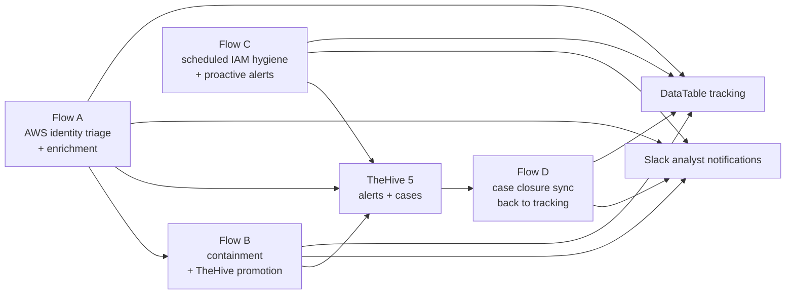

# ☁️ AWS IAM Identity Security Automation Capstone (n8n + AWS + Slack + DataTable + TheHive 5)

<p align="center">
  <a href="https://www.linkedin.com/in/abdul4rehman215/"></a>
  <a href="https://github.com/abdul4rehman215"></a>
  
  
  
</p>

<p align="center">
  
</p>

## 🎯 Problem vs Solution

Cloud identity findings often arrive as isolated alerts with incomplete context. In real SOC operations, that creates four recurring issues:

- analysts lose time pivoting manually across GuardDuty, Security Hub, CloudTrail, IAM, Slack, and ticketing
- containment is delayed because enrichment and response context are missing
- IAM hygiene drift stays unnoticed until it becomes an incident
- final case outcomes never flow back into operational tracking

This capstone solves that by designing a **four-workflow AWS IAM automation prototype**:

1. **Flow A** triages and enriches identity findings
2. **Flow B** executes containment and promotes the matching TheHive alert into a case
3. **Flow C** performs scheduled IAM hygiene reviews and opens proactive alerts
4. **Flow D** synchronizes TheHive case closure back into tracking

Together, these workflows demonstrate one connected lifecycle for **detection, enrichment, containment, hygiene monitoring, ticketing, and closure synchronization**.

---

## 🧠 What this capstone proves

This project demonstrates that I can design and document a practical cloud identity automation pipeline that connects:

- **AWS-native detection and context**
- **n8n orchestration and branching logic**
- **Slack analyst notifications**
- **DataTable state tracking**
- **TheHive 5 alert and case handling**
- **operational lifecycle closure**

This is not just a set of imported JSON files. It is a portfolio-grade prototype showing workflow design, normalization, enrichment, ticketing integration, scheduled posture monitoring, closure feedback, and documentation-first engineering.

---

## 🧩 High-level architecture

<p align="center">
  
</p>

### Master lifecycle view



### Operational sequence in plain English

- **Flow A** receives AWS identity findings through SNS/webhook ingestion, validates the source, enriches IAM context, adds CloudTrail/last-used context, scores risk, updates Slack/DataTable, and creates a TheHive alert in the ticketing-enabled variant.
- **Flow B** receives a Security Hub custom action or approved containment event, disables the exposed IAM access key when applicable, updates Slack/DataTable, finds the matching TheHive alert from Flow A, promotes it to a case, and leaves a case comment.
- **Flow C** runs on a schedule, generates the IAM credential report, parses the CSV output, identifies hygiene findings such as missing MFA or unused keys, posts a digest to Slack, updates DataTable, and creates TheHive alerts for actionable hygiene issues.
- **Flow D** polls TheHive for recent cases, identifies those that are closed/resolved/duplicated/false-positive, normalizes the closure data, updates DataTable, and posts a closure sync notification to Slack.

---

## 🔗 How the four flows connect in production

| Flow | Primary function | Main inbound trigger | Main downstream output |
|---|---|---|---|
| **Flow A** | AWS identity triage and enrichment | SNS/webhook for identity findings | Slack, DataTable, TheHive alert |
| **Flow B** | IAM containment and case promotion | Security Hub custom action / approved event | Slack, DataTable, TheHive case |
| **Flow C** | Scheduled IAM hygiene checks | n8n schedule trigger | Slack digest, DataTable, TheHive hygiene alerts |
| **Flow D** | Closed-case lifecycle sync | n8n schedule/manual trigger | Slack closure notice, DataTable final state |

### Design intent

The workflows are intentionally documented as **separate portfolio projects** because each one proves a different SOC capability. In a real deployment, they operate as one coordinated prototype:

- Flow A creates the enriched alert context and ticketing anchor.
- Flow B acts on the same identity issue and escalates the matching alert into a real case.
- Flow C widens coverage by opening proactive IAM hygiene alerts.
- Flow D closes the loop by pushing case outcomes back into operational records.

---

## 🧰 Core technologies used

| Tool / Platform | Why it is used in this prototype |
|---|---|
| **AWS GuardDuty / Security Hub / IAM / CloudTrail** | Detection source, identity context, last-used intelligence, audit trail validation |
| **n8n** | Main orchestration layer for normalization, branching, enrichment, notifications, ticketing, and lifecycle automation |
| **Slack** | Fast analyst-facing notification channel for triage, containment, hygiene, and closure updates |
| **DataTable** | Lightweight state-tracking layer for inbox/finding lifecycle persistence |
| **TheHive 5** | Alert creation, case promotion, analyst workflow tracking, and closure lifecycle management |
| **CSV / IAM credential report** | Source of scheduled hygiene analysis for MFA, unused keys, and stale credentials |

---

## 📉 SOC value and expected impact

Because this is a prototype, the value is expressed as **expected operational impact**, not fictional production metrics.

### Expected outcomes

- **Lower MTTD:** analysts receive identity findings already enriched with IAM and CloudTrail context
- **Lower MTTR:** containment and case promotion happen in a structured, repeatable workflow
- **Reduced alert fatigue:** hygiene digests consolidate posture issues into one operational view
- **Better response consistency:** TheHive case promotion and closure sync make the lifecycle traceable
- **Stronger reporting:** DataTable state tracking becomes more complete once closure outcomes are synchronized

---

## 📁 Repository structure

```text
24-aws-iam-identity-security-automation-capstone/
├── README.md
├── architecture-notes.txt
├── interview_qna.md
├── notes/
│   ├── capstone-positioning-and-usp.md
│   └── implementation-decisions.md
├── resources/
│   └── README.md
├── project-pdfs/
├── workflow-jsons/
├── 00-project-overview/
├── 01-flow-a-aws-identity-triage-and-enrichment/
├── 02-flow-b-aws-identity-containment-and-case-promotion/
├── 03-flow-c-aws-iam-hygiene-monitoring-and-alerting/
└── 04-flow-d-thehive-case-closure-sync/
```

---

## 🗂️ Included artifacts

### PDFs
- full project overview PDF
- Flow A PDF
- Flow B PDF
- Flow C PDF
- Flow D PDF

### Workflow JSONs
- primary final JSON for each flow
- non-TheHive / non-ticketing variants where relevant
- build-iteration and patch variants retained for learning and reuse
- sample test payloads and CSV state files

---

## 📘 How to use this repository

### Portfolio / recruiter review
Start with:
- `README.md`
- `00-project-overview/README.md`
- each flow folder README in order from A to D

### Technical review
Open:
- `workflow-jsons/`
- each flow folder `architecture-notes.txt`
- each flow folder `troubleshooting.md`

### Demo / validation review
Use:
- the PDFs under `project-pdfs/`
- `workflow-jsons/sample-data/`
- each flow folder `notes/validation-notes.md`

---

## ⚠️ Prototype boundaries and honest limitations

This repository documents a **high-value capstone prototype**, not a production SaaS product.

- environment-specific credentials, URLs, Slack channels, and TheHive IDs are not bundled
- imported JSONs still require local credential binding in n8n
- Flow B depends on Flow A having opened the matching TheHive alert
- Flow C depends on IAM credential report readiness timing
- Flow D depends on consistent source/sourceRef or case-description mapping back to tracked findings

These limitations are part of the project’s credibility: they show where production hardening would be applied.

---

## 🔭 Future enhancements

- replace DataTable with richer persistence such as PostgreSQL or DynamoDB
- add analyst approval gates for selected containment paths
- extend ticketing abstraction to Jira or ServiceNow
- enrich Flow A and Flow C with identity ownership or asset criticality
- emit closure metrics for MTTR and lifecycle dashboards
- convert repeated logic into reusable n8n sub-workflows

---

## 🤝 Author

Built and documented by **[Abdul Rehman](https://www.linkedin.com/in/abdul4rehman215/)**.

GitHub branding: **abdul4rehman215**
