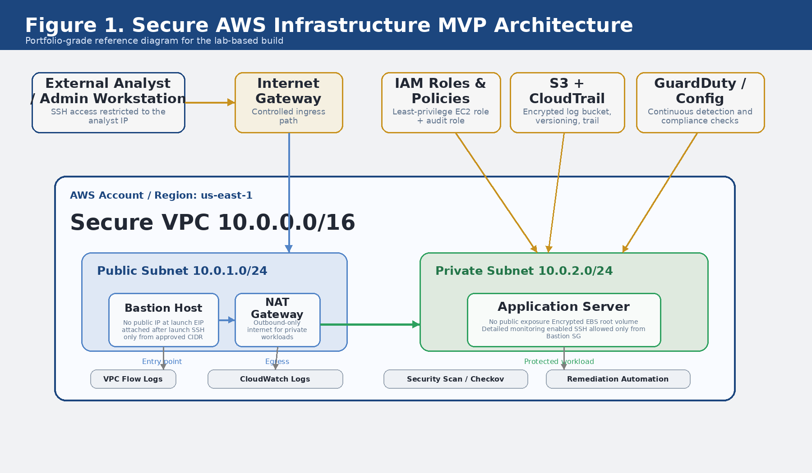
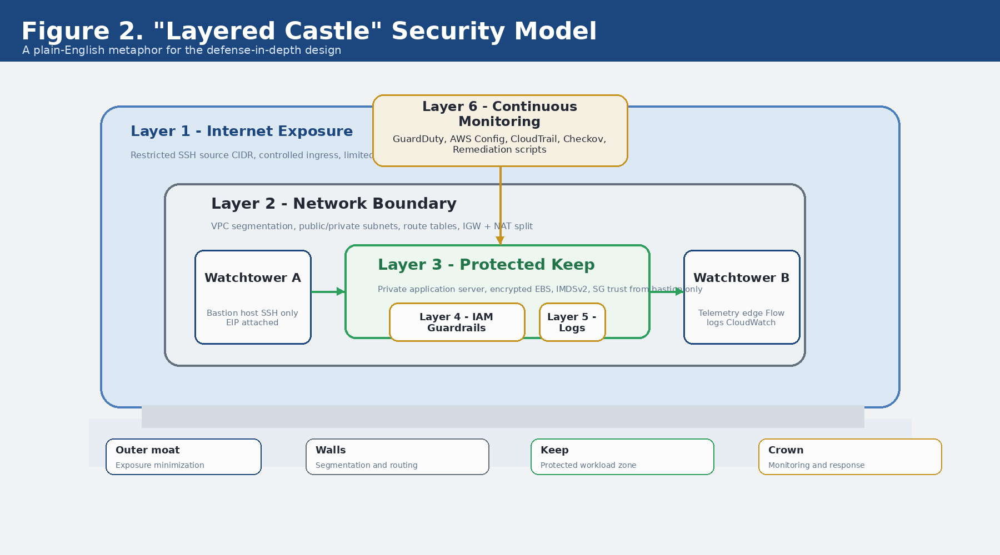
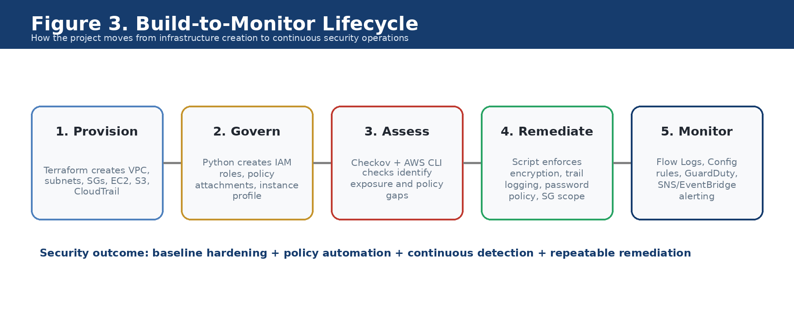

# AWS Secure Infrastructure MVP

Portfolio-grade AWS security engineering project focused on building, assessing, and hardening a small secure cloud environment using Terraform, Python automation, and defense-in-depth monitoring controls.

Prepared by **Abdul Rehman** (`abdul4rehman215`)

---

## 1. Project Summary

This repository packages the full Secure AWS Infrastructure MVP as a GitHub-ready portfolio project. The goal of the build is to show that a small AWS environment can be designed as a layered security system rather than a basic lab deployment.

Instead of stopping at infrastructure creation, the project covers the full lifecycle:

- provision a segmented AWS environment with Terraform
- apply IAM least-privilege automation with Python
- run security assessment checks
- remediate common misconfigurations
- enable continuous monitoring controls such as VPC Flow Logs, AWS Config, CloudTrail, and GuardDuty

This repository is intentionally arranged so it can support both portfolio review and implementation walkthrough. The report folder contains the long-form project document, while the Terraform, scripts, evidence, and diagram folders expose the technical artifacts directly.

---

## 2. Why This Project Matters

A lot of cloud lab work proves only that resources can be created. This project is stronger because it proves a security operating model:

- the network is segmented
- SSH exposure is intentionally restricted
- the application tier is isolated in a private subnet
- storage and telemetry paths are encrypted and logged
- IAM is treated as a guardrail system, not an afterthought
- scanning and remediation are automated
- monitoring is designed to continue after initial deployment

In plain English: this project treats AWS like a small defended castle, not like a flat test environment.

---

## 3. MVP Scope

The MVP prototype includes the following security building blocks:

### Infrastructure baseline
- VPC with DNS support and DNS hostnames enabled
- public subnet for controlled entry operations
- private subnet for protected application workloads
- internet gateway and NAT gateway split for ingress vs egress control
- bastion host pattern for administrative access
- application server in the private zone
- encrypted EBS root volumes

### Identity and policy controls
- EC2 least-privilege IAM role
- security audit role with MFA-based trust policy
- instance profile creation logic
- policy analysis helper for overly broad actions and resources

### Security assessment and remediation
- Terraform scanning with Checkov
- AWS CLI style configuration checks
- automated remediation for bucket encryption, password policy, CloudTrail, and security group scope

### Defense in depth
- VPC Flow Logs to CloudWatch Logs
- AWS Config recorder, delivery channel, and managed rules
- GuardDuty detector and export pipeline
- EventBridge to SNS alerting path for high-severity findings

---

## 4. Architecture Reference

### Figure 1. Secure AWS Infrastructure MVP Architecture



This diagram shows the primary security layout of the project:

- analyst access is restricted to an approved public IP
- the bastion host lives in the public subnet but does not auto-assign a public IP at launch
- the application server is isolated in the private subnet
- the NAT gateway supports outbound-only internet reachability for private workloads
- IAM, S3, CloudTrail, GuardDuty, and Config wrap the network design with policy and monitoring controls

### Figure 2. Layered Castle Security Model



This figure translates the technical controls into a simpler defense-in-depth metaphor:

- outer moat = exposure minimization
- walls = segmentation and routing boundaries
- keep = protected workload zone
- crown = monitoring and response layer

### Figure 3. Build-to-Monitor Lifecycle



This lifecycle view shows the repository as an operating sequence:

1. provision
2. govern
3. assess
4. remediate
5. monitor

---

## 5. Repository Layout

```text
aws-secure-infrastructure-mvp/
|-- README.md
|-- .gitignore
|-- requirements.txt
|-- report/
|   |-- AWS_Secure_Infrastructure_MVP_Project.pdf
|   `-- AWS_Secure_Infrastructure_MVP_Project.docx
|-- terraform/
|   |-- main.tf
|   `-- terraform_outputs.txt
|-- scripts/
|   |-- iam_security_manager.py
|   |-- security_scan.sh
|   |-- remediation_script.py
|   |-- config_setup.py
|   `-- guardduty_setup.py
|-- evidence/
|   |-- security_report.txt
|   |-- iam_security_report.json
|   |-- guardduty_setup_report.json
|   |-- sample_terraform_terminal.png
|   |-- sample_scan_terminal.png
|   `-- sample_monitor_terminal.png
`-- diagrams/
    |-- architecture_diagram.png
    |-- layered_castle_diagram.png
    `-- lifecycle_diagram.png
```

---

## 6. What Each Folder Does

### `report/`
Contains the polished portfolio document in both PDF and editable DOCX format. This is the narrative layer of the project and is suitable for portfolio presentation, recruiter sharing, or documentation handoff.

### `terraform/`
Contains the main infrastructure-as-code definition and a sample `terraform_outputs.txt` artifact showing the shape of the deployed outputs.

### `scripts/`
Contains the Python and Bash automation used to manage IAM, run assessments, remediate common findings, configure AWS Config, and enable GuardDuty export and alerting.

### `evidence/`
Contains representative artifacts that show the kinds of outputs the project produces. Because the original project package was assembled without live screenshots from every step, these evidence files are packaged as clearly labeled portfolio artifacts rather than falsely claiming to be raw production exports.

### `diagrams/`
Contains the figure exports used consistently across the report and the GitHub presentation layer.

---

## 7. Security Controls Implemented

| Control Area | What Was Implemented | Security Value |
|---|---|---|
| Network segmentation | Public + private subnets, route tables, IGW, NAT split | Reduces flat-network exposure |
| Controlled admin path | Bastion host, restricted SSH CIDR | Limits internet-facing admin access |
| Private workload zone | Application server in private subnet | Removes direct public exposure |
| Storage protection | Encrypted EBS root volumes, encrypted S3 bucket | Protects data at rest |
| Logging baseline | CloudTrail, CloudWatch Logs, VPC Flow Logs | Improves visibility and traceability |
| IAM guardrails | Least-privilege EC2 role, MFA-based audit role | Reduces blast radius and access abuse |
| Security validation | Checkov + AWS CLI style checks | Makes baseline review repeatable |
| Remediation | Python fixes for encryption, password policy, SG scope, trail logging | Turns findings into action |
| Compliance monitoring | AWS Config recorder, delivery channel, managed rules | Continuous compliance posture |
| Threat detection | GuardDuty + export + SNS alert path | Adds ongoing suspicious activity detection |

---

## 8. Main Technical Components

### `terraform/main.tf`
Builds the AWS baseline environment. It defines:

- VPC and subnet layout
- internet and NAT routing
- security groups
- EC2 instances
- S3 logging bucket
- CloudTrail trail
- output values for later automation

### `scripts/iam_security_manager.py`
Creates and manages secure IAM resources. The script:

- creates an EC2 role for restricted instance usage
- creates a security audit role with MFA-based trust policy
- creates and attaches custom policies
- creates an instance profile
- analyzes policy documents for common over-permission issues
- writes a JSON report artifact

### `scripts/security_scan.sh`
Packages the assessment flow in one simple shell script. It summarizes:

- Terraform scan output
- S3 encryption state
- public exposure checks for security groups
- IAM password policy status
- CloudTrail status
- GuardDuty state
- VPC Flow Logs state

### `scripts/remediation_script.py`
Applies common hardening fixes such as:

- enforcing S3 default encryption
- narrowing security group ingress scope
- enabling or updating CloudTrail logging
- enforcing a stronger IAM password policy

### `scripts/config_setup.py`
Configures AWS Config with:

- configuration recorder
- delivery channel
- role attachment
- managed compliance rules for volumes, S3 exposure, password policy, and CloudTrail

### `scripts/guardduty_setup.py`
Enables and operationalizes GuardDuty by:

- creating or reusing the detector
- creating a KMS key for findings export
- updating S3 policy for findings delivery
- creating the publishing destination
- wiring EventBridge to SNS for high-severity alerts

---

## 9. Evidence and Example Outputs

Representative evidence is included in the `evidence/` folder.

### Included files
- `security_report.txt`
- `iam_security_report.json`
- `guardduty_setup_report.json`
- terminal-style example PNGs for provisioning, scanning, and monitoring

### Important note on evidence packaging
These artifacts are included so the repository looks complete and reviewable even without every original execution screenshot. They are aligned to the project narrative and file structure, but they should be treated as **portfolio evidence artifacts** rather than as a claim that every file came directly from a single preserved lab run.

---

## 10. How To Run The Project

### Prerequisites
- AWS account or lab account with suitable permissions
- Terraform 1.6+
- AWS CLI v2
- Python 3.10+
- `boto3` and `botocore`
- optional: `checkov` for Terraform scanning

### Suggested setup flow

```bash
# 1. Clone the repository
# 2. Configure AWS credentials
aws configure

# 3. Move into the terraform folder
cd terraform

# 4. Add your SSH public key alongside main.tf if needed
#    and pass your allowed public CIDR during plan/apply
terraform init
terraform validate
terraform plan -var="allowed_ssh_cidr=YOUR_PUBLIC_IP/32"
terraform apply -var="allowed_ssh_cidr=YOUR_PUBLIC_IP/32"

# 5. Return to the repo root and install Python requirements
cd ..
python3 -m venv venv
source venv/bin/activate
pip install -r requirements.txt

# 6. Run the IAM automation
python scripts/iam_security_manager.py

# 7. Run the security scan
bash scripts/security_scan.sh

# 8. Run remediation if needed
python scripts/remediation_script.py --bucket-name secure-lab-logs-a1b2c3d4 --security-group-id sg-0c11a2b345d67890a --port 22 --allowed-cidr YOUR_PUBLIC_IP/32 --trail-name secure-lab-trail

# 9. Configure AWS Config and GuardDuty
python scripts/config_setup.py --bucket-name secure-lab-logs-a1b2c3d4 --region us-east-1
python scripts/guardduty_setup.py --bucket-name secure-lab-logs-a1b2c3d4 --region us-east-1
```

---

## 11. Sample End-State

A successful end-state for this repository should look like this:

- bastion host reachable only from the analyst IP range
- application workload isolated in the private subnet
- no direct public ingress to the application server
- encrypted storage baseline applied
- CloudTrail logging enabled and retained centrally
- IAM policies documented and reviewed for least privilege
- AWS Config rules monitoring baseline compliance
- GuardDuty enabled with export and alert routing configured
- evidence artifacts available for portfolio presentation

---

## 12. Portfolio Positioning

This project is strong for portfolio use because it demonstrates more than one skill at the same time:

- cloud infrastructure design
- Terraform-based provisioning
- Python automation for AWS security operations
- practical IAM hardening logic
- security scanning and remediation thinking
- monitoring architecture and defense-in-depth communication
- report packaging and technical storytelling

This makes the repository useful for:

- GitHub portfolio presentation
- resume project linking
- interview walkthroughs
- cloud security case-study discussions
- SOC / cloud security engineering demonstrations

---

## 13. Limitations

This repository represents a strong MVP, but it is still a bounded portfolio build.

Current limitations include:

- single-region design for demonstration clarity
- sample evidence artifacts included for packaging completeness
- no CI/CD wrapper yet for automated repeated deployment
- no multi-account organization layer
- no application service beyond the protected server pattern

---

## 14. Next Improvements

A next version of this repository could add:

- GitHub Actions for linting and packaging checks
- reusable Terraform modules instead of one main file
- Security Hub integration
- Inspector and Macie expansion
- richer dashboards for findings and compliance state
- diagram exports in SVG as well as PNG
- a red-team / blue-team test path for validation scenarios

---

## 15. Included Long-Form Report

For the full project narrative, executive summary, diagrams, validation write-up, and portfolio presentation layer, open:

- `report/AWS_Secure_Infrastructure_MVP_Project.pdf`
- `report/AWS_Secure_Infrastructure_MVP_Project.docx`

---

## 16. Author

**Abdul Rehman**

GitHub: `abdul4rehman215`

This repository was packaged as a portfolio-ready MVP project to keep the report, technical artifacts, figure exports, and evidence files aligned in one clean structure.
