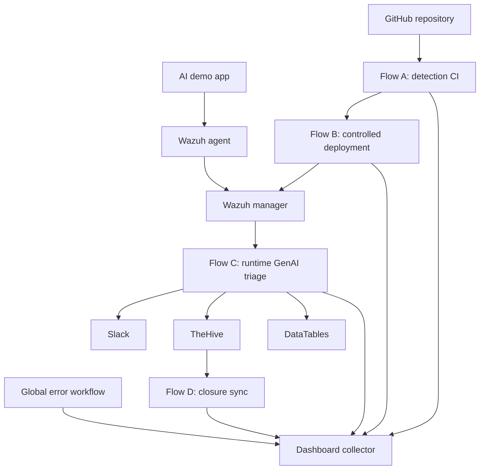

# Project Overview - GenAI Detection-as-Code CI/CD for Wazuh

This overview folder explains the full capstone prototype as one connected SOC engineering lifecycle.

## Scope

The project covers:

- Detection CI validation for GenAI Wazuh content
- Controlled Wazuh deployment
- Runtime AI application telemetry ingestion
- Wazuh custom rules and decoder
- n8n triage and enrichment
- Slack analyst notifications
- TheHive alert/case handling
- Dashboard, error, and closure-support workflows

## Architecture summary

## Why this belongs as a capstone

This project combines build-time detection engineering, deployment governance, runtime AI security telemetry, and incident-response operations. Each layer is independently explainable but also contributes to a full prototype.

## Main artifact

See `artifacts/GenAI_Detection_as_Code_CICD_for_Wazuh_Project_Overview.pdf` for the visual project walkthrough.
