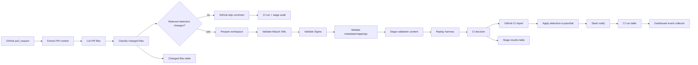

# Flow A - Detection CI Validation

Flow A is the detection engineering quality gate. It watches GitHub pull requests, classifies changed files, validates detection artifacts, reports CI results, and records audit/dashboard data.

## What it solves

Detection content is risky to deploy without validation. A malformed Wazuh XML file, missing metadata mapping, broken test event, or mismatched replay expectation can break detection pipelines or create false confidence. Flow A catches these issues before deployment.

## Main logic

## Key outputs

| Output | Purpose |
|---|---|
| GitHub CI report | PR-facing validation report |
| GitHub label | `detection-ci-pass` or `detection-ci-fail` gate for Flow B |
| Slack message | Analyst/engineer notification |
| `flow_a_ci_runs` | Summary row per CI run |
| `flow_a_ci_changed_files` | Changed file inventory |
| `flow_a_ci_stage_results` | Stage-level validation evidence |
| Dashboard events | SOC/project KPI rows |

## Included files

- `workflows/flow-a-detection-ci-validation-audited-dashboard-v2.n8n.json`
- `scripts/ci/validate_wazuh_xml.py`
- `scripts/ci/validate_sigma.py`
- `scripts/ci/validate_metadata.py`
- `scripts/ci/stage_validation_wazuh.sh`
- `scripts/ci/run_replay_harness.py`
- Flow A DataTable CSV exports
- Flow A project PDF

## Validation tests used

1. Docs-only PR produced a skip comment and skip audit rows.
2. Metadata-only PR triggered the full validation path and produced a pass report.

## Operational notes

Flow A does not deploy anything. It only validates, labels, comments, notifies, and records evidence. Flow B consumes the label state later.
