# Flow B - Controlled Wazuh Deployment

Flow B is the controlled release workflow for Wazuh rules and decoders. It takes validated detection content and deploys it only when the GitHub PR gate is satisfied.

## What it solves

Detection content should not be copied directly into a Wazuh manager without approval, backup, smoke testing, and rollback options. Flow B adds release control to detection engineering.

## Main logic

```mermaid
flowchart LR
    GH[GitHub event] --> Signal[Detect deploy signal]
    Signal --> Ctx[Extract deploy context]
    Ctx --> PR[Get PR state]
    PR --> Gate{Deploy allowed?}
    Gate -- no --> Block[GitHub blocked report]
    Block --> SlackBlocked[Slack blocked]
    Gate -- yes --> Backup[Backup current Wazuh content]
    Backup --> Checkout[Checkout approved commit]
    Checkout --> Stage[Stage rules/decoders]
    Stage --> XML[Predeploy XML check]
    XML --> Smoke[Predeploy smoke logtest]
    Smoke --> Activate[Activate content]
    Activate --> Restart[Restart Wazuh manager]
    Restart --> Post[Postdeploy test]
    Post --> Healthy{Healthy?}
    Healthy -- yes --> Success[Deployment report]
    Healthy -- no --> Rollback[Rollback from backup]
    Rollback --> Report[Rollback report]
    Success --> Audit[Deployment audit table]
    Report --> Audit
    Audit --> Dashboard[Dashboard events]
```

## Deployment gate

Flow B expects:

- `detection-ci-pass`
- `ready-to-deploy`
- `approved` or approved review state
- valid deploy signal such as `/deploy-lab`

## Key outputs

| Output | Purpose |
|---|---|
| GitHub deployment comment | PR evidence of blocked/success/noop/rollback result |
| Slack deployment message | SOC/engineering visibility |
| `flow_b_deployment_runs` | Full deployment audit row |
| Dashboard events | Deployment KPI rows |

## Included files

- `workflows/flow-b-controlled-deployment-audited-dashboard-v1.n8n.json`
- `scripts/deploy/*.sh`
- `scripts/deploy/postdeploy_test.py`
- `data-tables/flow_b_deployment_runs.csv`
- Flow B project PDF

## Validation tests used

- Blocked deployment: PR without CI/ready/approval was blocked.
- Successful deployment: gated PR deployed Wazuh XML content and passed postdeploy validation.
