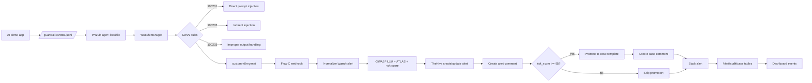

# Flow C - Runtime GenAI Triage with Wazuh, Slack, TheHive, and DataTables

Flow C is the runtime AI security workflow. It receives Wazuh alerts generated from AI demo guardrail telemetry, enriches them with GenAI context, notifies Slack, creates/updates TheHive alerts, comments on alerts, promotes high-risk cases, comments on cases, and writes audit/dashboard state.

## What it solves

AI application abuse can happen at the prompt/context/output layer. Flow C makes that telemetry visible to the SOC by converting app guardrail events into Wazuh detections and then into analyst-ready triage artifacts.

## Main logic

## Detection families

| Rule ID | Family | OWASP | Purpose |
|---|---|---|---|
| `100201` | `genai_prompt_injection` | LLM01 | Direct prompt injection |
| `100202` | `genai_indirect_injection` | LLM01 | Indirect prompt injection / untrusted retrieved context |
| `100203` | `genai_output_handling` | LLM05 | Improper output handling risk |

## Included files

- final Flow C n8n workflow JSON
- AI demo Flask app
- Wazuh decoder and rules
- Wazuh custom integration script
- localfile and manager integration config snippets
- test events and expected rules
- metadata, mappings, schemas, guardrail policy
- Flow C DataTables
- Flow C PDF

## TheHive behavior

Flow C uses TheHive as a true incident-response system:

- Create or update alert by source/sourceRef.
- Add automated alert comment.
- Promote high-risk direct and indirect prompt injection alerts to cases.
- Use separate case templates for direct and indirect prompt injection.
- Add automated case comment after promotion.
- Record case-promotion state in DataTables.

## Validation tests used

- AI demo app service active and health endpoint OK.
- `test_events.sh` generated direct, indirect, improper-output, and benign events.
- Wazuh alerts fired for `100201`, `100202`, and `100203`.
- Slack showed all three alerts.
- TheHive alerts/cases/comments were created.
- Case promotion skipped for lower-risk improper output handling.
- Flow C DataTables and dashboard rows were updated.
