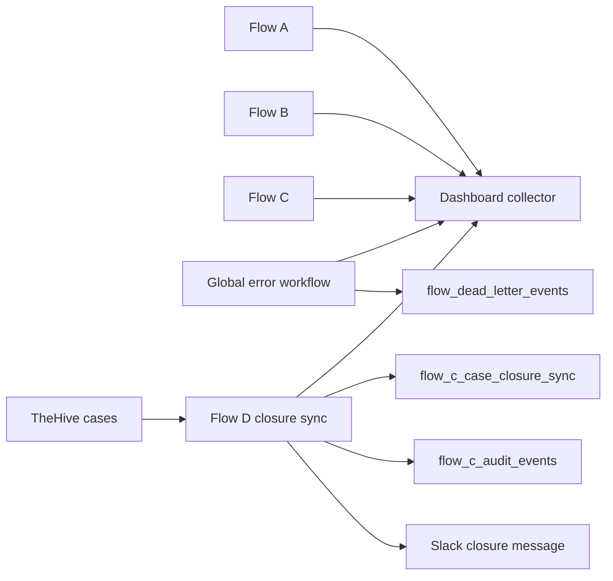

# Supporting Workflows - Audit, Dashboard, Error Handling, and Case Closure

This folder contains the support layer around the three main workflows. These workflows do not replace Flow A, B, or C; they make the prototype observable, resilient, and lifecycle-complete.

## Included supporting workflows

| Workflow | Purpose |
|---|---|
| SOC Dashboard Event Collector | Receives metric events from Flow A/B/C/D/error workflows and upserts dashboard rows |
| Global Error Dead-Letter Handler | Captures failed workflow executions, inserts dead-letter rows, and notifies Slack |
| Flow D TheHive Case Closure Sync | Polls TheHive for closed Flow C cases and syncs closure outcome to Slack/DataTables/dashboard |

## Support architecture

## Why this layer matters

The support workflows prove that the project does not stop at alert creation. It also tracks failures, stores metric events, and syncs case closure outcomes back into the project audit trail.

## Included files

- dashboard collector workflow JSON
- global error workflow JSON
- case closure sync workflow JSON
- dead-letter, dashboard, and case-closure DataTable exports/schemas
- supporting workflows PDF
