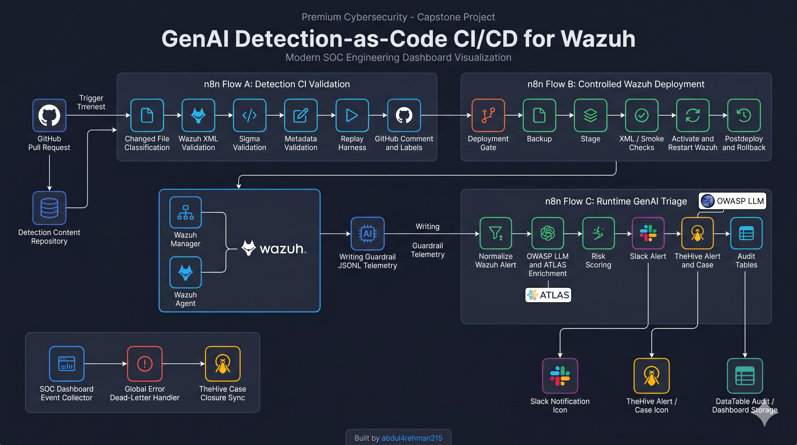
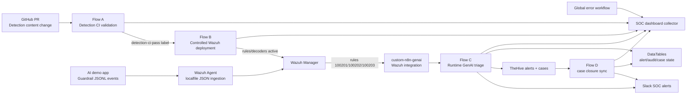
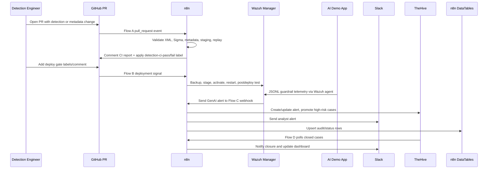

# 🕵️ GenAI Detection-as-Code CI/CD for Wazuh - GitHub, n8n, OWASP LLM, ATLAS, TheHive 5

### GenAI runtime detection engineering, Wazuh detection-as-code, controlled deployment, TheHive case handling, Slack notification, and audit/dashboard support.

<p align="center">
  <a href="https://www.linkedin.com/in/abdul4rehman215/"></a>
  <a href="https://github.com/abdul4rehman215"></a>
  
  
  
</p>

<p align="center">
  
</p>

---

## 🎯 Problem vs solution

AI applications are becoming part of normal enterprise workflows, but SOC pipelines usually still focus on traditional host, network, cloud, and identity telemetry. GenAI-specific risks such as direct prompt injection, indirect prompt injection, unsafe retrieved context, and improper output handling often stay inside the application layer, disconnected from SIEM detection engineering and incident response.

This capstone solves that gap by building a complete MVP prototype around **GenAI Detection-as-Code CI/CD for Wazuh**:

- detection content is validated through GitHub pull requests before deployment
- Wazuh rules and decoders are deployed only after a gated controlled deployment path
- an AI demo app emits structured guardrail telemetry
- Wazuh detects the runtime GenAI abuse patterns
- n8n triages the alerts, enriches them with OWASP LLM and ATLAS context, posts to Slack, creates TheHive alerts, promotes high-risk cases, and writes audit/dashboard data
- supporting workflows keep the lifecycle observable through dashboard events, dead-letter handling, and TheHive case closure sync

The result is not a single automation demo. It is a connected security engineering prototype showing how AI-app telemetry can move through detection-as-code, SIEM validation, deployment governance, runtime alerting, case management, and operational reporting.

---

## 📑 Table of contents

- [What this capstone proves](#what-this-capstone-proves)
- [Architecture](#architecture)
- [How the flows work together](#how-the-flows-work-together)
- [Repository layout](#repository-layout)
- [Included artifacts](#included-artifacts)
- [Zero-to-hero setup guide](#zero-to-hero-setup-guide)
- [Main workflow summaries](#main-workflow-summaries)
- [Data model and audit strategy](#data-model-and-audit-strategy)
- [Security and secret-handling note](#security-and-secret-handling-note)
- [Validation evidence summary](#validation-evidence-summary)
- [Interview talking points](#interview-talking-points)
- [Future improvements](#future-improvements)

---

## 🧠 What this capstone proves

This project demonstrates hands-on ability to design, implement, test, and document an AI-security SOC automation pipeline with realistic engineering constraints:

| Capability | Demonstrated through |
|---|---|
| Detection-as-code | GitHub PR-triggered validation for Wazuh XML, Sigma, metadata, mappings, tests, and replay logic |
| Deployment governance | Flow B gate requiring CI pass, approval, ready-to-deploy label, and valid deploy signal |
| Wazuh detection engineering | Custom JSON telemetry, Wazuh decoder, custom rules `100201`, `100202`, and `100203` |
| Runtime GenAI detection | AI demo app writes structured guardrail events to JSONL monitored by Wazuh agent |
| SOC orchestration | n8n normalizes, enriches, scores, deduplicates, notifies, and records outcomes |
| TheHive operations | TheHive 5 alerts, update-before-create logic, case templates, case comments, case promotion, and closure sync |
| Analyst communication | Slack messages with rule details, OWASP/ATLAS mappings, TheHive IDs/URLs, and recommended action |
| Auditability | n8n DataTables for CI runs, changed files, stage results, deployments, alert state, audit events, case promotion, closure sync, errors, and dashboard metrics |
| Portfolio communication | PDF project reports, workflow exports, scripts, configs, architecture notes, interview Q&A, and troubleshooting notes |

---

## 🧩 Architecture

<p align="center"></p>

### Master lifecycle view



### Runtime sequence



---

## 🔗 How the flows work together

| Flow | Purpose | Trigger | Main outputs |
|---|---|---|---|
| **Flow A** | Detection CI validation | GitHub pull request opened/reopened/synchronize | GitHub CI comment, labels, Slack, Flow A audit tables, dashboard events |
| **Flow B** | Controlled Wazuh deployment | GitHub labels/review/comment/push signals | Backup, checkout, stage, predeploy tests, activate, restart, postdeploy, rollback path, deployment audit, dashboard events |
| **Flow C** | Runtime GenAI alert triage | Wazuh custom integration webhook | Slack alert, TheHive alert/case/comment, alert/audit/case tables, dashboard events |
| **Supporting workflows** | Cross-cutting observability and lifecycle | Schedule/error/webhook | Dashboard event collection, global error dead-lettering, TheHive closure sync |

The flows are intentionally separated rather than merged into one large n8n canvas. Each workflow has a clear responsibility, a specific evidence trail, and a clean failure boundary. Together they behave like one production prototype.

---

## 🧰 Core technologies used

| Tool / Platform | Why it is used in this prototype |
|---|---|
| **GitHub Pull Requests** | Source-control entry point for detection engineering changes, review workflow, CI status comments, labels, and deployment approval signals |
| **n8n** | Main automation/orchestration layer for PR validation, deployment gating, Wazuh integration, Slack notifications, TheHive alert/case automation, DataTables, dashboards, and closure sync |
| **Wazuh Manager** | Detection engine for custom GenAI security telemetry, custom rules, decoders, alert generation, and runtime monitoring |
| **Wazuh Agent** | Runtime telemetry collector on the test/n8n instance, reading the AI demo JSONL log and forwarding events to the Wazuh manager |
| **Custom Wazuh rules and decoders** | Detection content for GenAI prompt injection, indirect prompt injection, improper output handling, and schema-aligned guardrail telemetry |
| **AI demo app** | Controlled runtime source that emits GenAI guardrail events into `/var/log/ai-demo/guardrail-events.jsonl` for end-to-end detection testing |
| **Slack** | Analyst-facing notification channel for CI status, deployment decisions, runtime GenAI alerts, TheHive case updates, errors, and closure events |
| **TheHive 5** | Case-management layer for alert creation, dedup/update behavior, alert comments, case promotion, case templates, case comments, and case closure tracking |
| **n8n DataTables** | Lightweight state and audit layer for CI runs, changed files, validation stages, deployment runs, runtime alert status, audit events, case promotions, closure sync, dead-letter events, and dashboard summaries |
| **OWASP LLM Top 10** | GenAI security classification framework used to label and explain LLM01 Prompt Injection and LLM05 Improper Output Handling scenarios |
| **MITRE ATLAS-style mapping** | AI threat-technique context used for prompt-injection mapping and analyst-friendly triage language |
| **Bash / Python / Flask / Gunicorn** | Supporting runtime pieces for CI scripts, deployment scripts, custom Wazuh integration, and the AI demo app service |

---

## 📈 SOC value and expected impact

Because this is a prototype, the value is expressed as **expected operational impact**, not fictional production metrics.

### Expected outcomes

- **Lower detection engineering risk:** Wazuh rules, decoders, metadata, and test events are validated before deployment.
- **Lower MTTR:** runtime GenAI alerts are enriched automatically with OWASP, ATLAS, risk score, request/session/user context, TheHive links, and recommended analyst action.
- **Lower alert fatigue:** Flow C filters only target GenAI alerts and suppresses non-target events before Slack/TheHive escalation.
- **Better deployment control:** Flow B blocks deployments unless the PR has CI pass, approval, ready-to-deploy state, and a valid deploy signal.
- **Stronger auditability:** Flow A, Flow B, Flow C, closure sync, error handling, and dashboard events all write structured records into n8n DataTables.
- **Improved case consistency:** high-risk GenAI alerts are promoted using specific TheHive case templates with prebuilt analyst tasks.
- **Better AI-security readiness:** the project models how SOC teams can operationalize AI-app telemetry instead of treating LLM threats as only theoretical risks.

### What this project proves

This project proves that GenAI security telemetry can be handled like a real detection-engineering lifecycle:

```text
Detection code change
→ PR validation
→ controlled deployment
→ runtime detection
→ analyst notification
→ TheHive alert
→ case promotion
→ audit trail
→ closure sync
→ dashboard summary
```

### Why this matters

Most GenAI security demos stop at one of these layers:

* a prompt-injection example,
* a SIEM rule,
* a Slack alert,
* or a case ticket.

This prototype connects all of them into one operational lifecycle. That makes it useful as a capstone-style SOC automation project, a portfolio artifact, and a blueprint for how AI-app detections can be governed before and after deployment.

---

## 📁 Repository layout

```text
26-genai-detection-as-code-cicd-wazuh-n8n-thehive/
├── README.md
├── architecture-notes.txt
├── interview_qna.md
├── SECURITY_NOTES.md
├── data-tables/
│   ├── exports/
│   └── schemas/
├── workflows/
│   ├── flow-a-detection-ci-validation-audited-dashboard-v2.n8n.json
│   ├── flow-b-controlled-deployment-audited-dashboard-v1.n8n.json
│   ├── flow-c-runtime-genai-triage-thehive5-case-templates-comments-v5.n8n.json
│   ├── flow-d-thehive-case-closure-sync-flowc-v1.n8n.json
│   ├── flow-global-error-deadletter-v2.n8n.json
│   └── flow-soc-dashboard-event-collector-v1.n8n.json
├── project-pdfs/
├── resources/
├── notes/
├── _shared/
├── 00-project-overview/
├── 01-flow-a-detection-ci-validation/
├── 02-flow-b-controlled-wazuh-deployment/
├── 03-flow-c-runtime-genai-triage-thehive/
└── 04-supporting-workflows-audit-dashboard-error-caseclosure/
```

---

## 🗂️ Included artifacts

### Project PDFs

| PDF | Purpose |
|---|---|
| `project-pdfs/GenAI_Detection_as_Code_CICD_for_Wazuh_Project_Overview.pdf` | Executive/project-level overview |
| `project-pdfs/Flow_A_Detection_CI_Validation.pdf` | Flow A implementation and evidence |
| `project-pdfs/Flow_B_Controlled_Deployment.pdf` | Flow B implementation and evidence |
| `project-pdfs/Flow_C_Runtime_GenAI_Triage_TheHive5.pdf` | Flow C implementation and evidence |
| `project-pdfs/Supporting_Workflows_Audit_Dashboard_Error_CaseClosure.pdf` | Dashboard, error workflow, and closure sync evidence |

### n8n workflow JSON exports

The workflow JSON files in `workflows/` are sanitized skeletons intended for portfolio/reference import. After import, re-map credentials and URLs in n8n.

### Scripts and configs

- Flow A includes CI validation scripts for Wazuh XML, Sigma, metadata, staging, and replay harness.
- Flow B includes deployment scripts for backup, checkout, staging, XML check, smoke logtest, activation, restart, postdeploy test, and rollback.
- Flow C includes AI demo app code, Wazuh rules/decoder, Wazuh integration script, localfile config snippet, metadata, schemas, mappings, and test events.

---

## 📘 How to use this repository

### Portfolio / recruiter review

Start with:

- `README.md`
- `project-pdfs/`
- `00-project-overview/README.md`
- `workflows/`
- the five premium PDF documents:
  - Flow A Detection CI Validation
  - Flow B Controlled Deployment
  - Flow C Runtime GenAI Triage
  - Supporting Workflows
  - Full Project Overview

Recommended reading order:

```text
1. Main README
2. Full Project Overview PDF
3. Flow A PDF
4. Flow B PDF
5. Flow C PDF
6. Supporting Workflows PDF
7. Interview Q&A
```

### Technical review

Open:

* `architecture-notes.txt`
* `FILE_INDEX.md`
* `workflows/n8n/`
* `data-tables/`
* each flow folder:

  * `01-flow-a-detection-ci-validation/`
  * `02-flow-b-controlled-wazuh-deployment/`
  * `03-flow-c-runtime-genai-triage-thehive/`
  * `04-supporting-workflows-audit-dashboard-error-caseclosure/`

For implementation details, review:

* Flow A CI scripts
* Flow B deployment scripts
* Flow C AI demo app
* Wazuh custom rule/decoder examples
* custom Wazuh-to-n8n integration script
* TheHive case-template notes
* DataTable schemas

### Demo / validation review

Use:

* `notes/validation-evidence-checklist.md`
* each flow folder’s `notes/`
* each flow folder’s `troubleshooting.md`
* project PDFs under `project-pdfs/`

The evidence set should show:


Flow A:
PR validation, GitHub CI comment, Slack PASS/SKIP, DataTable rows

Flow B:
blocked deployment gate, successful deployment, Slack result, deployment audit row

Flow C:
AI demo app event, Wazuh alert, Slack GenAI alert, TheHive alert, case promotion, DataTable audit

Supporting workflows:
dashboard rows, dead-letter event, TheHive case closure sync


### Rebuild / lab recreation

This repository is documentation-first. It includes the skeletons, scripts, configs, and notes needed to understand or recreate the lab, but live secrets are intentionally excluded.

Before importing workflows or running scripts, create your own:

* GitHub credential/token
* Slack app credential
* TheHive API key
* Wazuh API/user credential
* SSH key or trusted remote execution method
* `.env.ci` from `.env.ci.example`

Never commit live credentials.

---

## ⚠️ Prototype boundaries and honest limitations

This repository documents a **high-value capstone prototype**, not a production SaaS product.

### Environment-specific limitations

- Live credentials, tokens, SSH keys, Slack credentials, and TheHive API keys are **not bundled**.
- Imported n8n workflows still require local credential binding.
- EC2 public IPs and lab hostnames may need to be changed before reuse.
- The Wazuh manager, n8n instance, TheHive instance, and AI demo app were tested in a controlled lab environment.
- Some paths, usernames, service names, and network addresses are lab-specific and must be adapted for another environment.

### Workflow assumptions

- **Flow A** assumes PR-based detection content changes.
- **Flow B** assumes Flow A has already produced a pass/skip/fail state and that labels or review state are used as deployment gates.
- **Flow C** assumes Wazuh is already ingesting `/var/log/ai-demo/guardrail-events.jsonl`.
- **TheHive case promotion** depends on the configured case templates existing in TheHive.
- **Closure sync** depends on TheHive cases retaining tags/source references that map back to Flow C alerts.
- **Dashboard rows** are event-style KPI rows, not a full visual BI dashboard.

### Security boundaries

- This project intentionally avoids publishing live `.env.ci`, tokens, private keys, and API secrets.
- Workflow JSONs may contain placeholder credential references but not usable secrets.
- Any screenshots used for public posting should be reviewed for IPs, usernames, tokens, and sensitive identifiers.
- The AI demo app should not be left publicly exposed unless protected by security group restrictions or authentication.

### Production hardening that would be required

Before adapting this to a real production SOC environment, add:

- secrets manager integration,
- stronger workflow-level error routing,
- RBAC separation between CI, deployment, and runtime operations,
- deployment approvals from a real review system,
- TheHive search/update logic hardened against duplicate race conditions,
- signed commits or CODEOWNERS enforcement,
- Wazuh rule package versioning,
- Slack alert-rate limiting,
- case deduplication policies,
- retention and archival controls for DataTables,
- monitoring for n8n workflow failures and queue health.

These limitations are part of the project’s credibility: they show where the prototype ends and where production engineering would begin.

---

## 🧪 Zero-to-hero setup guide

> This repository folder is documentation-first. It contains the workflow exports, supporting scripts, and reference artifacts required to reproduce the prototype. It does not include live credentials or private keys.

### 1. Prerequisites

| Component | Why it is needed |
|---|---|
| GitHub repository | Pull request source for Flow A/Flow B |
| n8n self-hosted instance | Workflow orchestration |
| Wazuh manager | Detection validation and runtime alerting |
| Wazuh agent on n8n/testing host | Localfile ingestion for the AI demo JSONL log |
| Slack app/credential | SOC notifications |
| TheHive 5 | Alert/case management |
| Python 3 + Bash | CI/deploy scripts and AI demo app |

### 2. Import the n8n DataTables

Create/import these tables in n8n:

```text
flow_a_ci_runs
flow_a_ci_changed_files
flow_a_ci_stage_results
flow_b_deployment_runs
flow_c_alert_status
flow_c_audit_events
flow_c_case_promotions
flow_c_case_closure_sync
flow_dead_letter_events
flow_soc_dashboard_summary
```

Use the CSVs in `data-tables/exports/` and `data-tables/schemas/` as schema references.

### 3. Import supporting workflows first

Import and activate:

```text
workflows/flow-soc-dashboard-event-collector-v1.n8n.json
workflows/flow-global-error-deadletter-v2.n8n.json
```

Then configure the global error workflow in Flow A, Flow B, and Flow C settings.

### 4. Import Flow A, Flow B, and Flow C

Import:

```text
workflows/flow-a-detection-ci-validation-audited-dashboard-v2.n8n.json
workflows/flow-b-controlled-deployment-audited-dashboard-v1.n8n.json
workflows/flow-c-runtime-genai-triage-thehive5-case-templates-comments-v5.n8n.json
```

Re-map credentials:

| Workflow | Credentials to re-map |
|---|---|
| Flow A | GitHub, Slack webhook/env, command runtime |
| Flow B | GitHub, Slack, command runtime, Wazuh SSH/API env |
| Flow C | Slack, TheHive 5, DataTables |
| Supporting workflows | Slack, TheHive 5, DataTables |

### 5. Configure `.env.ci`

Use `_shared/config-templates/.env.ci.example` as a starting point. Do not commit real `.env.ci` files.

### 6. Install Flow C Wazuh runtime pieces

On the Wazuh manager:

- deploy decoder from `03-flow-c-runtime-genai-triage-thehive/wazuh/decoders/`
- deploy rules from `03-flow-c-runtime-genai-triage-thehive/wazuh/rules/`
- add the integration block from `wazuh/configs/wazuh-manager-integration-block.xml.txt`
- install `wazuh/integrations/custom-n8n-genai.py` as `/var/ossec/integrations/custom-n8n-genai`

On the n8n/testing host:

- configure Wazuh agent localfile monitoring using `wazuh/configs/wazuh-agent-localfile-block.xml.txt`
- run the AI demo app from `app/ai-demo/`

### 7. Validate end-to-end

Recommended order:

1. Flow A docs-only skip PR
2. Flow A metadata full CI PR
3. Flow B blocked deploy gate
4. Flow B allowed deploy
5. Flow C AI demo runtime alerts for rules `100201`, `100202`, and `100203`
6. TheHive case promotion and case closure sync
7. Global error workflow with a temporary failing workflow

---

## Main workflow summaries

### Flow A - Detection CI validation

Flow A validates detection content before deployment. It classifies PR changes, skips irrelevant PRs, validates detection artifacts, posts GitHub comments, applies CI labels, sends Slack status, and writes DataTable/dashboard rows.

### Flow B - Controlled Wazuh deployment

Flow B prevents unreviewed detection content from being pushed into Wazuh. It requires CI pass, ready-to-deploy, approval, and a valid deploy signal. It backs up existing manager content, checks out the approved commit, stages XML, performs predeploy checks, activates content, restarts Wazuh, validates postdeploy behavior, and supports rollback.

### Flow C - Runtime GenAI triage

Flow C receives Wazuh alerts created from AI demo guardrail telemetry. It maps each alert to OWASP LLM and ATLAS context, scores risk, creates/updates TheHive alerts, comments on alerts, promotes high-risk alerts to case templates, comments on cases, sends Slack notifications, and updates audit/status/dashboard tables.

### Supporting workflows

Supporting workflows keep the system observable:

- Dashboard collector receives metric events from Flow A/B/C/D/error workflows.
- Global error/dead-letter handler records failed executions and notifies Slack.
- Case closure sync polls TheHive and writes closure outcomes back to Flow C audit/state/dashboard records.

---

## 🗂️ Data model and audit strategy

The prototype uses n8n DataTables as a lightweight operational database.

| Table | Purpose |
|---|---|
| `flow_a_ci_runs` | One CI summary row per PR/SHA |
| `flow_a_ci_changed_files` | One changed-file row per PR file |
| `flow_a_ci_stage_results` | One validation-stage row per CI run |
| `flow_b_deployment_runs` | One deployment audit row per deployment signal/run |
| `flow_c_alert_status` | Latest state per Flow C GenAI alert dedup key |
| `flow_c_audit_events` | Append-style runtime audit trail |
| `flow_c_case_promotions` | Case-promotion state and outcome |
| `flow_c_case_closure_sync` | TheHive closure sync records |
| `flow_dead_letter_events` | Error workflow/dead-letter events |
| `flow_soc_dashboard_summary` | Event-level dashboard metrics |

---

## 🧭 Suggested review path and production hardening roadmap

### Suggested review path

If you are reviewing this project for technical depth, use this path:

```text
1. Start with the overview README and architecture notes.
2. Review Flow A to understand detection-as-code validation.
3. Review Flow B to understand gated Wazuh deployment.
4. Review Flow C to understand runtime GenAI triage and TheHive escalation.
5. Review supporting workflows to understand audit, dashboard, error, and closure sync.
6. Review the DataTable schemas to understand state tracking.
7. Review troubleshooting notes to understand failure modes and recovery steps.
````

### What to look for during review

| Area                  | What to verify                                                                               |
| --------------------- | -------------------------------------------------------------------------------------------- |
| Detection engineering | Flow A validates changed detection content before deployment                                 |
| Deployment safety     | Flow B blocks unsafe deploys and only deploys after explicit gates                           |
| Runtime SOC triage    | Flow C receives Wazuh alerts, enriches them, and sends analyst-ready Slack messages          |
| Case management       | TheHive alerts, comments, case promotion, case templates, and closure sync are included      |
| Auditability          | DataTables preserve CI, deployment, runtime, closure, and error records                      |
| Dashboard readiness   | Dashboard summary rows provide lightweight KPI/event tracking                                |
| Operational realism   | The system includes skip paths, blocked paths, success paths, error paths, and closure paths |

### Production hardening roadmap

This MVP can be improved in phases.

#### Phase 1 — reliability hardening

* Add retry policies for Slack, TheHive, and GitHub HTTP calls.
* Add rate limiting for repeated GenAI alert bursts.
* Add workflow-level dead-letter routing for all non-critical external integrations.
* Add health checks for Wazuh manager, n8n, TheHive, and the AI demo service.

#### Phase 2 — detection engineering hardening

* Add rule package versioning.
* Add CODEOWNERS approval requirements for detection folders.
* Add signed commit verification.
* Expand replay tests beyond the initial GenAI event set.
* Add negative tests for false-positive control.

#### Phase 3 — TheHive lifecycle hardening

* Search/update existing alerts before create using stronger duplicate matching.
* Add case deduplication based on user/session/request and sourceRef.
* Add automatic case comments for repeated sessions.
* Add closure reason normalization.
* Add analyst assignment logic based on rule family or severity.

#### Phase 4 — SOC dashboard hardening

* Replace event-style dashboard rows with scheduled aggregation.
* Add daily/weekly rollups.
* Add metrics for:

  * CI pass/fail count,
  * deployment success/blocked/rollback count,
  * GenAI alert volume,
  * case promotion count,
  * case closure count,
  * dead-letter/error count.
* Export summary rows to a dashboarding layer if needed.

#### Phase 5 — production security controls

* Move secrets into a managed secret store.
* Replace direct lab IPs with DNS names.
* Restrict n8n, TheHive, and demo app exposure with firewall/security group rules.
* Add authentication to the AI demo app.
* Add backup/restore process for n8n workflows and DataTables.
* Add monitoring for n8n execution failures and queue saturation.

### Final note

This capstone intentionally focuses on showing the **complete SOC automation lifecycle** rather than only one alert or one workflow. The value is in the chain:

```text
secure detection change
→ controlled deployment
→ runtime AI-security detection
→ analyst notification
→ TheHive case workflow
→ audit
→ dashboard
→ closure sync
```

That full lifecycle is what makes this project stronger than a single-rule or single-alert automation demo.

---

## ⚠️ Security and secret-handling note

This folder intentionally excludes:

- real GitHub tokens
- Slack webhook URLs
- Wazuh API passwords
- private SSH keys
- live `.env.ci` files

Workflow JSON files are sanitized skeletons. Re-map credentials in n8n after import. See `SECURITY_NOTES.md` before pushing or publishing.

---

## ☑️ Validation evidence summary

The project was validated with the following evidence scenarios:

- Flow A skip branch: docs-only PR created a GitHub skip comment and audit rows
- Flow A full branch: metadata PR passed validation and wrote CI, changed-file, stage-result, and dashboard rows
- Flow B blocked branch: `/deploy-lab` without gate requirements produced a blocked report and Slack message
- Flow B allowed branch: approved/ready/CI-passed deployment completed successfully with backup, staging, XML, smoke, activation, restart, and postdeploy checks
- Flow C runtime branch: AI demo app generated direct injection, indirect injection, and improper output handling events, detected by Wazuh and sent through Slack/TheHive/DataTables
- Supporting workflows: dashboard collector, global error handler, and case closure sync were implemented as lifecycle support flows

---

## 🎤 Interview talking points

- I separated CI, deployment, runtime triage, and support workflows to reduce blast radius and make evidence easier to reason about.
- Flow A acts like a security quality gate for detection content before it can be considered deployable.
- Flow B applies change-management controls to Wazuh content, including backup and rollback paths.
- Flow C demonstrates how AI-app telemetry can be treated like first-class SIEM telemetry.
- TheHive is not just a ticket sink; it is used for alert deduplication, case promotion, analyst comments, templates, and closure sync.
- DataTables provide a lightweight audit database for the prototype without adding an external DB dependency.

---

## 🔭 Future improvements

- Replace n8n DataTables with PostgreSQL for multi-user production audit scale.
- Add GitHub branch protection rules that require Flow A pass before merge.
- Build a dedicated web dashboard over the dashboard event table.
- Add additional OWASP LLM coverage such as excessive agency, sensitive information disclosure, and model denial-of-service.
- Add Wazuh dashboard visualizations for GenAI runtime alerts.
- Add TheHive custom fields for OWASP category, ATLAS technique, model, request ID, and session ID.
- Containerize the AI demo app and Wazuh/n8n lab bootstrap for easier reproduction.

---

## 🌐 Project Posts on LinkedIn

I also shared this project on LinkedIn through multiple posts covering the implementation, workflow, and key outcomes.

> To be added Soon....

<!--

<p align="left">
  <a href="https://tinyurl.com/aws-iam-flow-a"></a>
  <a href="https://tinyurl.com/aws-iam-flow-b"></a>
  <a href="https://tinyurl.com/aws-iam-flow-c"></a>
  <a href="https://tinyurl.com/aws-iam-flow-d"></a>
  <a href="https://tinyurl.com/3w7uaz74"></a>
  <a href="https://tinyurl.com/kjbzxyb8"></a>
  <a href="https://www.linkedin.com/posts/abdul4rehman215_detectionengineering-securityoperations-soar-activity-7452698979034660865-N8iD?"></a>
  <a href="https://www.linkedin.com/posts/abdul4rehman215_opentowork-cybersecurity-socanalyst-share-7450140849482645505-eXr4?"></a>
</p>

---

-->

## ⭐ Final Note

This project reflects **real hands-on implementation** focused on practical security workflow execution, technical depth, and portfolio-grade documentation.

It demonstrates the ability to:

> **Build → Validate → Investigate → Document → Present**

If this project adds value, consider starring the repository ⭐

---

## 👨‍💻 Author

**Abdul Rehman**  
SOC • SIEM • Detection Engineering • Incident Response • Threat Intelligence • Security Automation

---

### 📧 Reach Out

  <a href="https://github.com/abdul4rehman215">
    
  </a>
  <a href="https://linkedin.com/in/abdul4rehman215">
    
  </a>
  <a href="mailto:abdul4rehman215@gmail.com">
    
  </a>

---
