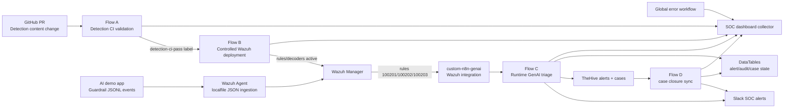
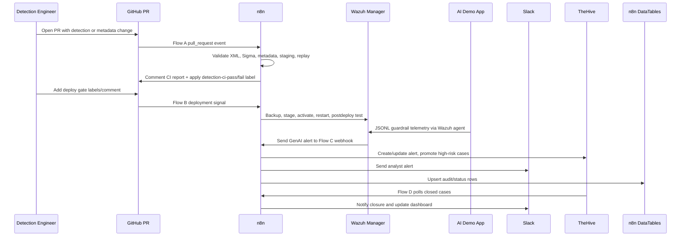

# GenAI Detection-as-Code CI/CD for Wazuh - GitHub, n8n, OWASP LLM, ATLAS, TheHive

<p align="center">
  <a href="https://www.linkedin.com/in/abdul4rehman215/"></a>
  <a href="https://github.com/abdul4rehman215"></a>
  
  
  
</p>

<p align="center">
  <b>Portfolio project by <a href="https://www.linkedin.com/in/abdul4rehman215/">abdul4rehman215</a></b><br/>
  GenAI runtime detection engineering, Wazuh detection-as-code, controlled deployment, TheHive case handling, Slack notification, and audit/dashboard support.
</p>

> **Architecture image placeholder:** add the generated master architecture image at `resources/genai-wazuh-capstone-architecture.png` and uncomment/update the image block below.
>
> `<p align="center"></p>`

---

## Problem vs solution

AI applications are becoming part of normal enterprise workflows, but SOC pipelines usually still focus on traditional host, network, cloud, and identity telemetry. GenAI-specific risks such as direct prompt injection, indirect prompt injection, unsafe retrieved context, and improper output handling often stay inside the application layer, disconnected from SIEM detection engineering and incident response.

This capstone solves that gap by building a complete MVP prototype around **GenAI Detection-as-Code CI/CD for Wazuh**:

- detection content is validated through GitHub pull requests before deployment
- Wazuh rules and decoders are deployed only after a gated controlled deployment path
- an AI demo app emits structured guardrail telemetry
- Wazuh detects the runtime GenAI abuse patterns
- n8n triages the alerts, enriches them with OWASP LLM and ATLAS context, posts to Slack, creates TheHive alerts, promotes high-risk cases, and writes audit/dashboard data
- supporting workflows keep the lifecycle observable through dashboard events, dead-letter handling, and TheHive case closure sync

The result is not a single automation demo. It is a connected security engineering prototype showing how AI-app telemetry can move through detection-as-code, SIEM validation, deployment governance, runtime alerting, case management, and operational reporting.

---

## Table of contents

- [What this capstone proves](#what-this-capstone-proves)
- [Architecture](#architecture)
- [How the flows work together](#how-the-flows-work-together)
- [Repository layout](#repository-layout)
- [Included artifacts](#included-artifacts)
- [Zero-to-hero setup guide](#zero-to-hero-setup-guide)
- [Main workflow summaries](#main-workflow-summaries)
- [Data model and audit strategy](#data-model-and-audit-strategy)
- [Security and secret-handling note](#security-and-secret-handling-note)
- [Validation evidence summary](#validation-evidence-summary)
- [Interview talking points](#interview-talking-points)
- [Future improvements](#future-improvements)

---

## What this capstone proves

This project demonstrates hands-on ability to design, implement, test, and document an AI-security SOC automation pipeline with realistic engineering constraints:

| Capability | Demonstrated through |
|---|---|
| Detection-as-code | GitHub PR-triggered validation for Wazuh XML, Sigma, metadata, mappings, tests, and replay logic |
| Deployment governance | Flow B gate requiring CI pass, approval, ready-to-deploy label, and valid deploy signal |
| Wazuh detection engineering | Custom JSON telemetry, Wazuh decoder, custom rules `100201`, `100202`, and `100203` |
| Runtime GenAI detection | AI demo app writes structured guardrail events to JSONL monitored by Wazuh agent |
| SOC orchestration | n8n normalizes, enriches, scores, deduplicates, notifies, and records outcomes |
| TheHive operations | TheHive 5 alerts, update-before-create logic, case templates, case comments, case promotion, and closure sync |
| Analyst communication | Slack messages with rule details, OWASP/ATLAS mappings, TheHive IDs/URLs, and recommended action |
| Auditability | n8n DataTables for CI runs, changed files, stage results, deployments, alert state, audit events, case promotion, closure sync, errors, and dashboard metrics |
| Portfolio communication | PDF project reports, workflow exports, scripts, configs, architecture notes, interview Q&A, and troubleshooting notes |

---

## Architecture

### Master lifecycle view



### Runtime sequence



---

## How the flows work together

| Flow | Purpose | Trigger | Main outputs |
|---|---|---|---|
| **Flow A** | Detection CI validation | GitHub pull request opened/reopened/synchronize | GitHub CI comment, labels, Slack, Flow A audit tables, dashboard events |
| **Flow B** | Controlled Wazuh deployment | GitHub labels/review/comment/push signals | Backup, checkout, stage, predeploy tests, activate, restart, postdeploy, rollback path, deployment audit, dashboard events |
| **Flow C** | Runtime GenAI alert triage | Wazuh custom integration webhook | Slack alert, TheHive alert/case/comment, alert/audit/case tables, dashboard events |
| **Supporting workflows** | Cross-cutting observability and lifecycle | Schedule/error/webhook | Dashboard event collection, global error dead-lettering, TheHive closure sync |

The flows are intentionally separated rather than merged into one large n8n canvas. Each workflow has a clear responsibility, a specific evidence trail, and a clean failure boundary. Together they behave like one production prototype.

---

## Repository layout

```text
26-genai-detection-as-code-cicd-wazuh-n8n-thehive/
├── README.md
├── architecture-notes.txt
├── interview_qna.md
├── SECURITY_NOTES.md
├── data-tables/
│   ├── exports/
│   └── schemas/
├── workflows/
│   ├── flow-a-detection-ci-validation-audited-dashboard-v2.n8n.json
│   ├── flow-b-controlled-deployment-audited-dashboard-v1.n8n.json
│   ├── flow-c-runtime-genai-triage-thehive5-case-templates-comments-v5.n8n.json
│   ├── flow-d-thehive-case-closure-sync-flowc-v1.n8n.json
│   ├── flow-global-error-deadletter-v2.n8n.json
│   └── flow-soc-dashboard-event-collector-v1.n8n.json
├── project-pdfs/
├── resources/
├── notes/
├── _shared/
├── 00-project-overview/
├── 01-flow-a-detection-ci-validation/
├── 02-flow-b-controlled-wazuh-deployment/
├── 03-flow-c-runtime-genai-triage-thehive/
└── 04-supporting-workflows-audit-dashboard-error-caseclosure/
```

---

## Included artifacts

### Project PDFs

| PDF | Purpose |
|---|---|
| `project-pdfs/GenAI_Detection_as_Code_CICD_for_Wazuh_Project_Overview.pdf` | Executive/project-level overview |
| `project-pdfs/Flow_A_Detection_CI_Validation.pdf` | Flow A implementation and evidence |
| `project-pdfs/Flow_B_Controlled_Deployment.pdf` | Flow B implementation and evidence |
| `project-pdfs/Flow_C_Runtime_GenAI_Triage_TheHive5.pdf` | Flow C implementation and evidence |
| `project-pdfs/Supporting_Workflows_Audit_Dashboard_Error_CaseClosure.pdf` | Dashboard, error workflow, and closure sync evidence |

### n8n workflow JSON exports

The workflow JSON files in `workflows/` are sanitized skeletons intended for portfolio/reference import. After import, re-map credentials and URLs in n8n.

### Scripts and configs

- Flow A includes CI validation scripts for Wazuh XML, Sigma, metadata, staging, and replay harness.
- Flow B includes deployment scripts for backup, checkout, staging, XML check, smoke logtest, activation, restart, postdeploy test, and rollback.
- Flow C includes AI demo app code, Wazuh rules/decoder, Wazuh integration script, localfile config snippet, metadata, schemas, mappings, and test events.

---

## Zero-to-hero setup guide

> This repository folder is documentation-first. It contains the workflow exports, supporting scripts, and reference artifacts required to reproduce the prototype. It does not include live credentials or private keys.

### 1. Prerequisites

| Component | Why it is needed |
|---|---|
| GitHub repository | Pull request source for Flow A/Flow B |
| n8n self-hosted instance | Workflow orchestration |
| Wazuh manager | Detection validation and runtime alerting |
| Wazuh agent on n8n/testing host | Localfile ingestion for the AI demo JSONL log |
| Slack app/credential | SOC notifications |
| TheHive 5 | Alert/case management |
| Python 3 + Bash | CI/deploy scripts and AI demo app |

### 2. Import the n8n DataTables

Create/import these tables in n8n:

```text
flow_a_ci_runs
flow_a_ci_changed_files
flow_a_ci_stage_results
flow_b_deployment_runs
flow_c_alert_status
flow_c_audit_events
flow_c_case_promotions
flow_c_case_closure_sync
flow_dead_letter_events
flow_soc_dashboard_summary
```

Use the CSVs in `data-tables/exports/` and `data-tables/schemas/` as schema references.

### 3. Import supporting workflows first

Import and activate:

```text
workflows/flow-soc-dashboard-event-collector-v1.n8n.json
workflows/flow-global-error-deadletter-v2.n8n.json
```

Then configure the global error workflow in Flow A, Flow B, and Flow C settings.

### 4. Import Flow A, Flow B, and Flow C

Import:

```text
workflows/flow-a-detection-ci-validation-audited-dashboard-v2.n8n.json
workflows/flow-b-controlled-deployment-audited-dashboard-v1.n8n.json
workflows/flow-c-runtime-genai-triage-thehive5-case-templates-comments-v5.n8n.json
```

Re-map credentials:

| Workflow | Credentials to re-map |
|---|---|
| Flow A | GitHub, Slack webhook/env, command runtime |
| Flow B | GitHub, Slack, command runtime, Wazuh SSH/API env |
| Flow C | Slack, TheHive 5, DataTables |
| Supporting workflows | Slack, TheHive 5, DataTables |

### 5. Configure `.env.ci`

Use `_shared/config-templates/.env.ci.example` as a starting point. Do not commit real `.env.ci` files.

### 6. Install Flow C Wazuh runtime pieces

On the Wazuh manager:

- deploy decoder from `03-flow-c-runtime-genai-triage-thehive/wazuh/decoders/`
- deploy rules from `03-flow-c-runtime-genai-triage-thehive/wazuh/rules/`
- add the integration block from `wazuh/configs/wazuh-manager-integration-block.xml.txt`
- install `wazuh/integrations/custom-n8n-genai.py` as `/var/ossec/integrations/custom-n8n-genai`

On the n8n/testing host:

- configure Wazuh agent localfile monitoring using `wazuh/configs/wazuh-agent-localfile-block.xml.txt`
- run the AI demo app from `app/ai-demo/`

### 7. Validate end-to-end

Recommended order:

1. Flow A docs-only skip PR
2. Flow A metadata full CI PR
3. Flow B blocked deploy gate
4. Flow B allowed deploy
5. Flow C AI demo runtime alerts for rules `100201`, `100202`, and `100203`
6. TheHive case promotion and case closure sync
7. Global error workflow with a temporary failing workflow

---

## Main workflow summaries

### Flow A - Detection CI validation

Flow A validates detection content before deployment. It classifies PR changes, skips irrelevant PRs, validates detection artifacts, posts GitHub comments, applies CI labels, sends Slack status, and writes DataTable/dashboard rows.

### Flow B - Controlled Wazuh deployment

Flow B prevents unreviewed detection content from being pushed into Wazuh. It requires CI pass, ready-to-deploy, approval, and a valid deploy signal. It backs up existing manager content, checks out the approved commit, stages XML, performs predeploy checks, activates content, restarts Wazuh, validates postdeploy behavior, and supports rollback.

### Flow C - Runtime GenAI triage

Flow C receives Wazuh alerts created from AI demo guardrail telemetry. It maps each alert to OWASP LLM and ATLAS context, scores risk, creates/updates TheHive alerts, comments on alerts, promotes high-risk alerts to case templates, comments on cases, sends Slack notifications, and updates audit/status/dashboard tables.

### Supporting workflows

Supporting workflows keep the system observable:

- Dashboard collector receives metric events from Flow A/B/C/D/error workflows.
- Global error/dead-letter handler records failed executions and notifies Slack.
- Case closure sync polls TheHive and writes closure outcomes back to Flow C audit/state/dashboard records.

---

## Data model and audit strategy

The prototype uses n8n DataTables as a lightweight operational database.

| Table | Purpose |
|---|---|
| `flow_a_ci_runs` | One CI summary row per PR/SHA |
| `flow_a_ci_changed_files` | One changed-file row per PR file |
| `flow_a_ci_stage_results` | One validation-stage row per CI run |
| `flow_b_deployment_runs` | One deployment audit row per deployment signal/run |
| `flow_c_alert_status` | Latest state per Flow C GenAI alert dedup key |
| `flow_c_audit_events` | Append-style runtime audit trail |
| `flow_c_case_promotions` | Case-promotion state and outcome |
| `flow_c_case_closure_sync` | TheHive closure sync records |
| `flow_dead_letter_events` | Error workflow/dead-letter events |
| `flow_soc_dashboard_summary` | Event-level dashboard metrics |

---

## Security and secret-handling note

This folder intentionally excludes:

- real GitHub tokens
- Slack webhook URLs
- Wazuh API passwords
- private SSH keys
- live `.env.ci` files

Workflow JSON files are sanitized skeletons. Re-map credentials in n8n after import. See `SECURITY_NOTES.md` before pushing or publishing.

---

## Validation evidence summary

The project was validated with the following evidence scenarios:

- Flow A skip branch: docs-only PR created a GitHub skip comment and audit rows
- Flow A full branch: metadata PR passed validation and wrote CI, changed-file, stage-result, and dashboard rows
- Flow B blocked branch: `/deploy-lab` without gate requirements produced a blocked report and Slack message
- Flow B allowed branch: approved/ready/CI-passed deployment completed successfully with backup, staging, XML, smoke, activation, restart, and postdeploy checks
- Flow C runtime branch: AI demo app generated direct injection, indirect injection, and improper output handling events, detected by Wazuh and sent through Slack/TheHive/DataTables
- Supporting workflows: dashboard collector, global error handler, and case closure sync were implemented as lifecycle support flows

---

## Interview talking points

- I separated CI, deployment, runtime triage, and support workflows to reduce blast radius and make evidence easier to reason about.
- Flow A acts like a security quality gate for detection content before it can be considered deployable.
- Flow B applies change-management controls to Wazuh content, including backup and rollback paths.
- Flow C demonstrates how AI-app telemetry can be treated like first-class SIEM telemetry.
- TheHive is not just a ticket sink; it is used for alert deduplication, case promotion, analyst comments, templates, and closure sync.
- DataTables provide a lightweight audit database for the prototype without adding an external DB dependency.

---

## Future improvements

- Replace n8n DataTables with PostgreSQL for multi-user production audit scale.
- Add GitHub branch protection rules that require Flow A pass before merge.
- Build a dedicated web dashboard over the dashboard event table.
- Add additional OWASP LLM coverage such as excessive agency, sensitive information disclosure, and model denial-of-service.
- Add Wazuh dashboard visualizations for GenAI runtime alerts.
- Add TheHive custom fields for OWASP category, ATLAS technique, model, request ID, and session ID.
- Containerize the AI demo app and Wazuh/n8n lab bootstrap for easier reproduction.

---

## Author

Built and documented by <a href="https://www.linkedin.com/in/abdul4rehman215/">abdul4rehman215</a>.
