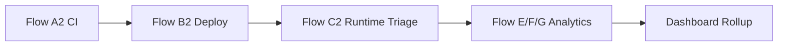

# 🌐 Project Overview - GenAI Detection-as-Code V2

This folder contains the master narrative for the capstone MVP V2 prototype. It explains how the individual flows connect into one AI Security Operations lifecycle.

<p align="center"></p>

## 📌 What is included

```text
00-project-overview/
├── README.md
├── architecture-notes.txt
├── interview_qna.md
├── troubleshooting.md
├── artifacts/
│   ├── 05_Master_Overview_GenAI_Detection_as_Code_V2_Premium.pdf
│   ├── 05_Master_Overview_GenAI_Detection_as_Code_V2_Premium.docx
│   └── GenAI_Detection_as_Code_V2_LinkedIn_Post_Pack.zip
└── notes/
```

## 🧠 Project storyline

The MVP V2 project shows how AI runtime security can be treated like a SOC engineering lifecycle. It starts with content validation, controls deployment, detects runtime MCP/RAG/agentic attacks, creates cases, and measures tuning quality.

## 🔗 Workflow relationship



## ✅ Best use of this folder

Use this folder when presenting the project to recruiters, interviewers, or portfolio reviewers. The main report gives the high-level context before the detailed flow folders.
