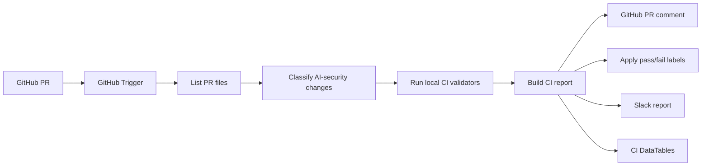

# 🧪 Flow A2 - AI Security Content CI

Flow A2 is the GitHub pull-request validation gate for the MVP V2 project. It extends the previous V1 CI idea beyond prompt/output detections and validates MCP, RAG/memory, agentic policy, mappings, schemas, and replay logic.

## 🎯 Purpose

Flow A2 prevents unsafe or broken AI-security content from being deployed. It reads a real GitHub PR, lists changed files, classifies risk areas, runs local validators, posts a PR comment, applies labels, sends Slack, and writes DataTable evidence.

## 🧩 Workflow logic

## ✅ Tested evidence

- Valid agentic policy PR passed 13/13 stages.
- Broken agentic policy PR failed and applied fail labels.
- GitHub comments, labels, Slack messages, and DataTables were captured.

## 📂 Important files

- `n8n-workflows/Flow_A2_AI_Security_Content_CI_FINAL_EVIDENCE_FIXED.json`
- `scripts/ci/run_flow_a2_local_ci.py`
- `scripts/ci/validate_agentic_policy.py`
- `mappings/case_template_rule_map.yml`
- `mappings/rule_family_map.yml`
- `data-tables/schemas/`
- `artifacts/01_Flow_A2_AI_Security_Content_CI_Premium.pdf`

## 🏭 Production improvements

Use hardened CI runners, signed PR checks, GitHub Actions status checks, and secrets from a vault instead of local `.env.ci` files.
