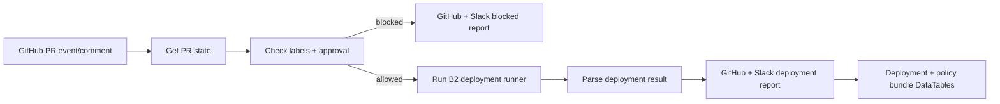

# 🚦 Flow B2 - Controlled Wazuh + AI Security Policy Deployment

Flow B2 is the controlled deployment gate. It only deploys Wazuh content and AI security policy bundles after Flow A2 has passed and the PR has the required approval/deploy signal.

## 🎯 Purpose

Flow B2 reduces deployment risk by enforcing labels, approval, and a valid `/deploy-lab` signal before staging and activating Wazuh rules/decoders and MCP/RAG/agentic policy bundles.

## 🧩 Workflow logic

## ✅ Tested evidence

- Failed PR deployment was blocked before touching Wazuh.
- Approved pass-labeled PR deployed successfully.
- GitHub comment, Slack, backup path, stage results, and DataTables were captured.

## 📂 Important files

- `n8n-workflows/Flow_B2_Controlled_Wazuh_AI_Security_Deployment_FINAL_V5_WORKFLOW_WITH_V7_RUNNER.json`
- `scripts/deploy/run_flow_b2_local_deploy.py`
- `scripts/deploy/rollback_wazuh_and_policy_bundle.sh`
- `config/env.ci.example`
- `data-tables/schemas/flow_b2_deployment_runs_schema.csv`
- `data-tables/schemas/flow_v2_policy_bundle_deployments_schema.csv`
- `artifacts/02_Flow_B2_Controlled_Wazuh_Policy_Deployment_Premium.pdf`

## 🏭 Production improvements

Replace lab SSH deployment with a hardened deployment runner, signed artifacts, canary Wazuh rule deployment, formal rollback testing, and stronger approval enforcement.
