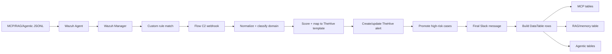

# 🚨 Flow C2 - Runtime MCP/RAG/Agentic SOC Triage

Flow C2 is the main star workflow of the MVP V2 project. It takes Wazuh alerts generated from AI runtime telemetry and turns them into Slack alerts, TheHive alerts/cases, and domain-specific DataTable evidence.

## 🌟 Why this is the star workflow

One workflow handles three modern AI security domains:

| Domain | Rule range | Example risk |
|---|---:|---|
| MCP runtime security | `100301-100306` | tool poisoning, schema drift, HITL bypass, resource exfiltration |
| RAG/memory security | `100401-100405` | context poisoning, memory poisoning, source trust violation |
| Agentic AI security | `100351-100358` | goal hijack, plan drift, tool loop, approval manipulation, confused deputy |

## 🧩 Workflow logic

## ✅ Tested evidence

- C1 MCP event was detected and routed to MCP runtime/policy/audit tables.
- C2 RAG/memory poisoning event was detected and routed to the RAG/memory table.
- C3 agentic risk event was detected and routed to agentic incidents, plan steps, and policy violations.
- Slack, TheHive, n8n execution, Wazuh alerts, and DataTables were captured.

## 📂 Important files

- `n8n-workflows/Flow_C2_Runtime_GenAI_MCP_RAG_Memory_Agentic_Triage_FIXED_ROUTING.json`
- `app/mcp-action-lab/`
- `app/rag-memory-lab/`
- `app/agentic-risk-lab/`
- `detections/wazuh/`
- `scripts/runtime/`
- `scripts/wazuh/custom-n8n-ai-security-v2`
- `thehive/case-templates/`
- `data-tables/schemas/`
- `artifacts/03_Flow_C2_Runtime_MCP_RAG_Agentic_SOC_Triage_Premium.pdf`

## 🧠 Key implementation detail

The final routing fix makes rule IDs win over broad Wazuh groups. This prevents `rag_memory` or `mcp` alerts from being misclassified as `agentic` when Wazuh groups include generic `agentic_ai` context.

## 🏭 Production improvements

Improve dedup across tenants, add signed event schemas, enforce source authentication for runtime events, move state to durable storage, and standardize TheHive closure taxonomy.
