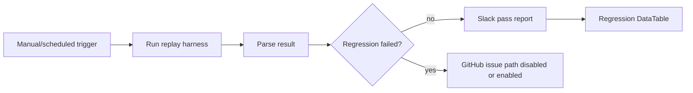

# 📊 Supporting Workflows - Flow E, Flow F, Flow G, and Dashboard Rollup

This folder contains the supporting engineering workflows that make the MVP V2 measurable, tunable, and easier to operate.

## 🧩 Workflow summary

| Workflow | Purpose |
|---|---|
| Flow E | Direct MCP runtime policy monitor for app-to-n8n policy events |
| Flow F | Red-team replay and regression harness for expected rule validation |
| Flow G | False-positive analytics and tuning recommendation workflow |
| Dashboard Rollup | Daily/weekly metrics rollup for SOC posture board |

## 🧪 Flow F example

Flow F runs a replay corpus and validates that expected rule IDs still fire. This protects against rule drift and accidental regression.

## ✅ Tested evidence

- Flow E policy monitor posted Slack and wrote policy-monitor rows.
- Flow F regression ran successfully with 22/22 tests passed.
- Flow G false-positive analytics generated tuning rows and Slack digest.
- Dashboard rollup produced V2 posture metrics.

## 📂 Important files

- `n8n-workflows/Flow_E_MCP_Runtime_Policy_Monitor_PRODUCTION_FINAL_FIXED.json`
- `n8n-workflows/Flow_F_RedTeam_Replay_Regression_FIXED_UPSERT.json`
- `n8n-workflows/Flow_G_False_Positive_Analytics_PRODUCTION_FINAL_FIXED.json`
- `n8n-workflows/Flow_SOC_Dashboard_V2_Metrics_Rollup_PRODUCTION_FINAL_FIXED.json`
- `scripts/analytics/`
- `data-tables/schemas/`
- `artifacts/04_Supporting_Workflows_E_F_G_Dashboard_Premium.pdf`

## 🏭 Production improvements

Move analytics to scheduled jobs, implement analyst closure taxonomy, add historical baselines, create dashboards in a durable BI layer, and open GitHub tuning issues for high-noise detections.
