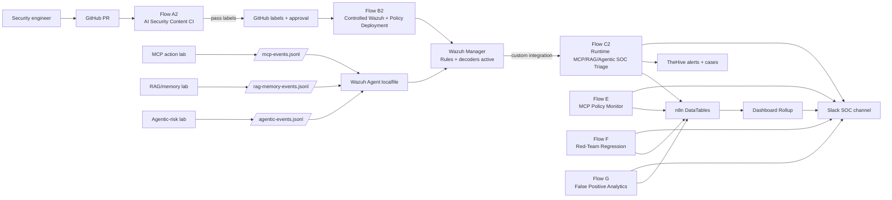
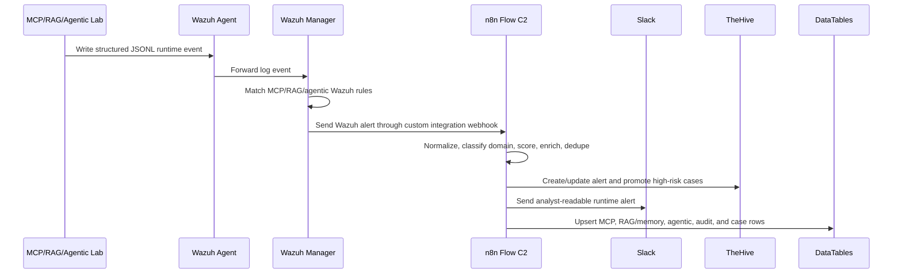

# 🧠 GenAI Detection-as-Code V2 — MCP, RAG/Memory, Agentic AI Security Operations

### Wazuh + n8n + TheHive + Slack + GitHub prototype for AI runtime security, detection CI/CD, policy deployment, regression analytics, and SOC posture metrics.

<p align="center">
  <a href="https://www.linkedin.com/in/abdul4rehman215/"></a>
  <a href="https://github.com/abdul4rehman215"></a>
  
  
  
  
</p>

<p align="center">
  
</p>

---

## 🎯 Problem vs solution

Enterprise AI applications are no longer just chat boxes. Modern GenAI systems can call tools, read MCP resources, retrieve RAG context, write memory, request approvals, and execute multi-step agent plans. Traditional SOC pipelines usually detect host, network, cloud, and identity events, but the AI **action path** often stays inside the application layer.

This capstone MVP V2 extends the previous GenAI Detection-as-Code CI/CD project into a broader **AI Security Operations prototype**. V1 focused mainly on prompt/output detection rules and a classic detection CI/CD lifecycle. V2 expands that model to protect the full GenAI runtime stack:

```text
prompt → agent plan → MCP tool discovery/call/result → RAG retrieval → memory write → approval decision → SOC triage
```

The prototype connects GitHub PR validation, controlled Wazuh deployment, runtime MCP/RAG/agentic detections, TheHive case handling, Slack notifications, n8n DataTables, regression tests, false-positive analytics, and dashboard metrics into one portfolio-ready security engineering system.

Framework-wise, this project is best described as **OWASP GenAI / OWASP LLM-aligned, partially OWASP MCP-aligned, and MITRE ATLAS-inspired**. It does not claim full OWASP compliance or a complete ATLAS technique matrix implementation. Instead, it uses those frameworks as practical security design references for AI-specific detection engineering and SOC automation.

---

## 📑 Table of contents

- [What this project proves](#-what-this-project-proves)
- [Architecture](#-architecture)
- [Workflow map](#-workflow-map)
- [Core technologies used](#-core-technologies-used)
- [OWASP and MITRE ATLAS alignment](#-owasp-and-mitre-atlas-alignment)
- [SOC value and expected impact](#-soc-value-and-expected-impact)
- [Repository layout](#-repository-layout)
- [Included artifacts](#-included-artifacts)
- [Zero-to-hero usage guide](#-zero-to-hero-usage-guide)
- [Main workflow summaries](#-main-workflow-summaries)
- [Data model](#-data-model)
- [Validation evidence](#-validation-evidence)
- [Prototype boundaries and honest limitations](#-prototype-boundaries-and-honest-limitations)
- [Production-hardening roadmap](#-production-hardening-roadmap)
- [Future improvements](#-future-improvements)
- [Interview talking points](#-interview-talking-points)
- [Security notes](#-security-notes)

---

## 🧪 What this project proves

| Capability | Demonstrated by |
|---|---|
| 🧬 AI-security detection engineering | Wazuh custom decoders/rules for MCP, RAG/memory, and agentic runtime threats |
| 🔁 Detection-as-code | Flow A2 validates Wazuh XML, schemas, MCP policy, RAG policy, agentic policy, mappings, DataTable schemas, and replay harness results |
| 🚦 Controlled deployment | Flow B2 gates deployment using A2 pass labels, approval, and `/deploy-lab` before staging/activating Wazuh and policy bundles |
| 🧠 Runtime SOC triage | Flow C2 receives Wazuh alerts and creates Slack + TheHive + DataTable evidence for MCP/RAG/agentic events |
| 🧰 Direct policy monitoring | Flow E monitors MCP policy events directly from app/policy layer before full Wazuh integration |
| 🧪 Regression engineering | Flow F replays red-team event corpora and tracks expected rule misses/unexpected alerts |
| 📉 Tuning analytics | Flow G computes false-positive and closure analytics for noisy rules and recommendations |
| 📊 SOC posture board | Dashboard rollup aggregates CI, deployment, runtime, regression, and FP metrics |
| 🧾 Documentation-first portfolio | Five PDF reports, workflow exports, scripts, case templates, schemas, configs, interview notes, and troubleshooting guides |

---

## 🏗️ Architecture

<p align="center">
  
</p>




### Runtime path



---

## 🗺️ Workflow map

| Folder | Workflow | Purpose | Status |
|---|---|---|---|
| `01-flow-a2-ai-security-content-ci/` | Flow A2 | GitHub PR-triggered AI-security CI gate | ✅ Tested PASS + FAIL |
| `02-flow-b2-controlled-wazuh-policy-deployment/` | Flow B2 | Controlled Wazuh + policy deployment | ✅ Tested BLOCKED + DEPLOYED |
| `03-flow-c2-runtime-mcp-rag-agentic-soc-triage/` | Flow C2 | Runtime SOC triage for MCP, RAG/memory, agentic AI | ✅ Tested C1/C2/C3 |
| `04-supporting-workflows-efg-dashboard-analytics/` | Flow E/F/G/Dashboard | Policy monitor, regression, FP analytics, metrics rollup | ✅ Tested support layer |
| `00-project-overview/` | Master overview | Project narrative, evidence pack, launch material | ✅ Portfolio-ready |

The flows are intentionally separated instead of being forced into one giant canvas. Flow A2 validates content before deployment, Flow B2 controls rollout, Flow C2 handles runtime SOC response, and the supporting workflows provide engineering feedback loops for monitoring, regression, tuning, and dashboard visibility.

---

## 🧰 Core technologies used

| Tool / platform | Role in this project |
|---|---|
| **GitHub Pull Requests** | Source-control entry point for AI-security content changes, PR comments, labels, approval state, and deployment signals |
| **n8n** | Main orchestration layer for GitHub triggers, CI reporting, deployment gating, Slack reporting, TheHive actions, Wazuh alert routing, DataTables, and supporting analytics workflows |
| **Wazuh Manager** | SIEM/detection layer for custom MCP, RAG/memory, and agentic runtime telemetry using custom rules and decoders |
| **Wazuh Agent** | Runtime collector that reads JSONL lab/application telemetry and forwards it to the Wazuh manager |
| **Custom Wazuh rules and decoders** | Detection content for MCP abuse, RAG/memory poisoning, agentic policy violations, prompt/context manipulation, and AI security event normalization |
| **TheHive 5** | Alert/case-management layer for high-risk runtime events, case templates, alert comments, case promotion, and analyst follow-up |
| **Slack** | Analyst-facing notification channel for CI results, blocked/deployed decisions, runtime alerts, regression reports, false-positive analytics, and dashboard rollups |
| **n8n DataTables** | Prototype state/audit layer for CI runs, changed files, stage results, deployment runs, runtime events, policy violations, case promotions, regression metrics, FP analytics, and dashboard summaries |
| **Python / Bash** | Local runners and helper scripts for Flow A2 validation, Flow B2 deployment, runtime event generation, regression replay, and policy analytics |
| **MCP/RAG/Agentic demo lab** | Controlled test environment used to generate realistic AI security telemetry without relying on a production AI application |
| **OWASP GenAI / LLM Top 10** | Main AI security reference for prompt injection, insecure output/tool handling, supply-chain risk, sensitive disclosure, and excessive agency style controls |
| **OWASP MCP Top 10** | MCP-specific reference for tool poisoning, command execution, context injection/over-sharing, audit/telemetry, and protocol-layer governance |
| **MITRE ATLAS-style mapping** | AI threat-modeling language used to describe adversarial AI behavior and make runtime alerts more analyst-readable |

---

## 🧭 OWASP and MITRE ATLAS alignment

This project uses OWASP and MITRE ATLAS as **security design and explanation frameworks**, not as a formal compliance certification.

### OWASP GenAI / OWASP LLM alignment

The strongest alignment is with **OWASP Top 10 for LLM Applications / OWASP GenAI Security** because the project focuses on AI application behavior, tool use, retrieved context, memory writes, and agentic decisions.

| OWASP LLM / GenAI risk family | Where it appears in the project |
|---|---|
| **LLM01 — Prompt Injection** | Flow C2 runtime triage, MCP/context test events, prompt policy checks, Slack/TheHive analyst summaries |
| **LLM02 — Insecure Output Handling** | Policy validation and runtime handling for unsafe tool/action outcomes and downstream AI-generated behavior |
| **LLM03 — Data / memory poisoning style risk** | RAG/memory tests, memory-write telemetry, RAG-memory DataTables, TheHive case evidence |
| **LLM05 — Supply Chain Vulnerabilities** | Flow A2 policy/content validation, tool schema hash checks, Flow B2 controlled deployment and policy bundle rollout |
| **LLM06 — Sensitive Information Disclosure** | MCP/RAG/agentic event enrichment and audit trails where risky context or memory exposure needs analyst review |
| **LLM07 — Insecure Plugin / Tool Design** | MCP tool discovery/call/result monitoring, tool schema hash validation, MCP policy violation routing |
| **LLM08 — Excessive Agency** | Agentic plan/goal risk detection, approval policy checks, agentic incident and plan-step DataTables |
| **LLM09 — Overreliance** | Workflow design keeps human approval gates, deployment labels, TheHive review, and analyst-facing context instead of silent automated trust |

### OWASP MCP alignment

The project also partially maps to **OWASP MCP Top 10** because Flow C2 and Flow E specifically handle MCP action telemetry and policy events.

| OWASP MCP risk family | Project coverage |
|---|---|
| **MCP03 — Tool Poisoning** | Tool schema/hash validation, MCP policy bundle checks, MCP runtime alert classification |
| **MCP04 — Software Supply Chain / Dependency Tampering** | Flow A2 CI validation and Flow B2 controlled deployment for policy/rule bundles |
| **MCP05 — Command Injection & Execution** | MCP action telemetry and high-risk tool/action scenarios routed to Slack/TheHive/DataTables |
| **MCP06 / MCP10 — Context injection and over-sharing** | RAG/context/memory events, MCP context handling, runtime triage evidence, analyst notes |
| **MCP08 — Lack of Audit and Telemetry** | DataTables, Slack notifications, TheHive alerts/cases, dashboard rollup, and supporting policy monitor workflow |

### MITRE ATLAS-inspired coverage

The project is **MITRE ATLAS-inspired**, not fully ATLAS-mapped. It uses ATLAS-style thinking for adversarial AI behavior such as prompt injection, memory/context poisoning, unsafe tool use, and agentic manipulation. A production version could add explicit ATLAS tactic/technique IDs in the Wazuh rules, Slack messages, TheHive custom fields, and DataTable schemas.

<!--

### Important wording for portfolio use

Use this wording to avoid overclaiming:
--->

> This prototype is OWASP GenAI/LLM-aligned, partially OWASP MCP-aligned, and MITRE ATLAS-inspired. It demonstrates practical SOC automation for AI runtime threats, but it is not a complete OWASP compliance implementation or full ATLAS matrix mapping.

Useful references:

- OWASP Top 10 for Large Language Model Applications: `https://owasp.org/www-project-top-10-for-large-language-model-applications/`
- OWASP MCP Top 10: `https://owasp.org/www-project-mcp-top-10/`
- MITRE ATLAS: `https://atlas.mitre.org/`

---

## 📈 SOC value and expected impact

Because this is an MVP prototype, the value is expressed as **expected SOC impact**, not fictional production statistics.

### Expected SOC value

- **Earlier detection-content quality control:** Flow A2 catches broken AI-security policies, schema problems, mapping issues, and replay failures before deployment.
- **Safer Wazuh deployment:** Flow B2 prevents direct rule/policy rollout unless CI labels, approval, and deployment signal are present.
- **Operational AI runtime visibility:** Flow C2 turns MCP/RAG/agentic runtime events into Slack alerts, TheHive artifacts, and audit rows instead of leaving them as raw application logs.
- **Better analyst context:** Alerts include domain classification, risk context, policy decision, recommended action, TheHive links, and evidence fields.
- **Reduced manual tracking:** DataTables record CI runs, deployments, runtime alerts, policy violations, case promotions, regression outcomes, and dashboard summaries.
- **Detection tuning loop:** Flow F and Flow G show how regression and false-positive analytics can support detection lifecycle management.
- **Portfolio-grade evidence:** The project includes workflow exports, scripts, rules, decoders, documentation, PDFs, and validated screenshots for interview/demo use.

### Lifecycle demonstrated

```text
GitHub AI-security change
→ Flow A2 CI validation
→ labels and PR comment
→ Flow B2 approval gate
→ staged Wazuh/policy deployment
→ runtime MCP/RAG/agentic event
→ Wazuh alert
→ Flow C2 triage
→ Slack + TheHive + DataTables
→ regression/FP/dashboard feedback loop
```

### Why this matters

Most GenAI security demos stop at a single prompt-injection example or a single SIEM alert. This project shows how AI-security events can be handled as an operational SOC lifecycle: validate the content, deploy it safely, detect runtime abuse, generate case evidence, and measure detection quality over time.

---

## 📁 Repository layout

```text
27-genai-detection-as-code-v2-mcp-rag-agentic-wazuh-n8n-thehive/
├── README.md
├── FILE_INDEX.md
├── SECURITY_NOTES.md
├── architecture-notes.txt
├── detailed-repo-layout.md
├── interview_qna.md
├── troubleshooting.md
├── 00-project-overview/
├── 01-flow-a2-ai-security-content-ci/
├── 02-flow-b2-controlled-wazuh-policy-deployment/
├── 03-flow-c2-runtime-mcp-rag-agentic-soc-triage/
├── 04-supporting-workflows-efg-dashboard-analytics/
├── _shared/
├── notes/
├── project-pdfs/
└── resources/
```

---

## 📦 Included artifacts

- ✅ Five premium project PDFs and DOCX files
- ✅ Final n8n workflow JSON exports
- ✅ Wazuh decoders and rules for MCP/RAG/agentic detections
- ✅ MCP, RAG/memory, and agentic demo lab code
- ✅ Runtime event generators and replay corpora
- ✅ Flow A2 CI validators and mapping files
- ✅ Flow B2 deployment runner, config template, and rollback helpers
- ✅ Flow E/F/G/Dashboard scripts and schemas
- ✅ TheHive case template copy-paste material
- ✅ DataTable schemas and evidence CSV exports
- ✅ Architecture notes, interview Q&A, troubleshooting, and production roadmap
- ✅ LinkedIn launch post pack and architecture image prompt

---

## 🚀 Zero-to-hero usage guide

This repository folder is designed as a **portfolio and implementation artifact**, not a one-command production installer. The exact lab was built on Wazuh, n8n, TheHive, Slack, and GitHub with remote SSH access to a Wazuh manager.

### 1. Import workflows

Import the final JSON files from each flow folder into n8n:

```text
01-flow-a2-ai-security-content-ci/n8n-workflows/
02-flow-b2-controlled-wazuh-policy-deployment/n8n-workflows/
03-flow-c2-runtime-mcp-rag-agentic-soc-triage/n8n-workflows/
04-supporting-workflows-efg-dashboard-analytics/n8n-workflows/
```

### 2. Configure credentials

Create n8n credentials for:

| Credential | Used by |
|---|---|
| GitHub API | Flow A2 and Flow B2 PR comments, labels, and PR state |
| Slack API | all analyst notifications |
| TheHive 5 API | Flow C2 alert/case creation and comments |
| SSH key / `.env.ci` | Flow A2 validation and Flow B2 deployment runners |

Use `_shared/config-templates/.env.ci.example` as the safe template. Do not commit real secrets.

### 3. Install Wazuh content

Use Flow B2 for controlled deployment, or manually review:

```text
03-flow-c2-runtime-mcp-rag-agentic-soc-triage/detections/wazuh/
```

### 4. Generate runtime evidence

Run the lab scripts under Flow C2:

```bash
python3 scripts/runtime/run_mcp_action_scenarios.py
python3 scripts/runtime/run_rag_memory_scenarios.py
python3 scripts/runtime/run_agentic_scenarios.py
```

### 5. Review SOC outputs

Validate evidence in:

- Slack SOC alert channel
- TheHive alerts/cases
- Wazuh alerts
- n8n execution logs
- n8n DataTables
- project PDFs under `project-pdfs/`

---

## 🧭 Main workflow summaries

### Flow A2 — AI Security Content CI

Flow A2 is the GitHub PR validation workflow. It validates AI-security content before anything is allowed to move toward deployment. It checks Wazuh XML, Sigma-style content, metadata, MCP policy files, MCP policy bundles, tool schema hashes, prompt policies, RAG memory policies, agentic policies, case-template mappings, rule-family maps, DataTable schemas, and replay harness results.

**Main output:** GitHub PR comment, pass/fail labels, Slack CI report, changed-file audit rows, stage-result rows, and CI run rows.

**Security purpose:** prevent broken AI-security rules, unsafe policy changes, or missing metadata from becoming deployed detection content.

### Flow B2 — Controlled Wazuh + AI Security Policy Deployment

Flow B2 is the deployment gate. It listens for a deployment signal and checks whether the PR has the required pass labels, approval/approved label, ready-to-deploy state, and valid `/deploy-lab` trigger. If the gate fails, it blocks deployment before touching Wazuh. If the gate passes, it runs the deployment runner to checkout the approved commit, stage rules/policies, create backups, run predeploy checks, activate content, restart Wazuh, and record deployment results.

**Main output:** blocked/deployed GitHub comment, Slack deployment message, deployment DataTable rows, policy bundle deployment rows, backup/staging references, and stage-result evidence.

**Security purpose:** turn AI-security content deployment into a controlled, auditable change-management process.

### Flow C2 — Runtime MCP, RAG/Memory, and Agentic SOC Triage

Flow C2 is the strongest runtime workflow. It receives Wazuh alerts generated from MCP, RAG/memory, and agentic AI test events. It normalizes the event, determines the AI security domain, enriches the alert, deduplicates state, sends Slack notifications, creates/updates TheHive alerts, promotes high-risk alerts to cases, and writes domain-specific DataTable rows.

**Main output:** Slack runtime alert, TheHive alert/case, MCP/RAG/agentic DataTables, policy violation rows, plan-step rows, audit events, and case-promotion evidence.

**Security purpose:** demonstrate how a SOC can operationalize AI runtime telemetry instead of treating LLM/MCP/RAG/agentic risk as only an application-side concern.

### Supporting workflows — Flow E, Flow F, Flow G, and dashboard rollup

The supporting workflows provide engineering feedback loops around the main flows:

- **Flow E MCP Runtime Policy Monitor:** monitors MCP policy events directly and reports policy violations.
- **Flow F Red-Team Replay Regression:** replays expected attack/benign corpora and tracks passed tests, expected misses, and unexpected alerts.
- **Flow G False Positive Analytics:** summarizes noisy detections and recommends tuning actions.
- **Dashboard Rollup:** combines CI, deployment, runtime, regression, and false-positive metrics into SOC-facing summaries.

**Main output:** Slack operational summaries, DataTable metrics, regression rows, FP/tuning rows, and dashboard rollup evidence.

**Security purpose:** show that detection engineering needs monitoring, regression, tuning, and dashboard visibility, not only one-time alert creation.

---

## 🧱 Data model

Key DataTables used by the prototype:

| Area | Tables |
|---|---|
| Flow A2 CI | `flow_a2_ci_runs`, `flow_a2_ci_changed_files`, `flow_a2_ci_stage_results`, `flow_v2_regression_runs` |
| Flow B2 deployment | `flow_b2_deployment_runs`, `flow_v2_policy_bundle_deployments` |
| Flow C2 MCP runtime | `flow_v2_mcp_runtime_events`, `flow_v2_mcp_policy_violations`, `flow_v2_mcp_case_promotions`, `flow_v2_mcp_audit_events` |
| Flow C2 RAG/memory | `flow_v2_rag_memory_events` |
| Flow C2 agentic | `flow_v2_agentic_incidents`, `flow_v2_agentic_plan_steps`, `flow_v2_agentic_policy_violations` |
| Supporting workflows | `flow_v2_mcp_policy_monitor_events`, `flow_v2_phase9_regression_runs`, `flow_v2_false_positive_analytics`, `flow_v2_rule_tuning_recommendations`, `flow_v2_dashboard_summary` |

### Audit strategy

The prototype uses DataTables as a lightweight audit/state layer so each workflow produces evidence beyond Slack messages:

- Flow A2 records what changed, which stages passed/failed, and the final CI decision.
- Flow B2 records whether deployment was blocked or deployed, why the gate passed/failed, and what backup/staging paths were used.
- Flow C2 records runtime AI security events by domain so MCP, RAG/memory, and agentic incidents do not get mixed together.
- Supporting workflows record regression, false-positive, policy-monitor, and dashboard metrics for engineering review.

---

## ✅ Validation evidence

The prototype was tested through:

- **A2 Test A1:** valid agentic-policy PR passed 13/13 stages.
- **A2 Test A2:** malformed/broken agentic-policy PR failed and applied fail labels.
- **B2 Test B1:** failed PR deployment was blocked before touching Wazuh.
- **B2 Test B2:** approved pass-labeled PR deployed Wazuh content and policy bundles.
- **C2 Test C1:** MCP runtime alert flowed into Slack, TheHive, and MCP DataTables.
- **C2 Test C2:** RAG/memory poisoning alert routed into the RAG/memory table after final routing fix.
- **C2 Test C3:** agentic goal/plan risk alert routed into agentic incident, plan, and policy tables.
- **Support tests:** Flow E, F, G, and dashboard rollup validated monitoring, regression, FP analytics, and metrics reporting.

---

## ⚠️ Prototype boundaries and honest limitations

This is a working MVP/capstone prototype, not a production-managed enterprise deployment. The goal is to prove the architecture, detection lifecycle, automation logic, and evidence flow.

| Boundary | Current MVP behavior | Production expectation |
|---|---|---|
| Lab scope | Built and tested in a controlled lab with one repo, one Wazuh manager path, and controlled AI demo telemetry | Multi-repo, multi-env, multi-agent rollout with environment-specific controls |
| n8n execution | Workflow logic runs inside n8n with command nodes and API nodes | Dedicated runner isolation, stricter service accounts, separate execution workers, and hardened credential boundaries |
| DataTables | Used as lightweight audit/state storage | PostgreSQL, SIEM data lake, or case-management database for durable long-term state |
| OWASP/ATLAS coverage | Mapped to OWASP GenAI/LLM, selected OWASP MCP categories, and ATLAS-style AI threat thinking | Add explicit framework IDs, coverage matrices, control owners, evidence links, and review cycles |
| Detection content | Custom Wazuh rules/decoders and demo event corpora validate the core concept | Larger rule corpus, per-rule unit tests, canary deployment, and monitored FP/FN feedback |
| TheHive handling | Alert/case creation, templates, comments, and promotion demonstrated | Full analyst workflow, SLAs, closure taxonomy, custom fields, owner assignment, and bi-directional case sync |
| Secrets | Real secrets are intentionally excluded from repository artifacts | Secret manager, short-lived credentials, audit logging, and formal rotation policy |
| Deployment safety | Backup, staging, XML check, restart, and rollback path demonstrated | Blue/green or canary Wazuh deployment, automated rollback verification, and change-management integration |

The project should be presented as a **validated prototype and portfolio-grade engineering build**. It shows strong implementation depth, but production use would require additional hardening, testing scale, access control, and operational governance.

---

## 🛡️ Security notes

This repo folder intentionally excludes live secrets, private SSH keys, Slack webhooks, GitHub PATs, Wazuh API passwords, and `.env.ci` runtime files. See `SECURITY_NOTES.md`.

---

## 🏭 Production-hardening roadmap

This is an MVP prototype. For production-grade use, improve:

- proper GitHub Actions or runner-host isolation for CI scripts
- stronger n8n credential isolation and environment management
- Wazuh rule lifecycle testing across multiple agents
- TheHive closure taxonomy standardization
- DataTable replacement with durable PostgreSQL or SIEM data lake
- automated false-positive sampling and analyst feedback loops
- per-rule unit tests and canary deployment before global rollout
- alert dedup strategy across multiple sessions/users/environments
- role-based deployment approvals and audit signing
- explicit OWASP GenAI / OWASP MCP / MITRE ATLAS ID mapping in rules, cases, and reports

---

## 🔭 Future improvements

Future work can turn this MVP from a strong lab prototype into a more production-like AI Security Operations platform:

1. **Add explicit framework mapping fields** for OWASP LLM, OWASP MCP, MITRE ATLAS tactic/technique, severity rationale, and mitigation guidance.
2. **Move DataTables to durable storage** such as PostgreSQL, OpenSearch, or a SIEM data lake for long-term analytics and joins.
3. **Introduce CI runners instead of local command nodes** for stronger isolation and repeatable validation environments.
4. **Expand runtime telemetry sources** beyond the demo lab to include real application middleware, API gateways, MCP servers, vector databases, and agent orchestration logs.
5. **Add canary deployment for Wazuh rules** before applying content globally.
6. **Build analyst feedback loops** so TheHive closure reasons and false-positive notes automatically feed tuning recommendations.
7. **Add dashboards for coverage and drift** showing which MCP/RAG/agentic scenarios are covered, missing, noisy, or recently changed.
8. **Implement stronger deduplication and correlation** across user ID, session ID, request ID, tool name, memory object, and agent plan ID.
9. **Add formal case SLAs and owner routing** for high-risk AI runtime events.
10. **Package lab replay as repeatable test suites** so the project can be revalidated after every rule/policy/workflow change.

---

## 🧑‍💼 Interview talking points

- “I extended a GenAI detection CI/CD prototype into an AI Security Operations platform that covers MCP, RAG/memory, and agentic AI runtime risk.”
- “Flow A2 validates AI-security content before deployment, Flow B2 gates deployment, and Flow C2 handles runtime SOC triage.”
- “The strongest part is Flow C2: one workflow handles three AI risk families and routes each to different DataTables, TheHive templates, and Slack summaries.”
- “The project is OWASP GenAI/LLM-aligned, partially OWASP MCP-aligned, and MITRE ATLAS-inspired, but I intentionally avoid overclaiming full compliance.”
- “I also built regression and false-positive analytics workflows because detections need measurement and tuning, not only alerts.”

---

## 🌐 Project Posts on LinkedIn

I also shared this project on LinkedIn through multiple posts covering the implementation, workflow, and key outcomes.

> To be added Soon....

<!--

<p align="left">
  <a href="https://tinyurl.com/aws-iam-flow-a"></a>
  <a href="https://tinyurl.com/aws-iam-flow-b"></a>
  <a href="https://tinyurl.com/aws-iam-flow-c"></a>
  <a href="https://tinyurl.com/aws-iam-flow-d"></a>
  <a href="https://tinyurl.com/3w7uaz74"></a>
  <a href="https://tinyurl.com/kjbzxyb8"></a>
  <a href="https://www.linkedin.com/posts/abdul4rehman215_detectionengineering-securityoperations-soar-activity-7452698979034660865-N8iD?"></a>
  <a href="https://www.linkedin.com/posts/abdul4rehman215_opentowork-cybersecurity-socanalyst-share-7450140849482645505-eXr4?"></a>
</p>

---

-->

## ⭐ Final Note

This project reflects **real hands-on implementation** focused on practical security workflow execution, technical depth, and portfolio-grade documentation.

It demonstrates the ability to:

> **Build → Validate → Investigate → Document → Present**

If this project adds value, consider starring the repository ⭐

---

## 👨‍💻 Author

Built and documented by **[abdul4rehman215](https://www.linkedin.com/in/abdul4rehman215/)** as a capstone-style SOC + AI Security automation MVP.

SOC • SIEM • Detection Engineering • Incident Response • Threat Intelligence • Security Automation

---

### 📧 Reach Out

  <a href="https://github.com/abdul4rehman215">
    
  </a>
  <a href="https://linkedin.com/in/abdul4rehman215">
    
  </a>
  <a href="mailto:abdul4rehman215@gmail.com">
    
  </a>

---
