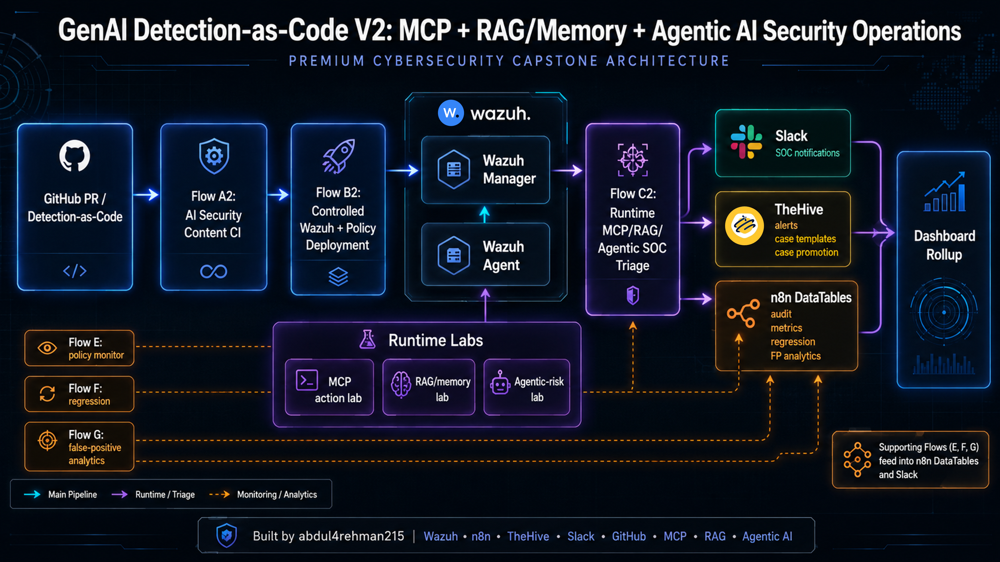
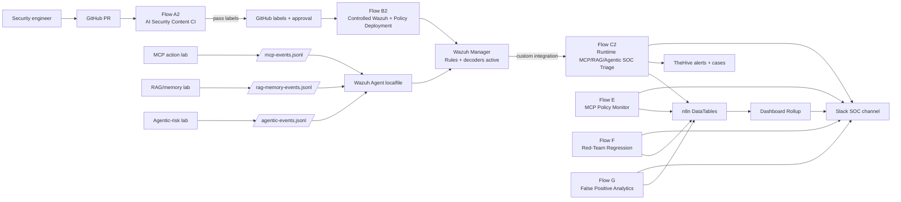
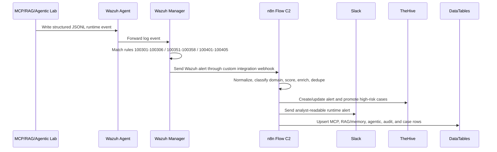

# 🧠 GenAI Detection-as-Code V2 — MCP, RAG/Memory, Agentic AI Security Operations

### Wazuh + n8n + TheHive + Slack + GitHub prototype for AI runtime security, detection CI/CD, policy deployment, regression analytics, and SOC posture metrics.

<p align="center">
  <a href="https://www.linkedin.com/in/abdul4rehman215/"></a>
  <a href="https://github.com/abdul4rehman215"></a>
  
  
  
</p>

<p align="center">
  
</p>

> **Architecture image note:** `resources/genai-detection-v2-master-architecture.png` is intentionally a placeholder path. Use the prompt in `resources/architecture-image-prompt.md` to generate the final hero image, then place it at that path.

---

## 🎯 Problem vs solution

Enterprise AI applications are no longer just chat boxes. Modern GenAI systems can call tools, read MCP resources, retrieve RAG context, write memory, request approvals, and execute multi-step agent plans. Traditional SOC pipelines usually detect host, network, cloud, and identity events — but the AI **action path** often stays inside the application layer.

This capstone MVP V2 extends the previous GenAI Detection-as-Code CI/CD project into a broader **AI Security Operations prototype**. V1 focused on prompt/output detection rules and a classic detection CI/CD lifecycle. V2 expands that model to protect the full GenAI runtime stack:

```text
prompt → agent plan → MCP tool discovery/call/result → RAG retrieval → memory write → approval decision → SOC triage
```

The prototype connects GitHub PR validation, controlled Wazuh deployment, runtime MCP/RAG/agentic detections, TheHive case handling, Slack notifications, n8n DataTables, regression tests, false-positive analytics, and dashboard metrics into one portfolio-ready security engineering system.

---

## 📑 Table of contents

- [What this project proves](#-what-this-project-proves)
- [Architecture](#-architecture)
- [Workflow map](#-workflow-map)
- [Repository layout](#-repository-layout)
- [Included artifacts](#-included-artifacts)
- [Zero-to-hero usage guide](#-zero-to-hero-usage-guide)
- [Data model](#-data-model)
- [Validation evidence](#-validation-evidence)
- [Production-hardening roadmap](#-production-hardening-roadmap)
- [Interview talking points](#-interview-talking-points)
- [Security notes](#-security-notes)

---

## 🧪 What this project proves

| Capability | Demonstrated by |
|---|---|
| 🧬 AI-security detection engineering | Wazuh custom decoders/rules for MCP, RAG/memory, and agentic runtime threats |
| 🔁 Detection-as-code | Flow A2 validates Wazuh XML, schemas, MCP policy, RAG policy, agentic policy, mappings, DataTable schemas, and replay harness results |
| 🚦 Controlled deployment | Flow B2 gates deployment using A2 pass labels, approval, and `/deploy-lab` before staging/activating Wazuh and policy bundles |
| 🧠 Runtime SOC triage | Flow C2 receives Wazuh alerts and creates Slack + TheHive + DataTable evidence for MCP/RAG/agentic events |
| 🧰 Direct policy monitoring | Flow E monitors MCP policy events directly from app/policy layer before full Wazuh integration |
| 🧪 Regression engineering | Flow F replays red-team event corpora and tracks expected rule misses/unexpected alerts |
| 📉 Tuning analytics | Flow G computes false-positive and closure analytics for noisy rules and recommendations |
| 📊 SOC posture board | Dashboard rollup aggregates CI, deployment, runtime, regression, and FP metrics |
| 🧾 Documentation-first portfolio | Five PDF reports, workflow exports, scripts, case templates, schemas, configs, interview notes, and troubleshooting guides |

---

## 🏗️ Architecture



### Runtime path



---

## 🗺️ Workflow map

| Folder | Workflow | Purpose | Status |
|---|---|---|---|
| `01-flow-a2-ai-security-content-ci/` | Flow A2 | GitHub PR-triggered AI-security CI gate | ✅ Tested PASS + FAIL |
| `02-flow-b2-controlled-wazuh-policy-deployment/` | Flow B2 | Controlled Wazuh + policy deployment | ✅ Tested BLOCKED + DEPLOYED |
| `03-flow-c2-runtime-mcp-rag-agentic-soc-triage/` | Flow C2 | Runtime SOC triage for MCP, RAG/memory, agentic AI | ✅ Tested C1/C2/C3 |
| `04-supporting-workflows-efg-dashboard-analytics/` | Flow E/F/G/Dashboard | Policy monitor, regression, FP analytics, metrics rollup | ✅ Tested support layer |
| `00-project-overview/` | Master overview | Project narrative, evidence pack, launch material | ✅ Portfolio-ready |

---

## 📁 Repository layout

```text
27-genai-detection-as-code-v2-mcp-rag-agentic-wazuh-n8n-thehive/
├── README.md
├── FILE_INDEX.md
├── SECURITY_NOTES.md
├── architecture-notes.txt
├── detailed-repo-layout.md
├── interview_qna.md
├── troubleshooting.md
├── 00-project-overview/
├── 01-flow-a2-ai-security-content-ci/
├── 02-flow-b2-controlled-wazuh-policy-deployment/
├── 03-flow-c2-runtime-mcp-rag-agentic-soc-triage/
├── 04-supporting-workflows-efg-dashboard-analytics/
├── _shared/
├── notes/
├── project-pdfs/
└── resources/
```

---

## 📦 Included artifacts

- ✅ Five premium project PDFs and DOCX files
- ✅ Final n8n workflow JSON exports
- ✅ Wazuh decoders and rules for MCP/RAG/agentic detections
- ✅ MCP, RAG/memory, and agentic demo lab code
- ✅ Runtime event generators and replay corpora
- ✅ Flow A2 CI validators and mapping files
- ✅ Flow B2 deployment runner, config template, and rollback helpers
- ✅ Flow E/F/G/Dashboard scripts and schemas
- ✅ TheHive case template copy-paste material
- ✅ DataTable schemas and evidence CSV exports
- ✅ Architecture notes, interview Q&A, troubleshooting, and production roadmap
- ✅ LinkedIn launch post pack and architecture image prompt

---

## 🚀 Zero-to-hero usage guide

This repository folder is designed as a **portfolio and implementation artifact**, not a one-command production installer. The exact lab was built on Wazuh, n8n, TheHive, Slack, and GitHub with remote SSH access to a Wazuh manager.

### 1. Import workflows

Import the final JSON files from each flow folder into n8n:

```text
01-flow-a2-ai-security-content-ci/n8n-workflows/
02-flow-b2-controlled-wazuh-policy-deployment/n8n-workflows/
03-flow-c2-runtime-mcp-rag-agentic-soc-triage/n8n-workflows/
04-supporting-workflows-efg-dashboard-analytics/n8n-workflows/
```

### 2. Configure credentials

Create n8n credentials for:

| Credential | Used by |
|---|---|
| GitHub API | Flow A2 and Flow B2 PR comments, labels, and PR state |
| Slack API | all analyst notifications |
| TheHive 5 API | Flow C2 alert/case creation and comments |
| SSH key / `.env.ci` | Flow A2 validation and Flow B2 deployment runners |

Use `_shared/config-templates/.env.ci.example` as the safe template. Do not commit real secrets.

### 3. Install Wazuh content

Use Flow B2 for controlled deployment, or manually review:

```text
03-flow-c2-runtime-mcp-rag-agentic-soc-triage/detections/wazuh/
```

### 4. Generate runtime evidence

Run the lab scripts under Flow C2:

```bash
python3 scripts/runtime/run_mcp_action_scenarios.py
python3 scripts/runtime/run_rag_memory_scenarios.py
python3 scripts/runtime/run_agentic_scenarios.py
```

### 5. Review SOC outputs

Validate evidence in:

- Slack SOC alert channel
- TheHive alerts/cases
- Wazuh alerts
- n8n execution logs
- n8n DataTables
- project PDFs under `project-pdfs/`

---

## 🧱 Data model

Key DataTables used by the prototype:

| Area | Tables |
|---|---|
| Flow A2 CI | `flow_a2_ci_runs`, `flow_a2_ci_changed_files`, `flow_a2_ci_stage_results`, `flow_v2_regression_runs` |
| Flow B2 deployment | `flow_b2_deployment_runs`, `flow_v2_policy_bundle_deployments` |
| Flow C2 MCP runtime | `flow_v2_mcp_runtime_events`, `flow_v2_mcp_policy_violations`, `flow_v2_mcp_case_promotions`, `flow_v2_mcp_audit_events` |
| Flow C2 RAG/memory | `flow_v2_rag_memory_events` |
| Flow C2 agentic | `flow_v2_agentic_incidents`, `flow_v2_agentic_plan_steps`, `flow_v2_agentic_policy_violations` |
| Supporting workflows | `flow_v2_mcp_policy_monitor_events`, `flow_v2_phase9_regression_runs`, `flow_v2_false_positive_analytics`, `flow_v2_rule_tuning_recommendations`, `flow_v2_dashboard_summary` |

---

## ✅ Validation evidence

The prototype was tested through:

- **A2 Test A1:** valid agentic-policy PR passed 13/13 stages.
- **A2 Test A2:** malformed/broken agentic-policy PR failed and applied fail labels.
- **B2 Test B1:** failed PR deployment was blocked before touching Wazuh.
- **B2 Test B2:** approved pass-labeled PR deployed Wazuh content and policy bundles.
- **C2 Test C1:** MCP runtime alert flowed into Slack, TheHive, and MCP DataTables.
- **C2 Test C2:** RAG/memory poisoning alert routed into the RAG/memory table after final routing fix.
- **C2 Test C3:** agentic goal/plan risk alert routed into agentic incident, plan, and policy tables.
- **Support tests:** Flow E, F, G, and dashboard rollup validated monitoring, regression, FP analytics, and metrics reporting.

---

## 🛡️ Security notes

This repo folder intentionally excludes live secrets, private SSH keys, Slack webhooks, GitHub PATs, Wazuh API passwords, and `.env.ci` runtime files. See `SECURITY_NOTES.md`.

---

## 🏭 Production-hardening roadmap

This is an MVP prototype. For production-grade use, improve:

- proper GitHub Actions or runner-host isolation for CI scripts
- stronger n8n credential isolation and environment management
- Wazuh rule lifecycle testing across multiple agents
- TheHive closure taxonomy standardization
- DataTable replacement with durable PostgreSQL or SIEM data lake
- automated false-positive sampling and analyst feedback loops
- per-rule unit tests and canary deployment before global rollout
- alert dedup strategy across multiple sessions/users/environments
- role-based deployment approvals and audit signing

---

## 🧑‍💼 Interview talking points

- “I extended a GenAI detection CI/CD prototype into an AI Security Operations platform that covers MCP, RAG/memory, and agentic AI runtime risk.”
- “Flow A2 validates AI-security content before deployment, Flow B2 gates deployment, and Flow C2 handles runtime SOC triage.”
- “The strongest part is Flow C2: one workflow handles three AI risk families and routes each to different DataTables, TheHive templates, and Slack summaries.”
- “I also built regression and false-positive analytics workflows because detections need measurement and tuning, not only alerts.”

---

## 👤 Author

Built and documented by **[abdul4rehman215](https://www.linkedin.com/in/abdul4rehman215/)** as a capstone-style SOC + AI Security automation MVP.
