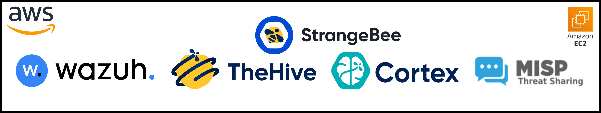

# 🛡️ SOC SOAR ECOSYSTEM AWS - End-to-End SOC Operations, Detection Engineering & Incident Response Portfolio

> SOC Operations • SOC Analyst Workflows • Detection Engineering • Incident Response • Threat Intelligence • SOAR Automation

<p align="center">
  
</p>

<p align="center">
  
### A complete **self-built, hands-on SOC/SOAR ecosystem portfolio on AWS** demonstrating practical blue-team capability across **detection, triage, investigation, response, threat detection & intelligence, automation, and security visualization**.

### This repository is **not a collection of isolated labs** — it is a **connected security operations environment** built from scratch to show how modern SOC workflows operate across multiple integrated projects.

</p>

<!--
<p align="center">
  A full <strong>project-based</strong>, <strong>self-built</strong>, and <strong>hands-on</strong> SOC/SOAR ecosystem portfolio created from scratch on AWS using open-source security tooling.
  <br>
  This repository is not a collection of isolated labs — it is a connected security operations environment covering
  <strong>detection</strong>, <strong>triage</strong>, <strong>investigation</strong>, <strong>response</strong>, <strong>threat intelligence</strong>, <strong>automation</strong>, and <strong>security visualization</strong>.
</p>
-->

---

<div align="center">

<!-- ===================== PLATFORM & STACK ===================== -->


<!-- ===================== SOC STACK ===================== -->


<!-- ===================== FOCUS AREAS ===================== -->


<!-- ===================== SCOPE & STATUS ===================== -->


<!-- ===================== REPO METADATA ===================== -->


</div>

---

# 🎯 Executive Summary

This repository presents a **full self-built SOC/SOAR ecosystem on AWS**, designed to demonstrate practical security engineering across the complete defensive workflow:

- ✅ **SOC architecture design and stack integration**
- ✅ **Detection engineering across endpoint, network, web, and cloud**
- ✅ **Incident response, case management, and threat intelligence workflows**
- ✅ **Security automation and active response pipelines**
- ✅ **Secure AWS infrastructure engineering using Terraform, IAM guardrails, Checkov scanning, remediation automation, AWS Config, GuardDuty, and VPC Flow Logs**
- ✅ **AI-assisted SOC alert triage and analyst reporting**
- ✅ **GenAI detection-as-code CI/CD for Wazuh using GitHub, n8n, OWASP LLM, MITRE ATLAS, TheHive, Slack, and audit tables**
- ✅ **GenAI Detection-as-Code V2 covering MCP tool security, RAG/memory poisoning, agentic AI risk detection, controlled deployment, regression testing, false-positive analytics, and SOC posture metrics**
- ✅ **Dashboard engineering for monitoring, ATT&CK visibility, and compliance posture**

This is **not a tool-installation showcase** and **not a collection of isolated mini-labs**.

It is a **project-based security operations portfolio** built from scratch to reflect how modern blue-team environments actually work:

**Detect → Enrich → Investigate → Respond → Share Intelligence → Automate → Visualize**

The repository demonstrates hands-on implementation using **Wazuh, TheHive, Cortex, MISP, Sysmon, Osquery, auditd, Suricata, Snort, Zeek, ModSecurity, Fail2Ban, CloudTrail, AWS Config, GuardDuty, Terraform, Checkov, GitHub PR automation, n8n, Gemini, Slack, OWASP LLM mapping, MCP/RAG/agentic AI-security telemetry, and MITRE ATT&CK/ATLAS-style context** across multiple connected projects.

---

# 📌 About This Repository

This repository contains a **complete AWS-based SOC/SOAR portfolio** built as a connected ecosystem of practical blue-team, detection engineering, incident response, and security automation projects.

Rather than treating each technology as a separate standalone setup, this portfolio shows how security tools work **together** in a realistic operational environment.

It includes hands-on work across:

- **Telemetry collection** from endpoint, network, cloud, and web sources
- **Detection engineering** using rules, decoders, thresholds, enrichment, and tuning
- **Threat hunting and investigation** using high-context telemetry and behavioral signals
- **Incident response and case management** using structured workflows
- **Threat intelligence enrichment and IOC sharing**
- **SOAR-style automation and AI-assisted triage**
- **Secure cloud infrastructure engineering using Terraform, IAM guardrails, assessment, remediation, and continuous monitoring**
- **AI application security, GenAI detection-as-code workflowing, MCP tool-risk monitoring, RAG/memory security, and agentic AI runtime governance**
- **Dashboards and security visualization** for analyst workflows and operational visibility

This portfolio is designed to reflect **real security operations thinking**, with a strong emphasis on implementation depth, workflow continuity, and documentation discipline.

---

# 🚀 What This Portfolio Demonstrates

This repository demonstrates practical capability across:

- **SOC stack deployment and architecture design on AWS**
- **Wazuh SIEM/XDR implementation and customization**
- **TheHive + Cortex + MISP integration for investigation and response**
- **Windows and Linux endpoint visibility with Sysmon, Osquery, and auditd**
- **Network detection engineering using Suricata, Snort, and Zeek**
- **Web security monitoring with Apache, NGINX, ModSecurity, and Fail2Ban**
- **Threat intelligence enrichment using VirusTotal and AlienVault OTX**
- **Active response workflows such as automated DNS sinkholing and IP blocking**
- **Cloud monitoring and security visibility using AWS CloudTrail**
- **Secure AWS infrastructure MVP design using Terraform, public/private subnet separation, bastion access, IAM least privilege, encrypted logging, Checkov scanning, remediation scripts, AWS Config, GuardDuty, and VPC Flow Logs**
- **AI-driven SOC alert triage automation using Wazuh + n8n + Gemini**
- **GenAI application-security detection-as-code using GitHub PR validation, controlled Wazuh deployment, runtime guardrail telemetry, OWASP LLM mapping, MITRE ATLAS context, Slack, TheHive, and n8n DataTables**
- **MCP, RAG/memory, and agentic AI security operations using Wazuh custom rules, n8n Flow C2 triage, Slack, TheHive, DataTables, regression testing, false-positive analytics, and dashboard rollups**
- **Dashboard engineering for threat monitoring, MITRE ATT&CK coverage, and compliance reporting**
- **Structured project documentation including configs, scripts, notes, troubleshooting, and interview-ready explanations**

---

# 👥 Who This Repository Is For

This repository is especially useful for:

- **Recruiters and hiring managers** evaluating practical blue-team and security engineering work
- **SOC Analyst (Tier 1 / Tier 2) learners**
- **Detection Engineering and SIEM engineering learners**
- **Blue Team and defensive security practitioners**
- **Incident Response / DFIR learners**
- **Threat hunting and security monitoring learners**
- **Security automation and SOAR learners**
- **Anyone building an open-source SOC/SOAR portfolio on AWS**

It is intended for readers who want to see **hands-on implementation, real workflow thinking, and end-to-end security project execution** rather than only conceptual summaries.

---

# 🧭 Architecture Snapshot

<p align="center">
  
</p>

### High-Level Workflow


---

# 🚀 Why This Repository Stands Out

### ✅ It is a connected ecosystem, not random isolated labs
Projects are designed as parts of a larger SOC workflow.

### ✅ It goes beyond “tool installation”
The portfolio includes detection logic, enrichment flows, response steps, analyst workflow, and case lifecycle thinking.

### ✅ It shows breadth across multiple security domains
Endpoint, network, web, cloud, threat intel, dashboards, and automation are all covered.

### ✅ It includes portfolio-grade capstones
The repository contains six strong flagship implementations:
- **SOC + SOAR malware incident response capstone**
- **AI-driven SOC alert triage automation**
- **AWS IAM identity security automation capstone**
- **Secure AWS infrastructure MVP with Terraform, IAM hardening, scanning, remediation, AWS Config, GuardDuty, and VPC Flow Logs**
- **GenAI detection-as-code CI/CD for Wazuh, n8n, OWASP LLM, MITRE ATLAS, Slack, and TheHive**
- **GenAI Detection-as-Code V2 for MCP, RAG/memory, and agentic AI security operations with regression, false-positive analytics, and SOC posture metrics**

### ✅ It reflects analyst and engineering discipline
Many projects include:
- architecture notes
- commands and configurations
- troubleshooting
- custom scripts
- Q&A / interview notes
- artifact folders
- implementation walkthroughs

---

# 🌟 Featured Portfolio Highlights

## 1. 🧠 Full SOC + SOAR Malware Incident Response Capstone
**[19-capstone-soc-soar-malware-incident-response](./19-capstone-soc-soar-malware-incident-response/)**

A full end-to-end capstone that covers:
- Windows malware behavior detection using Sysmon + Wazuh
- triage and true-positive validation
- case creation in TheHive
- enrichment through Cortex
- MITRE ATT&CK mapping
- IOC validation and publishing to MISP
- structured incident response lifecycle execution

**Subprojects**
- [Part 1 — Windows Malware Detection & Analysis](./19-capstone-soc-soar-malware-incident-response/part01-windows-malware-detection-and-analysis/)
- [Part 2 — Incident Response, Case Management & Threat Intelligence](./19-capstone-soc-soar-malware-incident-response/part02-incident-response-case-management-threat-intel/)

---

## 2. 🤖 AI-Driven SOC Alert Triage Automation
**[20-ai-driven-soc-alert-triage-automation](./20-ai-driven-soc-alert-triage-automation/)**

A modern SOC automation pipeline using:
- Wazuh alert forwarding
- n8n workflow orchestration
- JavaScript alert normalization
- Gemini-based triage summarization
- HTML email formatting
- analyst-ready severity-colored reporting

---
## 3. ☁️ AWS IAM Identity Security Automation Capstone
**[24-aws-iam-identity-security-automation-capstone](./24-aws-iam-identity-security-automation-capstone/)**

A four-flow cloud identity security automation capstone covering:
- AWS identity finding triage and enrichment
- IAM access-key containment with analyst actioning
- scheduled IAM hygiene monitoring and proactive alerting
- TheHive 5 alert and case lifecycle integration
- Slack and DataTable operational tracking
- closure-state synchronization back into tracking

---

## 4. 🏰 Secure AWS Infrastructure MVP
**[25-aws-secure-infrastructure-mvp](./25-aws-secure-infrastructure-mvp/)**

A secure-by-design AWS infrastructure MVP covering:
- Terraform-based VPC, public/private subnet, routing, bastion, and private workload architecture
- IAM least-privilege automation, MFA-based audit role design, and policy review logic
- Checkov and AWS CLI-style security assessment workflow
- scripted remediation for S3 encryption, password policy, CloudTrail, and security group exposure
- continuous monitoring using CloudTrail, VPC Flow Logs, AWS Config, GuardDuty, EventBridge, and SNS
- professional project packaging with diagrams, evidence artifacts, scripts, and long-form report

---

## 5. 🧬 GenAI Detection-as-Code CI/CD for Wazuh, n8n, TheHive & OWASP LLM
**[26-genai-detection-as-code-cicd-wazuh-n8n-thehive](./26-genai-detection-as-code-cicd-wazuh-n8n-thehive/)**

A next-level AI-security SOC automation capstone covering:
- GitHub pull-request validation for Wazuh XML, Sigma, metadata, mappings, and replay logic
- controlled Wazuh manager deployment with approval gates, backup, staging, restart, postdeploy validation, and rollback path
- runtime GenAI telemetry from an AI demo app into Wazuh localfile monitoring
- custom Wazuh rules for direct prompt injection, indirect prompt injection, and improper output handling
- n8n triage enrichment with OWASP LLM and MITRE ATLAS context
- Slack analyst alerts, TheHive 5 alert/case/comment lifecycle, dashboard event collection, error dead-lettering, and case closure synchronization

---

## 6. 🧠 GenAI Detection-as-Code V2 — MCP, RAG/Memory & Agentic AI Security Operations
**[27-genai-detection-as-code-v2-mcp-rag-agentic-wazuh-n8n-thehive](./27-genai-detection-as-code-v2-mcp-rag-agentic-wazuh-n8n-thehive/)**

A capstone MVP V2 extension of the GenAI detection-as-code work, focused on the modern AI action path rather than only prompt/output detection. It covers:
- GitHub-driven **Flow A2** validation for AI-security content, Wazuh rules, schemas, MCP policies, RAG/memory policies, agentic policies, mappings, DataTables, and replay harness evidence
- **Flow B2** controlled Wazuh + AI policy deployment with labels, approval, `/deploy-lab`, backup, staging, restart, postdeploy validation, and rollback-aware reporting
- **Flow C2** runtime SOC triage for MCP tool misuse, RAG/memory poisoning, and agentic AI risks through Wazuh → n8n → Slack → TheHive → DataTables
- supporting engineering workflows for direct MCP policy monitoring, red-team replay regression, false-positive analytics, and SOC metrics rollup
- five premium PDF project reports, workflow exports, rules/decoders, scripts, DataTable schemas, case templates, interview notes, and troubleshooting guides

This project extends the previous GenAI CI/CD capstone from **prompt/output security** into **MCP + RAG/memory + agentic AI security operations**.

---

## 7. 🌐 Detection Engineering Across Endpoint, Network, Web, and Cloud
The repository includes practical projects around:
- SSH brute-force detection
- HTTP anomaly detection using OpenSearch ML
- Windows and Linux Sysmon detection engineering
- CloudTrail monitoring
- Suricata / Snort / Zeek integration
- ModSecurity WAF monitoring
- DNS hunting, enrichment, and sinkholing
- auditd credential access hunting
- Osquery endpoint visibility

---

## 8. 📊 Dashboard Engineering and Visibility Projects
**[21-dashboards](./21-dashboards/)** contains dedicated security visualization work for:
- SOC threat monitoring
- MITRE ATT&CK coverage
- CIS / compliance posture visibility

---

# 🗂️ Project Index

> Click any lab title to jump directly to its folder.

---

# 🗂 Projects Overview

## 🧱 Section 1: Platform Buildout & Core SOC Architecture

<div align="left">


</div>

Buildout of the full AWS-based SOC/SOAR foundation, covering infrastructure deployment, stack integration, and core workflow design.

| ID | Project | Focus Area | What It Covers |
|---|---|---|---|
| 00 | [Installation & Setup Guide](./00-installation-and-setup-guide/) | Stack deployment | AWS EC2, Docker, Wazuh, TheHive, MISP, Cortex, agents, and tool integrations |
| 01 | [Core SOC Ecosystem on AWS](./01-core-soc-ecosystem/) | Architecture & workflow | Detect → Enrich → Investigate → Manage operating model across the full SOC stack |

### 🧠 Skills Demonstrated
- AWS EC2 security lab deployment
- Dockerized security platform setup
- Wazuh, TheHive, Cortex, and MISP integration
- SOC pipeline architecture thinking
- End-to-end platform assembly from scratch

---

## 🛡️ Section 2: Detection Engineering, Monitoring & Threat Validation

<div align="left">


</div>

Detection-focused projects covering alert logic, telemetry engineering, monitoring pipelines, enrichment, and validation across multiple sources.

| ID | Project | Focus Area | What It Covers |
|---|---|---|---|
| 02 | [SSH Brute Force Detection & Real-Time Alerting](./02-wazuh-ssh-bruteforce-alerting-setup/) | Authentication abuse detection | Threshold-based Wazuh alerting, source-IP grouping, Slack notifications |
| 03 | [Real SSH Brute Force Incident Response](./03-real-ssh-bruteforce-incident-response/) | Detection → IR workflow | Triage, investigation, containment, TheHive case management, MISP sharing |
| 04 | [Behavior-Based HTTP Anomaly Detection](./04-behavior-based-http-anomaly-detection/) | ML-assisted anomaly detection | OpenSearch ML, anomaly-based web behavior monitoring, Slack + TheHive escalation |
| 05 | [Wazuh + Sysmon Advanced Windows Monitoring](./05-wazuh-sysmon-windows/) | Windows endpoint detection | PowerShell, LOLBins, DNS C2, LSASS access, custom Sysmon visibility |
| 06 | [AWS CloudTrail EC2 Monitoring with Wazuh](./06-aws-cloudtrail-ec2-monitoring-wazuh/) | Cloud security monitoring | CloudTrail ingestion, EC2 action visibility, cloud-centric SOC monitoring |
| 07 | [Sysmon for Linux + Wazuh SIEM](./07-sysmon-linux-endpoint-detection/) | Linux detection engineering | Sysmon for Linux telemetry, decoding, custom rules, noise reduction |
| 08 | [Suricata IDS + Wazuh SIEM](./08-suricata-network-threat-detection/) | Network IDS integration | Suricata alerts, decoders, rules, MITRE enrichment, SOC-ready parsing |
| 09 | [Wazuh + VirusTotal Integration](./09-wazuh-virustotal-integration/) | Threat intel enrichment | FIM + VirusTotal validation + active response + TheHive visibility |

### 🧠 Skills Demonstrated
- Authentication abuse detection engineering
- Alert thresholding and noise reduction
- Endpoint telemetry engineering on Windows and Linux
- CloudTrail monitoring and SIEM ingestion
- Network IDS parsing and alert correlation
- Threat intelligence enrichment and validation
- SOC alert escalation into response workflows

---

## 🌐 Section 3: Web Security, Threat Hunting & Active Response

<div align="left">


</div>

Projects focused on WAF monitoring, hunting workflows, automated containment, DNS-driven investigation, endpoint context, and NSM-style visibility.

| ID | Project | Focus Area | What It Covers |
|---|---|---|---|
| 10 | [Apache + ModSecurity + Wazuh](./10-apache-wazuh-modsecurity-waf/) | Web application security monitoring | Apache WAF deployment, OWASP CRS, web attack telemetry into Wazuh |
| 11 | [NGINX + ModSecurity + Wazuh](./11-nginx-wazuh-modsecurity-waf/) | Web layer detection engineering | NGINX WAF build, active blocking, SOC visibility, MITRE mapping |
| 12 | [Fail2Ban + ModSecurity IP Blocking](./12-fail2ban-modsecurity-ip-block/) | Automated containment | Repeated attack detection, automatic host-level IP blocking, containment workflow |
| 13 | [DNS Threat Hunting Project](./13-dns-threat-hunting-project/) | DNS hunting & enrichment | Sysmon DNS telemetry, DNS-Stats, AlienVault OTX, enriched alerting |
| 14 | [Automated DNS Sinkholing](./14-automated-dns-sinkholing-wazuh/) | Active response automation | Detection → validation → sinkholing → endpoint-level malicious domain blocking |
| 15 | [Osquery Endpoint Visibility](./15-osquery-endpoint-visibility-wazuh/) | Endpoint instrumentation | SQL-based endpoint telemetry, visibility expansion, Wazuh integration |
| 16 | [Snort IDS + Wazuh Integration](./16-snort-ids-wazuh-integration/) | Signature-based network detection | Custom Snort rules, attack simulation, Wazuh monitoring pipeline |
| 17 | [Zeek Network Monitoring + Wazuh](./17-zeek-network-monitoring-wazuh/) | Network security monitoring | DNS, TLS, rejected connections, scan behavior, NSM-style visibility |
| 18 | [Auditd Credential Access Hunting](./18-auditd-wazuh-credential-access-hunting/) | Linux credential access hunting | auditd rules, exec monitoring, key file access telemetry, Wazuh custom rules |

### 🧠 Skills Demonstrated
- Web application firewall deployment and tuning
- Layer 7 attack monitoring and analysis
- Automated blocking and active response design
- DNS-based threat hunting and IOC enrichment
- Endpoint instrumentation and investigative telemetry
- Signature IDS + network security monitoring integration
- Linux kernel-level audit telemetry and credential-access detection

---

## 🚀 Section 4: Capstones, Automation, Dashboards & Portfolio Extensions

<div align="left">


</div>

Flagship portfolio work covering end-to-end SOC/SOAR execution, AI-assisted automation, dashboarding, platform exploration, and supporting security research.

| ID | Project | Focus Area | What It Covers |
|---|---|---|---|
| 19 | [SOC + SOAR Malware Incident Response Capstone](./19-capstone-soc-soar-malware-incident-response/) | Full IR lifecycle | Detection, case management, Cortex enrichment, MISP sharing, reporting |
| 20 | [AI-Driven SOC Alert Triage Automation](./20-ai-driven-soc-alert-triage-automation/) | SOAR-style automation | Wazuh → n8n → Gemini → analyst-ready email triage workflow |
| 21 | [Wazuh Dashboard Engineering & Security Visualization](./21-dashboards/) | Dashboard engineering | Dedicated dashboards for threat monitoring, ATT&CK coverage, and compliance, plus additional project-embedded dashboards in SSH brute-force, Suricata, and Zeek workflows |
| 22 | [Wazuh Module Exploration & Learning Projects](./22-learning-projects/) | Structured feature exploration | IT hygiene, threat hunting, discover indices, vulnerability detection exploration |
| 23 | [Other Projects](./23-other-projects/) | Supporting research & tuning work | Supplementary PDFs around rule tuning and detection refinement |
| 24 | [AWS IAM Identity Security Automation Capstone](./24-aws-iam-identity-security-automation-capstone/) | Cloud identity security automation capstone | Four-flow prototype for AWS identity triage, IAM containment, hygiene monitoring, TheHive integration, and closure sync |
| 25 | [Secure AWS Infrastructure MVP](./25-aws-secure-infrastructure-mvp/) | Secure cloud infrastructure engineering MVP | Terraform VPC segmentation, bastion/private subnet design, IAM least privilege, Checkov scanning, remediation automation, CloudTrail, VPC Flow Logs, AWS Config, GuardDuty, and portfolio report packaging |
| 26 | [GenAI Detection-as-Code CI/CD for Wazuh, n8n, TheHive & OWASP LLM](./26-genai-detection-as-code-cicd-wazuh-n8n-thehive/) | AI security + detection-as-code capstone | GitHub PR CI, Wazuh controlled deployment, AI-demo runtime telemetry, OWASP LLM/ATLAS enrichment, Slack, TheHive cases, audit tables, dashboard collector, error handling, and closure sync |
| 27 | [GenAI Detection-as-Code V2 — MCP, RAG/Memory & Agentic AI Security Operations](./27-genai-detection-as-code-v2-mcp-rag-agentic-wazuh-n8n-thehive/) | Advanced AI security operations capstone | Flow A2 AI-security CI, Flow B2 controlled Wazuh/policy deployment, Flow C2 MCP/RAG/agentic runtime triage, Flow E policy monitor, Flow F regression replay, Flow G false-positive analytics, SOC dashboard rollup, TheHive case templates, Slack evidence, DataTables, Wazuh rules/decoders, and project reporting |

### 🧠 Skills Demonstrated
- Full SOC + SOAR case lifecycle execution
- AI-assisted alert triage and decision support
- Cloud identity security automation and orchestration
- Secure AWS infrastructure design, Terraform provisioning, IAM hardening, assessment, remediation, and continuous monitoring
- GenAI application-security telemetry and prompt-injection detection engineering
- MCP, RAG/memory, and agentic AI runtime security workflowing
- Detection-as-code CI/CD and controlled Wazuh deployment governance
- TheHive alert-to-case lifecycle synchronization
- Dashboard engineering for analyst workflows
- Threat intel lifecycle thinking
- Detection tuning and portfolio documentation depth
- Structured security learning and feature exploration

---

# 🧩 Subproject Highlights

## 📂 Dashboard & Visualization Projects

This repository includes both **dedicated dashboard engineering projects** and **project-specific operational dashboards** built inside specific detection and incident-response workflows.

Some dashboards live inside their related project folders because they are tightly coupled to the telemetry, use case, and operational scenario of that project.

### 1) Dedicated Dashboard Engineering Project
Inside **[21-dashboards](./21-dashboards/)**:

- [01 — SOC Threat Monitoring Dashboard](./21-dashboards/01-soc-threat-monitoring-dashboard/)
- [02 — SOC MITRE ATT&CK Coverage Dashboard](./21-dashboards/02-soc-mitre-attack-coverage-dashboard/)
- [03 — SOC Compliance & CIS Benchmark Dashboard](./21-dashboards/03-soc-compliance-cis-benchmark-dashboard/)

### Additional Dashboards Embedded in Projects
These dashboards are stored inside individual project folders because they support that specific detection, monitoring, or incident-response workflow:

- [03 — SOC SSH Brute Force Incident Analysis Dashboard (NDJSON)](./03-real-ssh-bruteforce-incident-response/SOC%20%E2%80%93%20SSH%20Brute%20Force%20Incident%20Analysis.ndjson)
- [08 — Suricata Network Threat Detection Dashboard](./08-suricata-network-threat-detection/dashboard-agent-group/)
- [17 — Zeek Network Security Monitoring & Threat Hunting Dashboard](./17-zeek-network-monitoring-wazuh/dashboards/)

### 🧠 What These Dashboards Cover

Across the repository, dashboard work supports:

- **SOC threat monitoring and alert visibility**
- **MITRE ATT&CK coverage visualization**
- **Compliance and CIS benchmark monitoring**
- **Suricata-based network threat visibility**
- **Zeek-based network security monitoring and threat hunting**
- **SSH brute-force incident analysis and operational visibility**

> This gives the portfolio both **centralized dashboard engineering depth** and **use-case-specific operational dashboards** embedded directly inside relevant projects.

---

## 📚 Learning Exploration Projects

These projects extend the portfolio beyond implementation by focusing on **feature understanding, analyst thinking, platform depth, and practical use-case exploration**.

Inside **[22-learning-projects](./22-learning-projects/)**:

- [01 — IT Hygiene Module Exploration](./22-learning-projects/01-it-hygiene-module-exploration/)
- [02 — Threat Hunting Module Exploration](./22-learning-projects/02-threat-hunting-module-exploration/)
- [03 — Discover Indices Exploration](./22-learning-projects/03-exploring-discovery-indexes/)
- [04 — Vulnerability Detection Module Exploration](./22-learning-projects/04-vulnerability-detection-module-exploration/)

### 🧠 What These Learning Projects Cover

Across this section, the learning projects support:

- **Deeper Wazuh platform understanding**
- **Analyst-focused feature exploration**
- **Threat hunting visibility and workflow awareness**
- **Security data discovery and index-level understanding**
- **Vulnerability detection module exploration and practical value**
- **Better appreciation of underused but high-impact SOC capabilities**

> This gives the portfolio not only **implementation depth**, but also **feature-level platform understanding** that strengthens analyst reasoning, investigation quality, and overall SOC maturity.

---

# 🏁 Flagship Capstone Projects

These flagship projects represent the **strongest end-to-end portfolio work** in this repository.  
Together, they show practical capability across **SOC operations, detection engineering, case management, threat intelligence, automation, and analyst-ready reporting**.

## 🚨 Flagship Capstone 01 — End-to-End SOC + SOAR Malware Incident Response (Project 19)

<div align="center">

`Detect` ➜ `Analyze` ➜ `Escalate` ➜ `Enrich` ➜ `Investigate` ➜ `Contain` ➜ `Share IOCs`

</div>

<div align="center">


</div>

### 🧩 Integrated Components Used

- **Windows Endpoint + Sysmon** for malware-behavior telemetry
- **Wazuh** for detection, correlation, and alert generation
- **TheHive** for case creation, incident tracking, and analyst workflow
- **Cortex** for observable enrichment and investigation support
- **MISP** for IOC sharing and threat intelligence feedback loop
- **Structured notes, timelines, IOC tracking, and response documentation** for full case lifecycle handling

### 🎯 What This Capstone Simulates

This capstone represents a **realistic SOC-to-IR escalation workflow** where suspicious endpoint activity is:

- detected through endpoint telemetry
- validated and triaged as a true security event
- escalated into structured case management
- enriched with investigation context and observables
- mapped into the incident response lifecycle
- converted into intelligence that can be shared back into the ecosystem

It is a full **Detect → Investigate → Respond → Share Intelligence** portfolio implementation.

### ✅ Outcome Statement

This project demonstrates the ability to execute a **complete SOC + SOAR malware incident response workflow** from endpoint detection to investigation, containment, documentation, and validated IOC sharing.

**Project link:** [19-capstone-soc-soar-malware-incident-response](./19-capstone-soc-soar-malware-incident-response/)

---

## 🤖 Flagship Capstone 02 — AI-Driven SOC Alert Triage Automation (Project 20)

<div align="center">

`Receive Alert` ➜ `Normalize` ➜ `Orchestrate` ➜ `AI Triage` ➜ `Format Report` ➜ `Notify Analyst`

</div>

<div align="center">


</div>

### 🧩 Integrated Components Used

- **Wazuh custom integration** for forwarding alerts
- **n8n workflow automation** for orchestration
- **JavaScript normalization logic** for structured payload cleanup
- **Gemini AI prompt engineering** for security-focused triage summarization
- **HTML report formatting** for analyst-friendly severity-based output
- **SMTP / email delivery pipeline** for direct notification workflow

### 🎯 What This Capstone Simulates

This project represents a **modern SOC automation workflow** where raw alerts are transformed into analyst-ready intelligence by:

- receiving live security alerts from Wazuh
- cleaning and structuring the alert payload
- routing the event through an automation workflow
- generating AI-assisted triage summaries
- converting analysis into readable HTML reporting
- delivering concise actionable output to the analyst

It is a full **Alert → Context → Triage → Reporting** automation pipeline.

### ✅ Outcome Statement

This project demonstrates the ability to build a **practical AI-assisted SOC alert triage workflow** that reduces analyst effort, improves context delivery, and shows strong security automation thinking.

**Project link:** [20-ai-driven-soc-alert-triage-automation](./20-ai-driven-soc-alert-triage-automation/)

---

## ☁️ Flagship Capstone 03 — AWS IAM Identity Security Automation (Project 24)

<div align="center">

`Ingest Finding` ➜ `Enrich Identity Context` ➜ `Contain Access` ➜ `Open / Promote Case` ➜ `Monitor Hygiene` ➜ `Sync Closure`

</div>

<div align="center">


</div>

### 🧩 Integrated Components Used

- **AWS GuardDuty / Security Hub / IAM / CloudTrail** for detection source, identity context, and audit trail validation
- **n8n** for multi-flow orchestration, normalization, branching, and scheduled automation
- **Slack** for analyst-facing triage, containment, hygiene, and closure notifications
- **TheHive 5** for alert creation, case promotion, and closure-state handling
- **n8n Data Tables** for lightweight operational state tracking
- **IAM credential report parsing** for scheduled hygiene review and proactive issue generation

### 🎯 What This Capstone Simulates

This capstone represents a **cloud identity security operations workflow** where AWS identity findings are:

- ingested and normalized from identity-focused AWS detections
- enriched with IAM and CloudTrail context before analyst action
- optionally contained through access-key deactivation flows
- pushed into TheHive for alerting and case handling
- expanded with proactive hygiene monitoring for missing MFA and stale credential issues
- synchronized back into tracking once the case lifecycle is closed

It is a full **Detect → Enrich → Contain → Track → Close** cloud identity automation implementation.

### ✅ Outcome Statement

This project demonstrates the ability to build a **multi-workflow AWS identity security automation capstone** that connects cloud detections, analyst notifications, ticketing, hygiene monitoring, and closure synchronization into one coherent SOC prototype.

**Project link:** [24-aws-iam-identity-security-automation-capstone](./24-aws-iam-identity-security-automation-capstone/)

---

## 🏰 Flagship Capstone 04 — Secure AWS Infrastructure MVP (Project 25)

<div align="center">

`Architect` ➜ `Harden` ➜ `Validate` ➜ `Remediate` ➜ `Monitor`

</div>

<div align="center">


</div>

### 🧩 Integrated Components Used

- **Terraform** for VPC, subnet, routing, EC2, security group, S3, and CloudTrail infrastructure-as-code
- **AWS IAM** for least-privilege roles, MFA-based audit trust policy, instance profile design, and policy review logic
- **AWS CLI / Python / boto3** for security assessment, IAM automation, remediation, AWS Config, and GuardDuty setup
- **Checkov** for infrastructure security scanning and repeatable validation
- **CloudTrail, VPC Flow Logs, AWS Config, GuardDuty, EventBridge, and SNS** for continuous visibility and alerting
- **Diagrams, evidence artifacts, and long-form report** for professional portfolio documentation and interview walkthrough

### 🎯 What This Capstone Simulates

This capstone represents a **secure-by-design AWS foundation** where a small cloud environment is treated as a layered defensive system instead of a flat lab deployment.

It demonstrates how cloud infrastructure can be:

- architected with public/private subnet separation and controlled entry paths
- hardened with encrypted storage, restricted SSH, least-privilege IAM, and centralized logging
- assessed with repeatable scanning and configuration checks
- remediated with Python automation for common misconfigurations
- monitored continuously through CloudTrail, VPC Flow Logs, AWS Config, and GuardDuty
- documented as an interview-ready security engineering MVP

### ✅ Outcome Statement

This project demonstrates the ability to build a **production-minded AWS security infrastructure MVP** that connects architecture, hardening, validation, remediation, and monitoring into one clear cloud security engineering prototype.

**Project link:** [25-aws-secure-infrastructure-mvp](./25-aws-secure-infrastructure-mvp/)

---

## 🧬 Flagship Capstone 05 — GenAI Detection-as-Code CI/CD for Wazuh (Project 26)

**[26-genai-detection-as-code-cicd-wazuh-n8n-thehive](./26-genai-detection-as-code-cicd-wazuh-n8n-thehive/)**

<div align="left">


</div>

This capstone extends the portfolio into modern **AI application security operations** by building a complete GenAI runtime detection and detection-engineering pipeline around Wazuh, GitHub, n8n, Slack, TheHive, and structured audit tables.

It is organized as a multi-workflow prototype:

- **Flow A — Detection CI validation:** GitHub pull request workflow for Wazuh XML, Sigma, metadata, mapping, staging, and replay validation.
- **Flow B — Controlled Wazuh deployment:** gated deployment path with approval signals, backup, checkout, staging, predeploy checks, activation, restart, postdeploy validation, and rollback path.
- **Flow C — Runtime GenAI triage:** AI demo app telemetry → Wazuh detection → n8n enrichment → Slack → TheHive alert/case/comment lifecycle → audit/dashboard rows.
- **Supporting workflows:** SOC dashboard event collector, global error/dead-letter handler, and TheHive case closure sync.

### 🧩 Integrated Components Used

- **GitHub PR events and labels** for detection-as-code workflow control
- **Wazuh manager and Wazuh agent** for rule validation and runtime GenAI alerting
- **Custom Wazuh rules/decoder** for prompt injection and unsafe output handling patterns
- **n8n** for CI validation, deployment orchestration, triage automation, dashboard events, and closure sync
- **OWASP LLM Top 10 and MITRE ATLAS-style mapping** for AI-security context
- **Slack** for analyst notification and operational evidence
- **TheHive 5** for alert creation, update-before-create logic, case promotion, comments, templates, and case closure synchronization
- **n8n DataTables** for CI runs, changed files, stage results, deployments, runtime alerts, audit events, case promotions, closure sync, dead letters, and dashboard metrics
- **AI demo app** producing structured guardrail telemetry for Wazuh localfile ingestion

### 🎯 What This Capstone Simulates

This capstone represents a production-style **AI-security detection engineering pipeline** where GenAI runtime risks are treated as first-class SOC telemetry:

- detection changes are validated before being merged or deployed
- Wazuh content deployment is controlled by CI status, labels, approval, and deploy signals
- AI-app guardrail events are detected by Wazuh rules and routed to n8n
- high-risk prompt-injection alerts are enriched, tracked, and promoted to TheHive cases
- runtime triage outcomes are sent to Slack and written into audit/dashboard tables
- closed TheHive cases synchronize back into the operational tracking layer

It is a full **Detection-as-Code → Controlled Deployment → Runtime Detection → Case Lifecycle → Audit Dashboard** implementation for GenAI security operations.

### ✅ Outcome Statement

This project demonstrates the ability to build an advanced **GenAI security SOC automation capstone** that connects detection engineering, CI/CD validation, Wazuh deployment safety, AI runtime telemetry, analyst notification, TheHive case handling, and operational auditability into one coherent MVP prototype.

**Project link:** [26-genai-detection-as-code-cicd-wazuh-n8n-thehive](./26-genai-detection-as-code-cicd-wazuh-n8n-thehive/)

---

## 🧠 Flagship Capstone 06 — GenAI Detection-as-Code V2 — MCP, RAG/Memory & Agentic AI Security Operations (Project 27)

**[27-genai-detection-as-code-v2-mcp-rag-agentic-wazuh-n8n-thehive](./27-genai-detection-as-code-v2-mcp-rag-agentic-wazuh-n8n-thehive/)**

<div align="left">


</div>

This capstone is the **MVP V2 expansion** of the previous GenAI detection-as-code project. The earlier V1 implementation focused on AI-app prompt/output telemetry, detection CI/CD, controlled Wazuh deployment, TheHive case lifecycle, and audit/dashboard flows. V2 expands that model into the full GenAI action path:

```text
prompt → agent plan → MCP tool discovery/call/result → RAG retrieval → memory write → approval decision → SOC triage
```

It is organized as a multi-workflow AI Security Operations prototype:

- **Flow A2 — AI Security Content CI:** validates Wazuh XML, Sigma, metadata, MCP manifest/policy bundle, tool-schema hashes, prompt policies, RAG/memory policies, agentic policies, case-template mappings, rule-family maps, DataTable schemas, and replay harness results.
- **Flow B2 — Controlled Wazuh + Policy Deployment:** gates deployment using A2 pass labels, approval, and `/deploy-lab`, then stages Wazuh rules/decoders and policy bundles with backup, activation, postdeploy validation, and rollback-aware reporting.
- **Flow C2 — Runtime MCP/RAG/Agentic SOC Triage:** processes Wazuh alerts for MCP tool misuse, RAG/memory poisoning, and agentic AI risk into Slack, TheHive alerts/cases/comments, and domain-specific DataTables.
- **Supporting workflows:** Flow E MCP runtime policy monitor, Flow F red-team replay/regression harness, Flow G false-positive analytics, and SOC dashboard V2 metrics rollup.

### 🧩 Integrated Components Used

- **GitHub PR events, labels, comments, and approval signals** for AI-security content governance
- **Wazuh rules and decoders** for MCP, RAG/memory, and agentic AI runtime events
- **n8n production workflows** for CI, deployment, runtime triage, analytics, and dashboard rollups
- **TheHive 5** alert/case templates, comments, sourceRef deduplication, and case-promotion evidence
- **Slack** for analyst-readable CI, deployment, runtime, regression, tuning, and dashboard notifications
- **n8n DataTables** for CI runs, deployments, MCP runtime events, RAG/memory events, agentic incidents, policy violations, regression runs, false-positive analytics, and dashboard metrics
- **Local demo labs** for MCP action security, RAG/memory poisoning, and agentic AI plan/approval misuse scenarios
- **Python, Bash, JavaScript, JSON, YAML, XML, and CSV artifacts** for scripts, policies, schemas, mappings, configs, rules, and validation fixtures

### 🎯 What This Capstone Simulates

This capstone represents a prototype SOC program for AI systems where GenAI applications are treated as operational security assets, not only model prompts.

It demonstrates how an AI-security workflow can:

- validate detection/policy changes before deployment
- gate Wazuh and policy-bundle deployment through approvals and CI labels
- detect risky MCP tool calls, RAG/memory poisoning, and agentic plan drift
- route alerts into Slack and TheHive with case templates and analyst context
- store runtime and governance evidence in DataTables
- replay red-team corpora to prevent rule regressions
- use closure and false-positive data to improve tuning
- summarize operational posture through dashboard rollup metrics

It is a full **AI Security Content CI → Controlled Deployment → Runtime MCP/RAG/Agentic Detection → Case Handling → Regression → False-Positive Analytics → SOC Metrics** implementation.

### ✅ Outcome Statement

This project demonstrates the ability to build a modern **GenAI / AI Security Operations capstone** that extends detection engineering into MCP, RAG/memory, and agentic AI security while preserving SOC-grade evidence, workflow governance, analyst notification, TheHive case handling, and measurable operational metrics.

**Project link:** [27-genai-detection-as-code-v2-mcp-rag-agentic-wazuh-n8n-thehive](./27-genai-detection-as-code-v2-mcp-rag-agentic-wazuh-n8n-thehive/)

---

## 🌟 Why These Flagship Capstones Matter

Together, these flagship projects show:

- **traditional SOC depth** through detection, investigation, incident response, and intelligence sharing
- **modern SOC capability** through automation, orchestration, and AI-assisted analyst support
- **cloud-focused identity operations capability** through enrichment, containment, hygiene monitoring, and lifecycle synchronization
- **cloud infrastructure security engineering capability** through Terraform provisioning, network segmentation, IAM hardening, scanning, remediation, AWS Config, GuardDuty, and defense-in-depth documentation
- **AI-security detection engineering capability** through GenAI telemetry, OWASP LLM mapping, prompt-injection detection, controlled deployment, TheHive case promotion, and audit/dashboard workflows
- **advanced GenAI security operations capability** through MCP tool-risk detection, RAG/memory poisoning detection, agentic AI plan/approval monitoring, regression testing, false-positive analytics, and SOC posture metrics
- **portfolio-level execution** across both defensive operations and workflow engineering

They are the strongest proof in this repository that the portfolio goes beyond tool setup and demonstrates **end-to-end security operations capability** across investigation, AI-assisted triage, cloud identity automation, secure AWS infrastructure engineering, GenAI detection-as-code, MCP/RAG/agentic AI security operations, and lifecycle closure.

# 🛠️ Tools & Technologies Used Across This Repository

<details>
<summary><strong>Click to expand full tool stack</strong></summary>

## ☁️ Infrastructure & Platform
- AWS EC2
- AWS VPC / public-private subnet architecture
- Terraform
- Ubuntu Linux
- Windows endpoint systems
- Docker / Docker Compose

## 🛡️ SIEM / SOAR / Threat Intelligence
- Wazuh
- TheHive
- Cortex
- MISP
- OpenSearch / Wazuh Dashboard
- TheHive 5 alert/case templates and comments

## 🖥️ Endpoint & Host Telemetry
- Sysmon for Windows
- Sysmon for Linux
- Osquery
- auditd
- Wazuh Agents

## 🌐 Network Security
- Suricata
- Snort
- Zeek
- DNS-Stats
- AlienVault OTX

## 🌍 Web Security
- Apache
- NGINX
- ModSecurity
- OWASP CRS
- Fail2Ban

## ☁️ Cloud Monitoring
- AWS CloudTrail
- AWS GuardDuty
- AWS Security Hub
- AWS IAM
- AWS Config
- VPC Flow Logs
- EventBridge / SNS alerting path
- Amazon S3
- IAM roles / access configuration

## 🤖 Automation & Scripting
- GitHub PR automation / GitHub API
- Terraform / IaC workflowing
- Checkov scanning
- n8n DataTables
- Python
- Bash / Shell
- PowerShell
- JavaScript
- n8n workflows
- JSON / XML / rule configuration files

## 🧬 AI Security / Detection-as-Code Context
- OWASP LLM Top 10 mapping
- MITRE ATLAS-style technique mapping
- Sigma rule validation
- Wazuh XML rule/decoder validation
- GenAI guardrail telemetry modeling
- MCP tool-call and policy telemetry modeling
- RAG/memory poisoning and retrieval-to-tool escalation modeling
- Agentic AI plan, identity, approval, and tool-chain risk modeling
- Regression replay and false-positive analytics for AI-security detections

## 🔍 Threat Intel / Enrichment / Notification
- VirusTotal
- AlienVault OTX
- Slack
- Email-based SOC reporting
- Gemini API
- n8n Data Tables

</details>

---

# 🧠 Hands-On Skills Demonstrated Across the Portfolio

<div align="center">

| Skill Area | Practical Capability Demonstrated |
|---|---|
| SOC Architecture | Building and integrating a full open-source SOC/SOAR ecosystem on AWS |
| Detection Engineering | Writing / tuning rules, decoders, thresholds, enrichment logic, and alert pipelines |
| SIEM Operations | Centralized visibility, alert triage, MITRE mapping, dashboard-driven monitoring |
| Threat Hunting | DNS hunting, process visibility, endpoint state investigation, IOC-driven analysis |
| Endpoint Detection | Windows and Linux telemetry engineering using Sysmon, Osquery, and auditd |
| Network Security Monitoring | Suricata, Snort, Zeek integration and network visibility expansion |
| Web Security Monitoring | WAF deployment, attack detection, logging, correlation, and blocking workflows |
| Incident Response | Triage, scoping, timeline, containment, eradication, recovery, and closure |
| Threat Intelligence | IOC validation, enrichment, contextualization, and MISP sharing |
| SOAR / Automation | TheHive + Cortex workflowing, Wazuh custom integrations, n8n automation |
| Cloud Identity Security Automation | GuardDuty / Security Hub / IAM / CloudTrail workflows, containment logic, hygiene checks, and case-closure synchronization |
| Secure Cloud Infrastructure Engineering | Terraform AWS foundation, VPC segmentation, bastion-only access, IAM least privilege, Checkov scanning, remediation automation, AWS Config, GuardDuty, and VPC Flow Logs |
| AI-Assisted Security Ops | Structured alert summarization, analyst-ready triage reporting, decision support |
| GenAI / AI-App Security Operations | Detection-as-code CI/CD, controlled deployment, MCP/RAG/agentic runtime triage, TheHive case promotion, Slack reporting, DataTables, regression, and false-positive analytics |
| Dashboard Engineering | Threat monitoring, ATT&CK coverage views, compliance posture visualization |
| Documentation Discipline | Commands, architecture notes, troubleshooting, interview Q&A, project walkthroughs |

</div>

---


# 🗂️ Repository Structure

This repository is organized as a **connected SOC/SOAR portfolio ecosystem** — progressing from **platform buildout**, to **detection engineering**, to **incident response**, **automation**, **dashboarding**, and **extended learning projects**.

```text
SOC-SOAR-ECOSYSTEM-AWS/
│
├── 00-installation-and-setup-guide/                  # AWS setup, Docker, Wazuh, TheHive, MISP, Cortex, integrations
├── 01-core-soc-ecosystem/                            # Core SOC/SOAR architecture, workflow, and stack overview
│
├── 02-wazuh-ssh-bruteforce-alerting-setup/           # Authentication abuse detection and alerting
├── 03-real-ssh-bruteforce-incident-response/         # Full SSH brute-force investigation and response workflow
├── 04-behavior-based-http-anomaly-detection/         # OpenSearch ML-based HTTP anomaly detection
├── 05-wazuh-sysmon-windows/                          # Windows endpoint monitoring and detection engineering
├── 06-aws-cloudtrail-ec2-monitoring-wazuh/           # AWS CloudTrail + EC2 security visibility
├── 07-sysmon-linux-endpoint-detection/               # Sysmon for Linux + Wazuh detection engineering
├── 08-suricata-network-threat-detection/             # Suricata IDS integration and network detection
├── 09-wazuh-virustotal-integration/                  # IOC enrichment and file reputation validation
│
├── 10-apache-wazuh-modsecurity-waf/                  # Apache + ModSecurity + Wazuh web security monitoring
├── 11-nginx-wazuh-modsecurity-waf/                   # NGINX + ModSecurity + Wazuh web security monitoring
├── 12-fail2ban-modsecurity-ip-block/                 # Automated IP blocking and containment workflow
├── 13-dns-threat-hunting-project/                    # DNS hunting, enrichment, and suspicious domain analysis
├── 14-automated-dns-sinkholing-wazuh/                # Automated DNS sinkholing and active response
├── 15-osquery-endpoint-visibility-wazuh/             # Osquery-based endpoint visibility and telemetry expansion
├── 16-snort-ids-wazuh-integration/                   # Snort IDS + Wazuh correlation pipeline
├── 17-zeek-network-monitoring-wazuh/                 # Zeek network monitoring and NSM-style visibility
├── 18-auditd-wazuh-credential-access-hunting/        # Linux credential-access hunting with auditd
│
├── 19-capstone-soc-soar-malware-incident-response/   # Flagship end-to-end SOC + SOAR malware IR capstone
│   ├── part01-windows-malware-detection-and-analysis/
│   └── part02-incident-response-case-management-threat-intel/
│
├── 20-ai-driven-soc-alert-triage-automation/         # Wazuh → n8n → Gemini analyst triage automation
│
├── 21-dashboards/                                    # Security visualization and dashboard engineering
│   ├── 01-soc-threat-monitoring-dashboard/
│   ├── 02-soc-mitre-attack-coverage-dashboard/
│   └── 03-soc-compliance-cis-benchmark-dashboard/
│
├── 22-learning-projects/                             # Wazuh module exploration and feature deep-dives
│   ├── 01-it-hygiene-module-exploration/
│   ├── 02-threat-hunting-module-exploration/
│   ├── 03-exploring-discovery-indexes/
│   └── 04-vulnerability-detection-module-exploration/
│
├── 23-other-projects/                                # Supplementary security work and supporting PDFs
├── 24-aws-iam-identity-security-automation-capstone/ # AWS IAM identity triage, containment, hygiene, and case-closure automation capstone
├── 25-aws-secure-infrastructure-mvp/                 # Secure AWS infrastructure MVP with Terraform, IAM hardening, scanning, remediation, Config, GuardDuty, and VPC Flow Logs
├── 26-genai-detection-as-code-cicd-wazuh-n8n-thehive/ # GenAI detection-as-code CI/CD, Wazuh deployment, runtime triage, TheHive cases, audit/dashboard workflows
├── 27-genai-detection-as-code-v2-mcp-rag-agentic-wazuh-n8n-thehive/ # GenAI Detection-as-Code V2 for MCP, RAG/memory, agentic AI runtime security, regression, FP analytics, and SOC metrics
├── resources/                                        # Shared logos, diagrams, screenshots, and architecture visuals
└── README.md
````

---

# 🧱 Portfolio Structure at a Glance

```text
SOC-SOAR-ECOSYSTEM-AWS/
├── 🔹 Platform Buildout & Core SOC Architecture
├── 🔹 Detection Engineering, Monitoring & Threat Validation
├── 🔹 Web Security, Threat Hunting & Active Response
├── 🔹 Capstones, Automation, Dashboards & Portfolio Extensions
└── README.md
```

---

# 🧾 Common Project Structure

Most implementation-heavy folders in this repository follow a **practical project documentation pattern** like this:

```text
project-name/
├── README.md                 # Project overview, architecture, implementation flow, outcomes
├── commands.sh               # Commands executed during setup, testing, and validation
├── architecture-notes.txt    # Design logic, workflow thinking, and project structure
├── troubleshooting.md        # Fixes, validation notes, and common issues
├── interview_qna.md          # Interview-focused explanation of the project
├── configs/                  # Tool configs, rules, XML, JSON, YAML, or agent settings
├── scripts/                  # Python, Bash, PowerShell, or JavaScript automation
├── rules/                    # Detection rules, decoders, or custom monitoring logic
├── notes/                    # Analyst notes, timelines, lessons learned, IOC tracking
├── artifacts/                # Evidence files, outputs, screenshots, or generated reports
└── images/                   # Diagrams, validation screenshots, and supporting visuals
```

> Not every folder contains every item above, but this reflects the **overall documentation and implementation style** used throughout the portfolio.

---

# 🎓 Learning Outcomes Across This Portfolio

By working through this repository, the portfolio demonstrates the ability to:

- Build and integrate a complete **AWS-based SOC/SOAR ecosystem**
- Engineer detections across **endpoint, network, web, and cloud** telemetry
- Perform **alert triage, investigation, and escalation** in realistic SOC workflows
- Use **TheHive, Cortex, and MISP** for case management, enrichment, and intelligence sharing
- Develop **active response and automation pipelines** for containment and analyst support
- Improve visibility with **dashboards, MITRE mapping, and compliance-oriented monitoring**
- Build **GenAI security operations prototypes** for MCP, RAG/memory, agentic AI risks, regression testing, false-positive analytics, and SOC metrics
- Apply **threat hunting and behavioral analysis** using high-context telemetry sources
- Document implementations clearly through configs, scripts, notes, troubleshooting, and interview-ready explanations

---

# 📈 Professional Relevance

This portfolio reflects practical capability relevant to roles such as:

- **SOC Analyst (Tier 1 / Tier 2)**
- **Detection Engineer**
- **SIEM / SOC Engineer**
- **Incident Response / DFIR Analyst**
- **Threat Hunting Analyst**
- **Security Automation / SOAR Engineer**

It demonstrates strengths in:

- **Detection engineering and alert tuning**
- **Multi-source log correlation and security visibility**
- **Case management and incident lifecycle execution**
- **Threat intelligence enrichment and IOC validation**
- **Security automation and workflow design**
- **Operational documentation and technical communication**

---

# 🌍 Real-World Alignment

These projects simulate real security operations workflows including:

- **Endpoint, network, cloud, and web telemetry monitoring**
- **Alert triage and investigation across multiple data sources**
- **Detection validation, false-positive reduction, and rule tuning**
- **Incident escalation into structured response workflows**
- **Threat intelligence enrichment, correlation, and sharing**
- **Automated containment actions such as IP blocking and DNS sinkholing**
- **Analyst reporting, dashboarding, and operational visibility improvement**

This portfolio is designed to reflect **practical SOC operations**, not isolated theory or tool-only setup work.

---

# 🧪 Real-World Simulation Model

All projects were built in **controlled lab environments** to simulate realistic blue-team and SOC engineering work.

The portfolio models workflows such as:

- **Detect → Triage → Investigate → Respond → Recover**
- **Enrich → Correlate → Validate → Share Intelligence**
- **Tune → Automate → Visualize → Improve Operations**

It represents **hands-on implementation from scratch** using open-source security tooling on AWS, with emphasis on realistic analyst workflow, detection depth, and operational integration.

---

# 📊 Security Skills Heatmap

This heatmap reflects **hands-on implementation across a full AWS-based SOC/SOAR ecosystem portfolio** covering:

**SOC Operations • SOC Analyst Workflows • Detection Engineering • Incident Response • Threat Intelligence • SOAR Automation • Security Visualization**

> Exposure bars represent practical implementation depth across the projects in this repository.

| Skill Area | Exposure Level | Practical Depth | Tools / Frameworks Used |
|---|---:|---|---|
| 🛡️ SOC Stack Integration | ██████████ **100%** | End-to-end platform buildout, multi-tool integration, workflow design | Wazuh, TheHive, Cortex, MISP, Docker, AWS |
| 📡 SIEM Operations & Alert Triage | █████████░ **90%** | Alert monitoring, triage flow, escalation logic, analyst visibility | Wazuh, dashboards, Slack, rules, alerts |
| 🧠 Detection Engineering | ██████████ **100%** | Custom rules, decoders, thresholds, tuning, MITRE-aligned detections | Wazuh rules, decoders, Sysmon, auditd |
| 💻 Endpoint Telemetry & EDR-Like Visibility | █████████░ **90%** | Process, network, file, DNS, and credential-access visibility | Sysmon Windows, Sysmon Linux, Osquery, auditd |
| 🌐 Network Security Monitoring | █████████░ **90%** | IDS/NSM integration, alert parsing, behavior visibility, correlation | Suricata, Snort, Zeek, Wazuh |
| 🌍 Web Security Monitoring & WAF Visibility | ████████░░ **80%** | Web attack logging, WAF monitoring, request-level detection, blocking workflows | Apache, NGINX, ModSecurity, Fail2Ban |
| ☁️ Cloud Security Monitoring | █████████░ **90%** | Cloud activity monitoring, log visibility, infrastructure event tracking, posture monitoring | AWS CloudTrail, AWS Config, GuardDuty, VPC Flow Logs, EC2, Wazuh |
| 🏗️ Secure Cloud Infrastructure Engineering | ████████░░ **80%** | IaC-based AWS foundation, public/private segmentation, bastion access, IAM least privilege, validation, remediation, and monitoring guardrails | Terraform, AWS IAM, Checkov, Python/boto3, AWS Config, GuardDuty, VPC Flow Logs |
| 🔎 Threat Hunting & IOC Analysis | █████████░ **90%** | DNS hunting, behavioral analysis, IOC enrichment, suspicious activity validation | DNS telemetry, OTX, VirusTotal, Wazuh |
| 🚨 Incident Response & Case Management | ██████████ **100%** | Triage → investigation → containment → recovery → lessons learned | TheHive, Cortex, Wazuh, case notes, response workflow |
| 🧬 Threat Intelligence Operations | █████████░ **90%** | Enrichment, observable analysis, IOC validation, intelligence sharing | MISP, VirusTotal, AlienVault OTX, Cortex |
| ⚙️ SOAR & Security Automation | █████████░ **90%** | Automated enrichment, workflowing, active response, orchestration | Wazuh integrations, n8n, Python, Bash, PowerShell |
| 🤖 AI-Assisted SOC Operations | ████████░░ **80%** | Alert normalization, AI triage prompting, analyst-ready summaries | n8n, Gemini, JavaScript, HTML email formatting |
| 🧬 GenAI / AI-App Security Detection | ██████████ **100%** | Prompt-injection telemetry, OWASP LLM mapping, MITRE ATLAS context, detection-as-code CI/CD, runtime triage, TheHive case promotion | Wazuh, GitHub, n8n, OWASP LLM, MITRE ATLAS, TheHive, Slack |
| 🧠 MCP / RAG / Agentic AI Security Operations | █████████░ **90%** | MCP tool-risk detection, RAG/memory poisoning detection, agentic plan/approval monitoring, regression replay, false-positive analytics, and SOC metrics | Wazuh, n8n, TheHive, Slack, GitHub, DataTables, Python, JSONL, MCP/RAG/agentic demo labs |
| 📈 Dashboard Engineering & Security Visualization | ████████░░ **80%** | Threat dashboards, ATT&CK visibility, compliance monitoring | Wazuh Dashboard, OpenSearch visualizations |
| 🧾 Security Documentation & Reporting | ██████████ **100%** | Architecture notes, commands, troubleshooting, interview Q&A, project reporting | Markdown, JSON, configs, screenshots, notes |

## 🔍 Proficiency Scale

- ██████████ = Implemented **end-to-end with strong operational depth**
- █████████░ = **Advanced practical implementation** with workflow context
- ████████░░ = **Strong working implementation** with applied portfolio depth
- ███████░░░ = **Foundational + applied exposure**

This heatmap reflects **project-level security engineering capability**, not isolated tool usage — covering:

> **Detect → Triage → Investigate → Enrich → Respond → Share Intelligence → Automate → Visualize**

---

# 🧪 How To Use

```bash
# Clone the repository
git clone https://github.com/abdul4rehman215/SOC-SOAR-ECOSYSTEM-AWS.git
cd SOC-SOAR-ECOSYSTEM-AWS
````

This repository is best explored as a **connected portfolio**, not as random standalone folders.

**Best approach:**

* Start with the **setup and core architecture**
* Move into the **implementation projects**
* Finish with the **capstone, automation, and dashboards**

> Each major folder is readable on its own, but together they show the full SOC/SOAR ecosystem workflow.

---

# 🧾 How to Navigate This Repository

### Recommended reading order

1. **[00-installation-and-setup-guide](./00-installation-and-setup-guide/)**
   Build and understand the core infrastructure, deployments, and integrations.

2. **[01-core-soc-ecosystem](./01-core-soc-ecosystem/)**
   Understand the overall SOC/SOAR architecture, tool roles, and workflow model.

3. **[02–18 project folders](./)**
   Explore the hands-on implementation projects across:

   * endpoint detection
   * network monitoring
   * web security
   * cloud visibility
   * threat hunting
   * active response

4. **[19-capstone-soc-soar-malware-incident-response](./19-capstone-soc-soar-malware-incident-response/)**
   Review the main end-to-end SOC + SOAR incident workflow.

5. **[20-ai-driven-soc-alert-triage-automation](./20-ai-driven-soc-alert-triage-automation/)**
   Review the automation and AI-assisted analyst triage pipeline.

6. **[24-aws-iam-identity-security-automation-capstone](./24-aws-iam-identity-security-automation-capstone/)**
   Review the four-flow AWS IAM identity security automation capstone covering triage, containment, IAM hygiene monitoring, TheHive integration, and closure sync.

7. **[25-aws-secure-infrastructure-mvp](./25-aws-secure-infrastructure-mvp/)**
   Review the secure AWS infrastructure MVP covering Terraform provisioning, public/private subnet design, bastion access, IAM hardening, Checkov scanning, remediation automation, AWS Config, GuardDuty, and VPC Flow Logs.

8. **[26-genai-detection-as-code-cicd-wazuh-n8n-thehive](./26-genai-detection-as-code-cicd-wazuh-n8n-thehive/)**
   Review the GenAI detection-as-code capstone covering GitHub PR validation, controlled Wazuh deployment, AI demo runtime telemetry, Slack triage, TheHive case promotion, audit tables, dashboard collection, error handling, and closure synchronization.

9. **[27-genai-detection-as-code-v2-mcp-rag-agentic-wazuh-n8n-thehive](./27-genai-detection-as-code-v2-mcp-rag-agentic-wazuh-n8n-thehive/)**
   Review the MVP V2 GenAI security operations capstone covering Flow A2 AI-security CI, Flow B2 controlled Wazuh/policy deployment, Flow C2 MCP/RAG/agentic runtime triage, Flow E policy monitoring, Flow F regression replay, Flow G false-positive analytics, and SOC dashboard metrics.

10. **[21-dashboards](./21-dashboards/)** and **[22-learning-projects](./22-learning-projects/)**
   Explore visibility engineering, dashboarding, and feature/module exploration.

---

# 📚 Documentation Style Across Projects

Most folders follow a practical documentation pattern so the work is easy to review.

Common files include:

* `README.md` → project overview, implementation flow, architecture, and results
* `commands.sh` → commands executed during setup, testing, or validation
* `architecture-notes.txt` → design logic, workflow thinking, and project structure
* `troubleshooting.md` → fixes, validation notes, and common issues
* `interview_qna.md` → interview-style explanation of the project
* `scripts/`, `configs/`, `rules/`, `notes/` → implementation assets and supporting material
* `artifacts/`, PDFs, or images → screenshots, outputs, diagrams, and supporting evidence

This structure keeps the repository useful as both a **portfolio showcase** and a **technical reference**.

---

# 🔐 Execution Environment

All projects in this repository were built and tested in **controlled AWS-based lab environments** designed to simulate realistic SOC, detection engineering, incident response, and security automation workflows.

**Environment characteristics:**

- **AWS EC2 lab infrastructure** for hosting the SOC/SOAR stack and test systems
- **Ubuntu Linux servers** for Wazuh, TheHive, Cortex, MISP, Docker, and supporting services
- **Windows and Linux endpoints** for endpoint telemetry, malware-behavior simulation, and investigation workflows
- **Containerized deployments** where required for repeatable setup and integration
- **Isolated monitoring and simulation workflows** for endpoint, network, web, and cloud security visibility
- **Structured outputs and evidence artifacts** including configs, logs, dashboards, scripts, notes, and response documentation

This portfolio was built to reflect **practical analyst and engineering execution quality**, not just tool installation.

---

# 🎯 Intended Use

This repository is designed to support:

- **SOC analyst skill development**
- **Detection engineering practice**
- **Incident response and case management learning**
- **Threat intelligence enrichment and sharing workflows**
- **Blue-team security monitoring and alert triage**
- **SOAR and security automation portfolio development**
- **Open-source SOC/SOAR architecture learning on AWS**

The projects are intended for **defensive security education, portfolio demonstration, workflow understanding, and professional skill development**.

---

# ⚖️ Ethical & Responsible Use

All simulations, detections, and validation activities in this repository were conducted:

- In **controlled lab environments**
- Against **self-built, test, or intentionally safe systems**
- For **defensive security, detection engineering, incident response, and educational purposes**
- Using **authorized data, generated telemetry, or lab-safe simulations**

This repository does **not** promote unauthorized access, misuse, or testing against real-world systems without permission.

The techniques and workflows shown here are intended strictly for:

- **Blue-team training**
- **SOC engineering practice**
- **Detection and monitoring improvement**
- **Incident response education**
- **Responsible security portfolio development**

Use everything here **ethically, legally, and only in approved environments**.

---

# 🎯 Open to Roles

This portfolio is aligned with roles involving **security monitoring, detection engineering, incident response, threat intelligence, and security automation**.

### Suitable Roles

- **SOC Analyst (Tier 1 / Tier 2)**
- **Detection Engineer**
- **SIEM / SOC Engineer**
- **Incident Response Analyst**
- **DFIR Analyst**
- **Threat Hunting Analyst**
- **Security Automation / SOAR Engineer**
- **Cloud Security Analyst / Cloud Security Engineer**
- **AI Security / GenAI Security Operations Engineer**
- **Blue Team Security Engineer**
- **Security Operations Engineer**
- **Junior-to-Mid Security Engineer** focused on defensive operations

---

# 🧠 What This Portfolio Demonstrates

This portfolio demonstrates the ability to:

- Build and integrate a full **open-source SOC/SOAR ecosystem on AWS**
- Work across **endpoint, network, web, and cloud** security telemetry
- Perform **alert triage, investigation, escalation, and incident response**
- Engineer and tune detections using **rules, decoders, thresholds, and enrichment**
- Use **Wazuh, TheHive, Cortex, and MISP** in connected operational workflows
- Build **cloud identity security automation** using GuardDuty, Security Hub, IAM, CloudTrail, n8n, Slack, and TheHive
- Build **secure AWS infrastructure MVPs** using Terraform, public/private network design, IAM least privilege, Checkov, remediation automation, AWS Config, GuardDuty, and VPC Flow Logs
- Build **GenAI detection-as-code CI/CD** using GitHub, Wazuh, n8n, OWASP LLM, MITRE ATLAS, Slack, TheHive, and audit/dashboard workflows
- Build **MCP, RAG/memory, and agentic AI runtime security workflows** with Wazuh rules, n8n Flow C2 triage, TheHive case templates, Slack reporting, DataTables, regression replay, false-positive analytics, and dashboard metrics
- Enrich and validate IOCs using **threat intelligence sources**
- Design **active response and automation workflows**
- Create **dashboard-driven security visibility**
- Document projects clearly with **configs, scripts, notes, troubleshooting, and analyst-style reporting**

---

# 🛠️ Core Practical Strengths

Key strengths shown through this repository include:

- **SOC operations and analyst workflow execution**
- **Detection engineering and alert tuning**
- **SIEM integration and monitoring pipeline design**
- **Incident response lifecycle understanding**
- **Threat intelligence enrichment and sharing**
- **SOAR-style workflow automation**
- **Secure cloud infrastructure engineering and defense-in-depth AWS design**
- **Detection-as-code CI/CD and AI-security workflow engineering**
- **MCP, RAG/memory, and agentic AI security operations prototyping**
- **Security dashboarding and operational visibility**
- **Hands-on project execution from setup to validation**

> This repository is meant to show not just tool familiarity, but the ability to contribute to **real security operations workflows** in a practical, implementation-focused role.

---

## 🌐 Project Post on LinkedIn

I also shared this project on LinkedIn with a concise portfolio summary, key highlights, and implementation context.

[](https://www.linkedin.com/posts/abdul4rehman215_soc-soar-ecosystem-on-aws-portfolio-activity-7436500914733215744-H781?)

---

# ⭐ Final Note

This repository reflects **real hands-on SOC/SOAR project work** — not isolated tool setup and not theoretical notes.

It demonstrates practical capability across a full security operations workflow:

> **Detect → Validate → Deploy → Correlate → Investigate → Respond → Enrich → Automate → Visualize**

The portfolio is designed to show how modern blue-team environments operate through **integrated detection, incident response, threat intelligence, automation, and security visibility**.

If you are reviewing this portfolio, the best places to start are:

- **[19-capstone-soc-soar-malware-incident-response](./19-capstone-soc-soar-malware-incident-response/)**
- **[20-ai-driven-soc-alert-triage-automation](./20-ai-driven-soc-alert-triage-automation/)**
- **[24-aws-iam-identity-security-automation-capstone](./24-aws-iam-identity-security-automation-capstone/)**
- **[25-aws-secure-infrastructure-mvp](./25-aws-secure-infrastructure-mvp/)**
- **[26-genai-detection-as-code-cicd-wazuh-n8n-thehive](./26-genai-detection-as-code-cicd-wazuh-n8n-thehive/)**
- **[27-genai-detection-as-code-v2-mcp-rag-agentic-wazuh-n8n-thehive](./27-genai-detection-as-code-v2-mcp-rag-agentic-wazuh-n8n-thehive/)**
- **[21-dashboards](./21-dashboards/)**
- **[00-installation-and-setup-guide](./00-installation-and-setup-guide/)**

If this portfolio adds value, consider starring the repository ⭐

---

# 👨‍💻 Author

**Abdul Rehman**  

SOC • SIEM • Detection Engineering • Incident Response • Threat Intelligence • Security Automation

Building practical security operations projects focused on **real workflow execution, technical depth, and portfolio-grade implementation**.

### 📧 Reach Out

  <a href="https://github.com/abdul4rehman215">
    
  </a>  
  <a href="https://linkedin.com/in/abdul4rehman215">
     
  </a>
  <a href="mailto:abdul4rehman215@gmail.com">
    
  </a>

  <a href="https://www.buymeacoffee.com/abdul4rehman215">
    
  </a>
  
---
