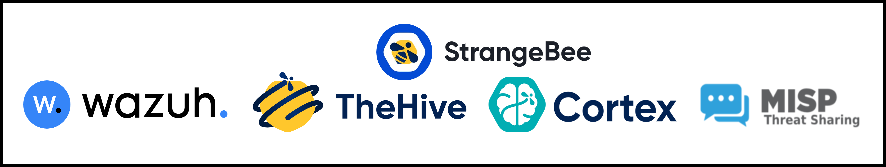
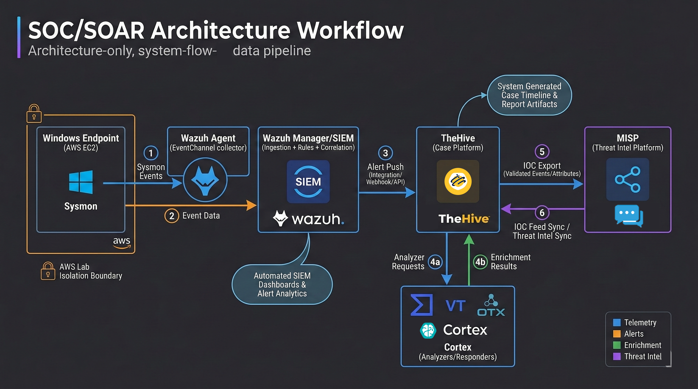
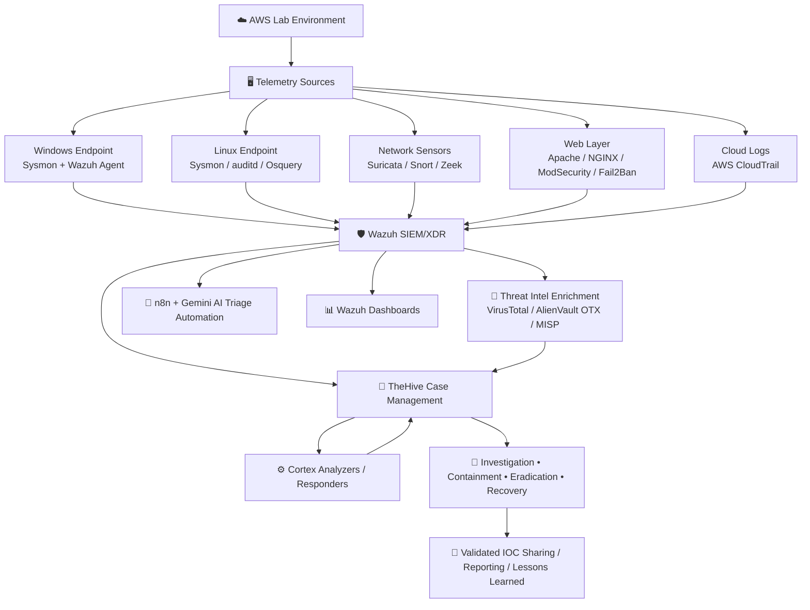

# 🛡️ SOC-SOAR-ECOSYSTEM-AWS - End-to-End SOC Operations, Detection Engineering & Incident Response Portfolio

> SOC Operations • SOC Analyst Workflows • Detection Engineering • Incident Response • Threat Intelligence • SOAR Automation

<p align="center">
  
</p>

### A complete **self-built, hands-on SOC/SOAR ecosystem portfolio on AWS** demonstrating practical blue-team capability across **detection, triage, investigation, response, threat intelligence, automation, and security visualization**.

### This repository is **not a collection of isolated labs** — it is a **connected security operations environment** built from scratch to show how modern SOC workflows operate across multiple integrated projects.

<!--
<p align="center">
  A full <strong>project-based</strong>, <strong>self-built</strong>, and <strong>hands-on</strong> SOC/SOAR ecosystem portfolio created from scratch on AWS using open-source security tooling.
  <br>
  This repository is not a collection of isolated labs — it is a connected security operations environment covering
  <strong>detection</strong>, <strong>triage</strong>, <strong>investigation</strong>, <strong>response</strong>, <strong>threat intelligence</strong>, <strong>automation</strong>, and <strong>security visualization</strong>.
</p>
-->

---

<div align="center">

<!-- ===================== PLATFORM & STACK ===================== -->


<!-- ===================== SOC STACK ===================== -->


<!-- ===================== FOCUS AREAS ===================== -->


<!-- ===================== SCOPE & STATUS ===================== -->


<!-- ===================== REPO METADATA ===================== -->


</div>

---

# 🎯 Executive Summary

This repository presents a **full self-built SOC/SOAR ecosystem on AWS**, designed to demonstrate practical security engineering across the complete defensive workflow:

- ✅ **SOC architecture design and stack integration**
- ✅ **Detection engineering across endpoint, network, web, and cloud**
- ✅ **Incident response, case management, and threat intelligence workflows**
- ✅ **Security automation and active response pipelines**
- ✅ **AI-assisted SOC alert triage and analyst reporting**
- ✅ **Dashboard engineering for monitoring, ATT&CK visibility, and compliance posture**

This is **not a tool-installation showcase** and **not a collection of isolated mini-labs**.

It is a **project-based security operations portfolio** built from scratch to reflect how modern blue-team environments actually work:

**Detect → Enrich → Investigate → Respond → Share Intelligence → Automate → Visualize**

The repository demonstrates hands-on implementation using **Wazuh, TheHive, Cortex, MISP, Sysmon, Osquery, auditd, Suricata, Snort, Zeek, ModSecurity, Fail2Ban, CloudTrail, n8n, and Gemini** across multiple connected projects.

---

# 📌 About This Repository

This repository contains a **complete AWS-based SOC/SOAR portfolio** built as a connected ecosystem of practical blue-team, detection engineering, incident response, and security automation projects.

Rather than treating each technology as a separate standalone setup, this portfolio shows how security tools work **together** in a realistic operational environment.

It includes hands-on work across:

- **Telemetry collection** from endpoint, network, cloud, and web sources
- **Detection engineering** using rules, decoders, thresholds, enrichment, and tuning
- **Threat hunting and investigation** using high-context telemetry and behavioral signals
- **Incident response and case management** using structured workflows
- **Threat intelligence enrichment and IOC sharing**
- **SOAR-style automation and AI-assisted triage**
- **Dashboards and security visualization** for analyst workflows and operational visibility

This portfolio is designed to reflect **real security operations thinking**, with a strong emphasis on implementation depth, workflow continuity, and documentation discipline.

---

# 🚀 What This Portfolio Demonstrates

This repository demonstrates practical capability across:

- **SOC stack deployment and architecture design on AWS**
- **Wazuh SIEM/XDR implementation and customization**
- **TheHive + Cortex + MISP integration for investigation and response**
- **Windows and Linux endpoint visibility with Sysmon, Osquery, and auditd**
- **Network detection engineering using Suricata, Snort, and Zeek**
- **Web security monitoring with Apache, NGINX, ModSecurity, and Fail2Ban**
- **Threat intelligence enrichment using VirusTotal and AlienVault OTX**
- **Active response workflows such as automated DNS sinkholing and IP blocking**
- **Cloud monitoring and security visibility using AWS CloudTrail**
- **AI-driven SOC alert triage automation using Wazuh + n8n + Gemini**
- **Dashboard engineering for threat monitoring, MITRE ATT&CK coverage, and compliance reporting**
- **Structured project documentation including configs, scripts, notes, troubleshooting, and interview-ready explanations**

---

# 👥 Who This Repository Is For

This repository is especially useful for:

- **Recruiters and hiring managers** evaluating practical blue-team and security engineering work
- **SOC Analyst (Tier 1 / Tier 2) learners**
- **Detection Engineering and SIEM engineering learners**
- **Blue Team and defensive security practitioners**
- **Incident Response / DFIR learners**
- **Threat hunting and security monitoring learners**
- **Security automation and SOAR learners**
- **Anyone building an open-source SOC/SOAR portfolio on AWS**

It is intended for readers who want to see **hands-on implementation, real workflow thinking, and end-to-end security project execution** rather than only conceptual summaries.

---

# 🧭 Architecture Snapshot

<p align="center">
  
</p>

### High-Level Workflow



---

# 🚀 Why This Repository Stands Out

### ✅ It is a connected ecosystem, not random isolated labs
Projects are designed as parts of a larger SOC workflow.

### ✅ It goes beyond “tool installation”
The portfolio includes detection logic, enrichment flows, response steps, analyst workflow, and case lifecycle thinking.

### ✅ It shows breadth across multiple security domains
Endpoint, network, web, cloud, threat intel, dashboards, and automation are all covered.

### ✅ It includes portfolio-grade capstones
The repository contains two strong flagship implementations:
- **SOC + SOAR malware incident response capstone**
- **AI-driven SOC alert triage automation**

### ✅ It reflects analyst and engineering discipline
Many projects include:
- architecture notes
- commands and configurations
- troubleshooting
- custom scripts
- Q&A / interview notes
- artifact folders
- implementation walkthroughs

---

# 🌟 Featured Portfolio Highlights

## 1. 🧠 Full SOC + SOAR Malware Incident Response Capstone
**[19-capstone-soc-soar-malware-incident-response](./19-capstone-soc-soar-malware-incident-response/)**

A full end-to-end capstone that covers:
- Windows malware behavior detection using Sysmon + Wazuh
- triage and true-positive validation
- case creation in TheHive
- enrichment through Cortex
- MITRE ATT&CK mapping
- IOC validation and publishing to MISP
- structured incident response lifecycle execution

**Subprojects**
- [Part 1 — Windows Malware Detection & Analysis](./19-capstone-soc-soar-malware-incident-response/part01-windows-malware-detection-and-analysis/)
- [Part 2 — Incident Response, Case Management & Threat Intelligence](./19-capstone-soc-soar-malware-incident-response/part02-incident-response-case-management-threat-intel/)

---

## 2. 🤖 AI-Driven SOC Alert Triage Automation
**[20-ai-driven-soc-alert-triage-automation](./20-ai-driven-soc-alert-triage-automation/)**

A modern SOC automation pipeline using:
- Wazuh alert forwarding
- n8n workflow orchestration
- JavaScript alert normalization
- Gemini-based triage summarization
- HTML email formatting
- analyst-ready severity-colored reporting

---

## 3. 🌐 Detection Engineering Across Endpoint, Network, Web, and Cloud
The repository includes practical projects around:
- SSH brute-force detection
- HTTP anomaly detection using OpenSearch ML
- Windows and Linux Sysmon detection engineering
- CloudTrail monitoring
- Suricata / Snort / Zeek integration
- ModSecurity WAF monitoring
- DNS hunting, enrichment, and sinkholing
- auditd credential access hunting
- Osquery endpoint visibility

---

## 4. 📊 Dashboard Engineering and Visibility Projects
**[21-dashboards](./21-dashboards/)** contains dedicated security visualization work for:
- SOC threat monitoring
- MITRE ATT&CK coverage
- CIS / compliance posture visibility

---

# 🗂️ Repository Structure

```text
SOC-SOAR-ECOSYSTEM-AWS/
│
├── 00-installation-and-setup-guide/        # Full stack deployment and integrations
├── 01-core-soc-ecosystem/                  # High-level SOC architecture and workflow
├── 02-18/                                  # Detection engineering, monitoring, hunting, response projects
├── 19-capstone-soc-soar-malware-incident-response/
│   ├── part01-windows-malware-detection-and-analysis/
│   └── part02-incident-response-case-management-threat-intel/
├── 20-ai-driven-soc-alert-triage-automation/
├── 21-dashboards/
│   ├── 01-soc-threat-monitoring-dashboard/
│   ├── 02-soc-mitre-attack-coverage-dashboard/
│   └── 03-soc-compliance-cis-benchmark-dashboard/
├── 22-learning-projects/
│   ├── 01-it-hygiene-module-exploration/
│   ├── 02-threat-hunting-module-exploration/
│   ├── 03-exploring-discovery-indexes/
│   └── 04-vulnerability-detection-module-exploration/
├── 23-other-projects/
└── resources/                              # Shared diagrams, logos, architecture images, visuals
```

---

# 🗂️ Project Index

> Click any lab title to jump directly to its folder.

---

# 🗂 Projects Overview

## 🧱 Section 1: Platform Buildout & Core SOC Architecture

**Focus:** AWS deployment, open-source SOC stack setup, cross-platform integrations, analyst workflow design.

| ID | Project | Focus Area | What It Covers |
|---|---|---|---|
| 00 | [Installation & Setup Guide](./00-installation-and-setup-guide/) | Stack deployment | AWS EC2, Docker, Wazuh, TheHive, MISP, Cortex, agents, and tool integrations |
| 01 | [Core SOC Ecosystem on AWS](./01-core-soc-ecosystem/) | Architecture & workflow | Detect → Enrich → Investigate → Manage operating model across the full SOC stack |

### 🧠 Skills Demonstrated
- AWS EC2 security lab deployment
- Dockerized security platform setup
- Wazuh, TheHive, Cortex, and MISP integration
- SOC pipeline architecture thinking
- End-to-end platform assembly from scratch

---

## 🛡️ Section 2: Detection Engineering, Monitoring & Threat Validation

**Focus:** authentication abuse, anomaly detection, endpoint telemetry, network IDS, cloud monitoring, enrichment, and alert validation.

| ID | Project | Focus Area | What It Covers |
|---|---|---|---|
| 02 | [SSH Brute Force Detection & Real-Time Alerting](./02-wazuh-ssh-bruteforce-alerting-setup/) | Authentication abuse detection | Threshold-based Wazuh alerting, source-IP grouping, Slack notifications |
| 03 | [Real SSH Brute Force Incident Response](./03-real-ssh-bruteforce-incident-response/) | Detection → IR workflow | Triage, investigation, containment, TheHive case management, MISP sharing |
| 04 | [Behavior-Based HTTP Anomaly Detection](./04-behavior-based-http-anomaly-detection/) | ML-assisted anomaly detection | OpenSearch ML, anomaly-based web behavior monitoring, Slack + TheHive escalation |
| 05 | [Wazuh + Sysmon Advanced Windows Monitoring](./05-wazuh-sysmon-windows/) | Windows endpoint detection | PowerShell, LOLBins, DNS C2, LSASS access, custom Sysmon visibility |
| 06 | [AWS CloudTrail EC2 Monitoring with Wazuh](./06-aws-cloudtrail-ec2-monitoring-wazuh/) | Cloud security monitoring | CloudTrail ingestion, EC2 action visibility, cloud-centric SOC monitoring |
| 07 | [Sysmon for Linux + Wazuh SIEM](./07-sysmon-linux-endpoint-detection/) | Linux detection engineering | Sysmon for Linux telemetry, decoding, custom rules, noise reduction |
| 08 | [Suricata IDS + Wazuh SIEM](./08-suricata-network-threat-detection/) | Network IDS integration | Suricata alerts, decoders, rules, MITRE enrichment, SOC-ready parsing |
| 09 | [Wazuh + VirusTotal Integration](./09-wazuh-virustotal-integration/) | Threat intel enrichment | FIM + VirusTotal validation + active response + TheHive visibility |

### 🧠 Skills Demonstrated
- Authentication abuse detection engineering
- Alert thresholding and noise reduction
- Endpoint telemetry engineering on Windows and Linux
- CloudTrail monitoring and SIEM ingestion
- Network IDS parsing and alert correlation
- Threat intelligence enrichment and validation
- SOC alert escalation into response workflows

---

## 🌐 Section 3: Web Security, Threat Hunting & Active Response

**Focus:** WAF monitoring, Layer 7 visibility, automated blocking, DNS-based hunting, endpoint context, NSM, and Linux credential-access hunting.

| ID | Project | Focus Area | What It Covers |
|---|---|---|---|
| 10 | [Apache + ModSecurity + Wazuh](./10-apache-wazuh-modsecurity-waf/) | Web application security monitoring | Apache WAF deployment, OWASP CRS, web attack telemetry into Wazuh |
| 11 | [NGINX + ModSecurity + Wazuh](./11-nginx-wazuh-modsecurity-waf/) | Web layer detection engineering | NGINX WAF build, active blocking, SOC visibility, MITRE mapping |
| 12 | [Fail2Ban + ModSecurity IP Blocking](./12-fail2ban-modsecurity-ip-block/) | Automated containment | Repeated attack detection, automatic host-level IP blocking, containment workflow |
| 13 | [DNS Threat Hunting Project](./13-dns-threat-hunting-project/) | DNS hunting & enrichment | Sysmon DNS telemetry, DNS-Stats, AlienVault OTX, enriched alerting |
| 14 | [Automated DNS Sinkholing](./14-automated-dns-sinkholing-wazuh/) | Active response automation | Detection → validation → sinkholing → endpoint-level malicious domain blocking |
| 15 | [Osquery Endpoint Visibility](./15-osquery-endpoint-visibility-wazuh/) | Endpoint instrumentation | SQL-based endpoint telemetry, visibility expansion, Wazuh integration |
| 16 | [Snort IDS + Wazuh Integration](./16-snort-ids-wazuh-integration/) | Signature-based network detection | Custom Snort rules, attack simulation, Wazuh monitoring pipeline |
| 17 | [Zeek Network Monitoring + Wazuh](./17-zeek-network-monitoring-wazuh/) | Network security monitoring | DNS, TLS, rejected connections, scan behavior, NSM-style visibility |
| 18 | [Auditd Credential Access Hunting](./18-auditd-wazuh-credential-access-hunting/) | Linux credential access hunting | auditd rules, exec monitoring, key file access telemetry, Wazuh custom rules |

### 🧠 Skills Demonstrated
- Web application firewall deployment and tuning
- Layer 7 attack monitoring and analysis
- Automated blocking and active response design
- DNS-based threat hunting and IOC enrichment
- Endpoint instrumentation and investigative telemetry
- Signature IDS + network security monitoring integration
- Linux kernel-level audit telemetry and credential-access detection

---

## 🚀 Section 4: Capstones, Automation, Dashboards & Extended Portfolio Work

**Focus:** end-to-end SOC/SOAR operations, AI-assisted triage, security visualization, learning-focused exploration, and supporting research.

| ID | Project | Focus Area | What It Covers |
|---|---|---|---|
| 19 | [SOC + SOAR Malware Incident Response Capstone](./19-capstone-soc-soar-malware-incident-response/) | Full IR lifecycle | Detection, case management, Cortex enrichment, MISP sharing, reporting |
| 20 | [AI-Driven SOC Alert Triage Automation](./20-ai-driven-soc-alert-triage-automation/) | SOAR-style automation | Wazuh → n8n → Gemini → analyst-ready email triage workflow |
| 21 | [Wazuh Dashboard Engineering & Security Visualization](./21-dashboards/) | Dashboard engineering | Threat monitoring, ATT&CK visibility, compliance dashboarding |
| 22 | [Wazuh Module Exploration & Learning Projects](./22-learning-projects/) | Structured feature exploration | IT hygiene, threat hunting, discover indices, vulnerability detection exploration |
| 23 | [Other Projects](./23-other-projects/) | Supporting research & tuning work | Supplementary PDFs around rule tuning and detection refinement |

### 🧠 Skills Demonstrated
- Full SOC + SOAR case lifecycle execution
- AI-assisted alert triage and decision support
- Dashboard engineering for analyst workflows
- Threat intel lifecycle thinking
- Detection tuning and portfolio documentation depth
- Structured security learning and feature exploration

---

# 🧩 Subproject Highlights

## 📂 Dashboard Subprojects
Inside **[21-dashboards](./21-dashboards/)**:

- [01 — SOC Threat Monitoring Dashboard](./21-dashboards/01-soc-threat-monitoring-dashboard/)
- [02 — SOC MITRE ATT&CK Coverage Dashboard](./21-dashboards/02-soc-mitre-attack-coverage-dashboard/)
- [03 — SOC Compliance & CIS Benchmark Dashboard](./21-dashboards/03-soc-compliance-cis-benchmark-dashboard/)

## 📚 Learning Exploration Subprojects
Inside **[22-learning-projects](./22-learning-projects/)**:

- [01 — IT Hygiene Module Exploration](./22-learning-projects/01-it-hygiene-module-exploration/)
- [02 — Threat Hunting Module Exploration](./22-learning-projects/02-threat-hunting-module-exploration/)
- [03 — Discover Indices Exploration](./22-learning-projects/03-exploring-discovery-indexes/)
- [04 — Vulnerability Detection Module Exploration](./22-learning-projects/04-vulnerability-detection-module-exploration/)

---

# 🛠️ Tools & Technologies Used Across This Repository

<details>
<summary><strong>Click to expand full tool stack</strong></summary>

## ☁️ Infrastructure & Platform
- AWS EC2
- Ubuntu Linux
- Windows endpoint systems
- Docker / Docker Compose

## 🛡️ SIEM / SOAR / Threat Intelligence
- Wazuh
- TheHive
- Cortex
- MISP
- OpenSearch / Wazuh Dashboard

## 🖥️ Endpoint & Host Telemetry
- Sysmon for Windows
- Sysmon for Linux
- Osquery
- auditd
- Wazuh Agents

## 🌐 Network Security
- Suricata
- Snort
- Zeek
- DNS-Stats
- AlienVault OTX

## 🌍 Web Security
- Apache
- NGINX
- ModSecurity
- OWASP CRS
- Fail2Ban

## ☁️ Cloud Monitoring
- AWS CloudTrail
- Amazon S3
- IAM roles / access configuration

## 🤖 Automation & Scripting
- Python
- Bash / Shell
- PowerShell
- JavaScript
- n8n workflows
- JSON / XML / rule configuration files

## 🔍 Threat Intel / Enrichment / Notification
- VirusTotal
- AlienVault OTX
- Slack
- Email-based SOC reporting
- Gemini API

</details>

---

# 🧠 Hands-On Skills Demonstrated Across the Portfolio

| Skill Area | Practical Capability Demonstrated |
|---|---|
| SOC Architecture | Building and integrating a full open-source SOC/SOAR ecosystem on AWS |
| Detection Engineering | Writing / tuning rules, decoders, thresholds, enrichment logic, and alert pipelines |
| SIEM Operations | Centralized visibility, alert triage, MITRE mapping, dashboard-driven monitoring |
| Threat Hunting | DNS hunting, process visibility, endpoint state investigation, IOC-driven analysis |
| Endpoint Detection | Windows and Linux telemetry engineering using Sysmon, Osquery, and auditd |
| Network Security Monitoring | Suricata, Snort, Zeek integration and network visibility expansion |
| Web Security Monitoring | WAF deployment, attack detection, logging, correlation, and blocking workflows |
| Incident Response | Triage, scoping, timeline, containment, eradication, recovery, and closure |
| Threat Intelligence | IOC validation, enrichment, contextualization, and MISP sharing |
| SOAR / Automation | TheHive + Cortex workflowing, Wazuh custom integrations, n8n automation |
| AI-Assisted Security Ops | Structured alert summarization, analyst-ready triage reporting, decision support |
| Dashboard Engineering | Threat monitoring, ATT&CK coverage views, compliance posture visualization |
| Documentation Discipline | Commands, architecture notes, troubleshooting, interview Q&A, project walkthroughs |

---

# 🧾 How to Navigate This Repository

### Recommended reading path

1. Start with **[00-installation-and-setup-guide](./00-installation-and-setup-guide/)**  
   to understand how the environment and core tools were deployed.

2. Continue to **[01-core-soc-ecosystem](./01-core-soc-ecosystem/)**  
   to understand the high-level architecture and SOC workflow.

3. Explore **projects 02–18** based on your area of interest:
   - endpoint detection
   - network monitoring
   - web security
   - cloud monitoring
   - threat hunting
   - active response

4. Review **[19-capstone-soc-soar-malware-incident-response](./19-capstone-soc-soar-malware-incident-response/)**  
   for the strongest end-to-end SOC + SOAR case workflow in the portfolio.

5. Review **[20-ai-driven-soc-alert-triage-automation](./20-ai-driven-soc-alert-triage-automation/)**  
   for modern automation and AI-assisted SOC operations.

6. Use **[21-dashboards](./21-dashboards/)** and **[22-learning-projects](./22-learning-projects/)**  
   to explore visibility engineering and deeper platform understanding.

---

# 📚 Documentation Style Across Projects

Many projects in this repository include one or more of the following:

- `README.md` for implementation, architecture, and outcomes
- `commands.sh` for executed commands and build steps
- `architecture-notes.txt` for workflow and design thinking
- `troubleshooting.md` for validation and fixes
- `interview_qna.md` for interview-oriented explanation
- `scripts/`, `configs/`, `rules/`, or `notes/` folders for practical implementation assets
- `artifacts/` or PDF walkthroughs for visual proof and documentation depth

This makes the repository useful not just as a showcase, but also as a **repeatable learning and reference resource**.

---

# 🌍 Real-World Alignment

This portfolio was built to reflect practical enterprise-style security operations work such as:

- alert monitoring and triage
- detection engineering and alert tuning
- endpoint and network telemetry correlation
- incident response lifecycle execution
- IOC validation and intelligence sharing
- active response automation
- dashboard-driven monitoring and visibility improvement
- reducing analyst fatigue through better context and automation

The focus is consistently on **operational security engineering**, not just tool screenshots or theoretical summaries.

---

# ⚖️ Ethical & Responsible Use

All simulations, detections, and attack-like validations represented in this repository were performed in **controlled lab environments** for defensive security learning, detection engineering, and incident response development.

This repository is intended for:

- defensive security learning
- SOC engineering practice
- blue-team skill development
- portfolio demonstration
- security monitoring and response education

---

# 👨‍💻 Author

**Abdul Rehman**  
SOC • SIEM • Detection Engineering • Incident Response • Threat Intelligence • Security Automation

---

# ⭐ Final Note

This repository reflects **real hands-on project work** across a complete SOC/SOAR ecosystem.

It demonstrates the ability to:

**Detect → Correlate → Investigate → Respond → Enrich → Automate → Visualize**

If you are reviewing this portfolio, the strongest sections to start with are:

- **[19-capstone-soc-soar-malware-incident-response](./19-capstone-soc-soar-malware-incident-response/)**
- **[20-ai-driven-soc-alert-triage-automation](./20-ai-driven-soc-alert-triage-automation/)**
- **[21-dashboards](./21-dashboards/)**
- **[00-installation-and-setup-guide](./00-installation-and-setup-guide/)**

Happy building and defending. 🚀🛡️
