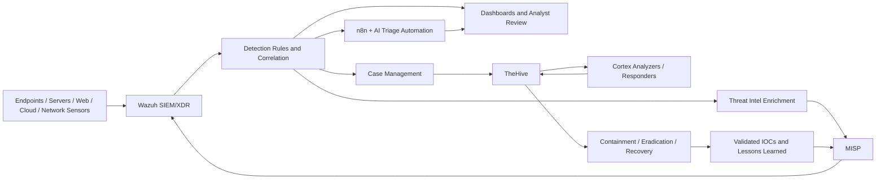

# SOC-SOAR-ECOSYSTEM-AWS

> **A hands-on AWS-based SOC/SOAR portfolio** built around **Wazuh, TheHive, Cortex, MISP, OpenSearch, n8n, and layered endpoint / network / cloud telemetry**.
>
> This repository brings together my **self-performed security engineering, detection engineering, incident response, threat intelligence, automation, dashboarding, and blue-team investigation projects** into one connected ecosystem.

---

## Overview

This repository is not a single isolated lab.
It is a **full SOC/SOAR ecosystem** designed, built, tested, documented, and extended through multiple practical projects.

Across this repo, I worked on:

- **SOC architecture design on AWS**
- **SIEM/XDR deployment and integration**
- **Detection engineering across endpoint, network, web, and cloud sources**
- **Incident triage, investigation, case management, and reporting**
- **Threat intelligence enrichment and IOC sharing**
- **SOAR-style automation and AI-assisted alert triage**
- **Dashboard engineering and operational visibility**
- **Wazuh feature exploration beyond alert-only workflows**

The result is a portfolio that shows how alerts move through a realistic workflow:

**Collect → Detect → Enrich → Investigate → Respond → Share → Improve**

---

## What this repository demonstrates

This portfolio demonstrates that I can:

- build and operate a **multi-tool SOC stack** on AWS
- integrate **Wazuh, TheHive, Cortex, and MISP** into a connected workflow
- create and tune detections for **Windows, Linux, network, web, and cloud telemetry**
- work with **Sysmon, Suricata, Snort, Zeek, auditd, Osquery, CloudTrail, ModSecurity, and VirusTotal**
- move from **raw alerts to analyst-ready triage and incident response**
- document investigations with **timelines, notes, observables, evidence, and case workflows**
- build **automation pipelines** for enrichment, notification, containment, and reporting
- create **dashboard-driven visibility** for SOC monitoring, ATT&CK coverage, and compliance posture
- explore underused modules and convert them into **practical analyst knowledge**

---

## Core SOC/SOAR workflow



---

## Main technologies used

### SOC / SIEM / SOAR
- **Wazuh**
- **TheHive**
- **Cortex**
- **MISP**
- **OpenSearch / Wazuh Dashboard**
- **n8n**

### Endpoint / host telemetry
- **Sysmon (Windows)**
- **Sysmon for Linux**
- **auditd**
- **Osquery**
- **Wazuh agents**

### Network / IDS / web monitoring
- **Suricata**
- **Snort**
- **Zeek**
- **ModSecurity (OWASP CRS)**
- **Fail2Ban**

### Threat intelligence / enrichment / automation
- **VirusTotal**
- **AlienVault OTX**
- **DNS-Stats**
- **Slack**
- **Gemini AI**

### Cloud / platform / ops
- **AWS EC2**
- **AWS CloudTrail**
- **Docker**
- **Ubuntu / Linux administration**
- **PowerShell / Bash / Python / JavaScript / XML rule configuration**

---

## Featured portfolio highlights

### 1. End-to-end SOC + SOAR capstone
**[19-capstone-soc-soar-malware-incident-response](./19-capstone-soc-soar-malware-incident-response)**

A flagship project showing a full analyst workflow:

- suspicious endpoint activity detected through **Sysmon + Wazuh**
- evidence reviewed and validated
- alert escalated into **TheHive**
- observables enriched through **Cortex**
- incident mapped to **MITRE ATT&CK**
- response workflow executed with notes, tasks, timeline, and case handling
- validated IOCs shared to **MISP** for future detection value

### 2. AI-driven SOC alert triage automation
**[20-ai-driven-soc-alert-triage-automation](./20-ai-driven-soc-alert-triage-automation)**

A modern automation project that connects:

**Wazuh → custom integration → n8n → AI analysis → formatted SOC email reporting**

This project demonstrates:

- alert normalization
- pipeline automation
- AI-assisted triage support
- structured email reporting for analysts
- reusable workflow export for n8n

### 3. Dashboard engineering for operational visibility
**[21-dashboards](./21-dashboards)**

A dedicated dashboard engineering section with projects for:

- threat monitoring
- MITRE ATT&CK coverage visibility
- compliance / CIS benchmark visibility

### 4. Detection engineering across multiple security layers
Across the repository, I built or documented practical detections and monitoring workflows for:

- authentication abuse and brute force activity
- endpoint telemetry and suspicious process behavior
- DNS-based threat hunting
- malware enrichment and removal workflows
- IDS / NSM integrations
- WAF visibility and automated IP blocking
- Linux credential-access hunting
- cloud log monitoring through AWS telemetry

---

## Repository structure

```text
SOC-SOAR-ECOSYSTEM-AWS/
├── 00-installation-and-setup-guide/
├── 01-core-soc-ecosystem/
├── 02-wazuh-ssh-bruteforce-alerting-setup/
├── 03-real-ssh-bruteforce-incident-response/
├── 04-behavior-based-http-anomaly-detection/
├── 05-wazuh-sysmon-windows/
├── 06-aws-cloudtrail-ec2-monitoring-wazuh/
├── 07-sysmon-linux-endpoint-detection/
├── 08-suricata-network-threat-detection/
├── 09-wazuh-virustotal-integration/
├── 10-apache-wazuh-modsecurity-waf/
├── 11-nginx-wazuh-modsecurity-waf/
├── 12-fail2ban-modsecurity-ip-block/
├── 13-dns-threat-hunting-project/
├── 14-automated-dns-sinkholing-wazuh/
├── 15-osquery-endpoint-visibility-wazuh/
├── 16-snort-ids-wazuh-integration/
├── 17-zeek-network-monitoring-wazuh/
├── 18-auditd-wazuh-credential-access-hunting/
├── 19-capstone-soc-soar-malware-incident-response/
├── 20-ai-driven-soc-alert-triage-automation/
├── 21-dashboards/
├── 22-learning-projects/
├── 23-other-projects/
└── resources/
```

---

## Project map

### 00. Installation and setup guide
**[00-installation-and-setup-guide](./00-installation-and-setup-guide)**

This section documents the platform buildout and tool integration work behind the ecosystem:

- [01-aws-ec2-infrastructure-setup](./00-installation-and-setup-guide/01-aws-ec2-infrastructure-setup) — AWS EC2 environment preparation, baseline hardening, health checks, and firewall setup
- [02-docker-installation](./00-installation-and-setup-guide/02-docker-installation) — Docker deployment and validation for containerized security tooling
- [03-wazuh-installation](./00-installation-and-setup-guide/03-wazuh-installation) — Wazuh SIEM/XDR setup and configuration
- [04-thehive-installation](./00-installation-and-setup-guide/04-thehive-installation) — TheHive deployment for incident case management
- [05-misp-installation](./00-installation-and-setup-guide/05-misp-installation) — MISP deployment for threat intelligence operations
- [06-wazuh-thehive-integration](./00-installation-and-setup-guide/06-wazuh-thehive-integration) — alert-to-case integration from Wazuh into TheHive
- [07-misp-thehive-integration](./00-installation-and-setup-guide/07-misp-thehive-integration) — intelligence visibility workflow between MISP and TheHive
- [08-wazuh-misp-integration](./00-installation-and-setup-guide/08-wazuh-misp-integration) — IOC-driven enrichment using custom scripts and rules
- [09-wazuh-agent-ubuntu](./00-installation-and-setup-guide/09-wazuh-agent-ubuntu) — Ubuntu agent deployment and onboarding
- [10-cortex-installation](./00-installation-and-setup-guide/10-cortex-installation) — Cortex installation for analyzers and responders
- [11-thehive-cortex-integration](./00-installation-and-setup-guide/11-thehive-cortex-integration) — SOAR-assisted enrichment from TheHive through Cortex

### 01. Core SOC ecosystem
**[01-core-soc-ecosystem](./01-core-soc-ecosystem)**

Defines the core architecture of the lab:

- **Wazuh** as the detection layer
- **MISP** as the threat intelligence layer
- **TheHive** as the investigation and case management layer

### 02–18. Detection engineering, monitoring, and response projects

- **[02-wazuh-ssh-bruteforce-alerting-setup](./02-wazuh-ssh-bruteforce-alerting-setup)** — brute-force detection engineering with real-time Slack alerting
- **[03-real-ssh-bruteforce-incident-response](./03-real-ssh-bruteforce-incident-response)** — investigation workflow using Wazuh, TheHive, and MISP for a real SSH brute-force scenario
- **[04-behavior-based-http-anomaly-detection](./04-behavior-based-http-anomaly-detection)** — HTTP anomaly detection with Wazuh, OpenSearch ML, Slack, and TheHive
- **[05-wazuh-sysmon-windows](./05-wazuh-sysmon-windows)** — advanced Windows monitoring and detection use cases with Sysmon and Wazuh
- **[06-aws-cloudtrail-ec2-monitoring-wazuh](./06-aws-cloudtrail-ec2-monitoring-wazuh)** — CloudTrail-based AWS monitoring through Wazuh SIEM
- **[07-sysmon-linux-endpoint-detection](./07-sysmon-linux-endpoint-detection)** — Linux endpoint telemetry and custom detection engineering with Sysmon for Linux
- **[08-suricata-network-threat-detection](./08-suricata-network-threat-detection)** — Suricata IDS integration, decoder/rule engineering, and network alert visibility in Wazuh
- **[09-wazuh-virustotal-integration](./09-wazuh-virustotal-integration)** — file threat enrichment and automated malware removal workflow
- **[10-apache-wazuh-modsecurity-waf](./10-apache-wazuh-modsecurity-waf)** — Apache + ModSecurity + Wazuh web application security monitoring
- **[11-nginx-wazuh-modsecurity-waf](./11-nginx-wazuh-modsecurity-waf)** — NGINX + ModSecurity + Wazuh monitoring for WAF-driven visibility
- **[12-fail2ban-modsecurity-ip-block](./12-fail2ban-modsecurity-ip-block)** — automated IP blocking using ModSecurity, Fail2Ban, and Wazuh
- **[13-dns-threat-hunting-project](./13-dns-threat-hunting-project)** — malicious DNS query hunting with Sysmon, DNS-Stats, AlienVault OTX, and Wazuh
- **[14-automated-dns-sinkholing-wazuh](./14-automated-dns-sinkholing-wazuh)** — active response workflow for DNS sinkholing on Windows endpoints
- **[15-osquery-endpoint-visibility-wazuh](./15-osquery-endpoint-visibility-wazuh)** — endpoint visibility and host-state exploration with Osquery and Wazuh
- **[16-snort-ids-wazuh-integration](./16-snort-ids-wazuh-integration)** — Snort IDS exploration, custom rule development, and SIEM integration
- **[17-zeek-network-monitoring-wazuh](./17-zeek-network-monitoring-wazuh)** — Zeek-based network monitoring and security context in Wazuh
- **[18-auditd-wazuh-credential-access-hunting](./18-auditd-wazuh-credential-access-hunting)** — Linux credential-access hunting through auditd and custom Wazuh detections

### 19. SOC + SOAR capstone
**[19-capstone-soc-soar-malware-incident-response](./19-capstone-soc-soar-malware-incident-response)**

The strongest end-to-end project in the repository, connecting:

- endpoint detection
- case creation
- observable extraction
- enrichment
- ATT&CK mapping
- incident handling
- intelligence sharing
- reporting and lessons learned

### 20. AI-driven SOC automation
**[20-ai-driven-soc-alert-triage-automation](./20-ai-driven-soc-alert-triage-automation)**

A workflow-focused automation project covering:

- custom Wazuh integration logic
- n8n workflow orchestration
- JavaScript-based alert normalization
- AI-supported triage guidance
- HTML email reporting for analysts

### 21. Dashboards
**[21-dashboards](./21-dashboards)**

A separate dashboard engineering track with:

- [01-soc-threat-monitoring-dashboard](./21-dashboards/01-soc-threat-monitoring-dashboard)
- [02-soc-mitre-attack-coverage-dashboard](./21-dashboards/02-soc-mitre-attack-coverage-dashboard)
- [03-soc-compliance-cis-benchmark-dashboard](./21-dashboards/03-soc-compliance-cis-benchmark-dashboard)

### 22. Learning projects
**[22-learning-projects](./22-learning-projects)**

A dedicated learning portfolio for deeper exploration of Wazuh capabilities beyond alert queues:

- [01-it-hygiene-module-exploration](./22-learning-projects/01-it-hygiene-module-exploration)
- [02-threat-hunting-module-exploration](./22-learning-projects/02-threat-hunting-module-exploration)
- [03-exploring-discovery-indexes](./22-learning-projects/03-exploring-discovery-indexes)
- [04-vulnerability-detection-module-exploration](./22-learning-projects/04-vulnerability-detection-module-exploration)

### 23. Other projects
**[23-other-projects](./23-other-projects)**

Additional focused work such as:

- rule tuning
- alert fatigue reduction
- PowerShell-focused detection tuning

### Shared assets
**[resources](./resources)**

Shared images, diagrams, and visual material used across the repository.

---

## Hands-on skills demonstrated

### Security operations and blue-team skills
- SOC workflow design
- alert triage and prioritization
- incident investigation
- case management
- IOC handling and validation
- containment and response planning
- MITRE ATT&CK mapping
- reporting and lessons learned

### Detection engineering skills
- Wazuh rule logic and alert tuning
- custom decoder and rule integration
- endpoint telemetry interpretation
- suspicious process and persistence analysis
- DNS-based hunting logic
- web attack monitoring
- IDS / NSM event interpretation
- false-positive reduction

### Engineering and implementation skills
- AWS lab buildout and environment preparation
- Docker-based service deployment
- Bash, Python, JavaScript, PowerShell, CMD, XML, and config editing
- integration scripting across security tools
- n8n workflow design
- dashboard design and operational visualization
- structured documentation and project packaging

---

## Why this portfolio stands out

Many security portfolios stop at:

- tool installation screenshots
- isolated dashboards
- single detections without follow-through

This repository goes further by showing:

- **tool integration instead of tool isolation**
- **workflow continuity instead of one-off labs**
- **detection + triage + response + intelligence sharing**
- **technical implementation backed by documentation**
- **multiple telemetry layers across host, network, web, and cloud**
- **both analyst thinking and engineering execution**

---

## Best places to start

If you are viewing this repository for the first time, start here:

1. **[01-core-soc-ecosystem](./01-core-soc-ecosystem)** for the architecture
2. **[19-capstone-soc-soar-malware-incident-response](./19-capstone-soc-soar-malware-incident-response)** for the flagship end-to-end workflow
3. **[20-ai-driven-soc-alert-triage-automation](./20-ai-driven-soc-alert-triage-automation)** for modern automation work
4. **[21-dashboards](./21-dashboards)** for operational visibility projects
5. **[00-installation-and-setup-guide](./00-installation-and-setup-guide)** for full stack deployment and integrations

---

## Notes

- This repository is organized as a **project-based security portfolio**, so most folders contain their own implementation guide, architecture notes, troubleshooting, commands, and interview-preparation material.
- Several projects also include supporting scripts, rules, configs, diagrams, dashboard exports, or case artifacts.
- The repository continues to grow as new blue-team and SOC engineering work is added.

---

## Contact / usage

This repository is intended for:

- portfolio presentation
- blue-team learning
- SOC engineering reference
- detection engineering study
- interview discussion and project walkthroughs

If you are reviewing this repo, the best way to understand it is to view it as **one connected SOC/SOAR program** made up of multiple practical projects rather than as unrelated folders.
