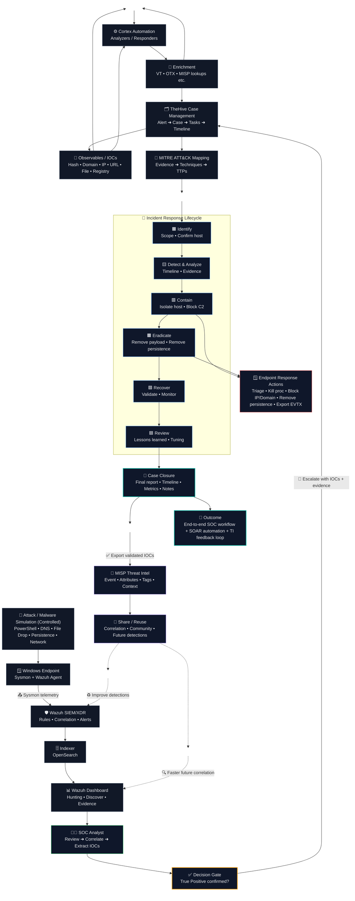

```mermaid
flowchart LR
  %% =========================================================
  %% SOC + SOAR Capstone (Master Workflow)
  %% Part 1 → Part 2 → MISP Feedback Loop
  %% =========================================================

  %% -------------------------
  %% Part 1 (Column 1)
  %% -------------------------
  subgraph P1["🧪 Part 1 — Detection & Analysis (Sysmon + Wazuh)"]
    direction TB
    SIM["🧨 Malware Simulation<br/>PowerShell • DNS • File Drop • Persistence • Network"]
    WEC2["🪟 Windows EC2 Endpoint<br/>(Sysmon + Wazuh Agent)"]
    WAZ["🛡️ Wazuh Manager (SIEM/XDR)<br/>Rules • Correlation • Alerting"]
    IDX["🗄️ Wazuh Indexer<br/>OpenSearch"]
    WDASH["📊 Wazuh Dashboard<br/>Threat Hunting • Discover"]
    A1["👨‍💻 SOC Analyst<br/>Alert Review ➜ Correlation ➜ IOC Extraction"]
    D1["✅ Decision Gate<br/>True Positive confirmed?"]

    SIM --> WEC2 -->|📤 Sysmon telemetry| WAZ --> IDX --> WDASH --> A1 --> D1
  end

  HOFF["🔁 Handoff<br/>IOCs + Evidence ➜ Case Creation"]
  D1 --> HOFF

  %% -------------------------
  %% Part 2 (Column 2)
  %% -------------------------
  subgraph P2["🧠 Part 2 — Case Mgmt + SOAR + IR + Closure"]
    direction TB

    HIVE["🗂️ TheHive<br/>Alert ➜ Case ➜ Tasks ➜ Timeline ➜ Report"]
    OBS["🧬 Observables<br/>Hash • Domain • IP • URL • File • Registry"]
    CORT["⚙️ Cortex<br/>Analyzers / Responders"]
    ENR["📎 Enrichment Results<br/>VT / OTX / MISP lookups etc."]
    MITRE["🧭 MITRE ATT&CK Mapping<br/>TTPs aligned to evidence"]

    subgraph IRL["🧭 IR Lifecycle"]
      direction TB
      IR1["🟧 Identify<br/>Scope • Confirm affected host"]
      IR2["🟨 Detect & Analyze<br/>Evidence • Timeline"]
      IR3["🟥 Contain<br/>Block C2 • Isolate host"]
      IR4["🟫 Eradicate<br/>Remove payload • Remove persistence"]
      IR5["🟩 Recover<br/>Validate stability • Monitor"]
      IR6["🟦 Review<br/>Lessons learned • Detection tuning"]
      IR1 --> IR2 --> IR3 --> IR4 --> IR5 --> IR6
    end

    WINACT["🪟 Endpoint Actions<br/>Kill proc • Block C2 • Remove persistence • Export EVTX"]
    CLOSE["🧾 Case Closure<br/>Summary • Timeline • Report • Metrics"]

    HIVE --> OBS --> CORT --> ENR --> HIVE
    HIVE --> MITRE --> IR1
    IR3 --> WINACT
    IR4 --> WINACT
    IR6 --> CLOSE
  end

  HOFF --> HIVE

  %% -------------------------
  %% Threat Intel (Column 3)
  %% -------------------------
  subgraph TI["🧠 Threat Intelligence Loop (MISP)"]
    direction TB
    MISP["📌 MISP Event<br/>Validated IOCs + Tags + Context"]
    SHARE["🔁 Share / Reuse<br/>Correlation • Community • Future detection value"]
    MISP --> SHARE
  end

  CLOSE -->|✅ Export validated IOCs| MISP

  %% Feedback loop back into detections (DASHED)
  SHARE -.->|♻️ Improve detections| WAZ
  SHARE -.->|🔍 Faster correlation| WDASH

  %% Final Outcome
  CLOSE --> OUT["🏁 Outcome<br/>End-to-end SOC workflow + SOAR automation + TI sharing"]

  %% =========================================================
  %% Styling (GitHub Mermaid)
  %% =========================================================

  %% Stronger "section" boxes for P1/P2/TI
  classDef part fill:#0b1220,stroke:#94a3b8,stroke-width:3px,stroke-dasharray: 6 4,color:#e5e7eb;

  %% Nodes
  classDef system fill:#111827,stroke:#475569,stroke-width:1px,color:#e5e7eb;
  classDef analyst fill:#0f172a,stroke:#22c55e,stroke-width:1px,color:#e5e7eb;
  classDef decision fill:#0f172a,stroke:#f59e0b,stroke-width:2px,color:#e5e7eb;
  classDef ir fill:#0f172a,stroke:#60a5fa,stroke-width:1px,color:#e5e7eb;
  classDef action fill:#0f172a,stroke:#ef4444,stroke-width:1px,color:#e5e7eb;
  classDef ti fill:#0f172a,stroke:#a78bfa,stroke-width:1px,color:#e5e7eb;
  classDef outcome fill:#0f172a,stroke:#14b8a6,stroke-width:2px,color:#e5e7eb;

  class P1,P2,TI part;
  class SIM,WEC2,WAZ,IDX,WDASH,HIVE,OBS,CORT,ENR,MITRE system;
  class A1 analyst;
  class D1 decision;
  class IR1,IR2,IR3,IR4,IR5,IR6 ir;
  class WINACT action;
  class MISP,SHARE ti;
  class CLOSE,OUT outcome;
```

---

```mermaid
flowchart LR
  %% =========================================================
  %% SOC + SOAR Capstone (Master Workflow)
  %% 3-Column Layout: Part 1 | Part 2 | Threat Intel
  %% =========================================================

  %% -------------------------
  %% Invisible spacers + anchors (layout helpers)
  %% -------------------------
  SP1[" "]:::spacer
  SP2[" "]:::spacer
  SP3[" "]:::spacer

  A12[" "]:::anchor
  A23[" "]:::anchor

  %% Keep spacers aligned in a row (forces column grid feel)
  SP1 --- A12 --- SP2 --- A23 --- SP3

  %% -------------------------
  %% Part 1 (Column 1)
  %% -------------------------
  subgraph P1["🧪 Part 1 — Detection & Analysis (Sysmon + Wazuh)"]
    direction TB
    SIM["🧨 Malware Simulation<br/>PowerShell • DNS • File Drop • Persistence • Network"]
    WEC2["🪟 Windows EC2 Endpoint<br/>(Sysmon + Wazuh Agent)"]
    WAZ["🛡️ Wazuh Manager (SIEM/XDR)<br/>Rules • Correlation • Alerting"]
    IDX["🗄️ Wazuh Indexer<br/>OpenSearch"]
    WDASH["📊 Wazuh Dashboard<br/>Threat Hunting • Discover"]
    A1["👨‍💻 SOC Analyst<br/>Alert Review ➜ Correlation ➜ IOC Extraction"]
    D1["✅ Decision Gate<br/>True Positive confirmed?"]

    SIM --> WEC2 -->|📤 Sysmon telemetry| WAZ --> IDX --> WDASH --> A1 --> D1
  end

  %% Route Part 1 → Part 2 through anchor (reduces crossing)
  D1 -->|📌 Escalate| A12

  %% -------------------------
  %% Part 2 (Column 2)
  %% -------------------------
  subgraph P2["🧠 Part 2 — Case Mgmt + SOAR + IR + Closure"]
    direction TB

    HIVE["🗂️ TheHive<br/>Alert ➜ Case ➜ Tasks ➜ Timeline ➜ Report"]
    OBS["🧬 Observables<br/>Hash • Domain • IP • URL • File • Registry"]
    CORT["⚙️ Cortex<br/>Analyzers / Responders"]
    ENR["📎 Enrichment Results<br/>VT / OTX / MISP lookups etc."]
    MITRE["🧭 MITRE ATT&CK Mapping<br/>TTPs aligned to evidence"]

    subgraph IRL["🧭 IR Lifecycle"]
      direction TB
      IR1["🟧 Identify<br/>Scope • Confirm affected host"]
      IR2["🟨 Detect & Analyze<br/>Evidence • Timeline"]
      IR3["🟥 Contain<br/>Block C2 • Isolate host"]
      IR4["🟫 Eradicate<br/>Remove payload • Remove persistence"]
      IR5["🟩 Recover<br/>Validate stability • Monitor"]
      IR6["🟦 Review<br/>Lessons learned • Detection tuning"]
      IR1 --> IR2 --> IR3 --> IR4 --> IR5 --> IR6
    end

    WINACT["🪟 Endpoint Actions<br/>Kill proc • Block C2 • Remove persistence • Export EVTX"]
    CLOSE["🧾 Case Closure<br/>Summary • Timeline • Report • Metrics"]

    HIVE --> OBS --> CORT --> ENR --> HIVE
    HIVE --> MITRE --> IR1
    IR3 --> WINACT
    IR4 --> WINACT
    IR6 --> CLOSE
  end

  A12 -->|🗂️ Create case| HIVE

  %% Route Part 2 → TI through anchor
  CLOSE -->|✅ Export validated IOCs| A23

  %% -------------------------
  %% Threat Intel (Column 3)
  %% -------------------------
  subgraph TI["🧠 Threat Intelligence Loop (MISP)"]
    direction TB
    MISP["📌 MISP Event<br/>Validated IOCs + Tags + Context"]
    SHARE["🔁 Share / Reuse<br/>Correlation • Community • Future detection value"]
    MISP --> SHARE
  end

  A23 --> MISP

  %% Feedback loop back into detections (DASHED) via anchors (cleaner)
  SHARE -.->|♻️ Improve detections| WAZ
  SHARE -.->|🔍 Faster correlation| WDASH

  %% Final Outcome (keep in Part 2 column area)
  CLOSE --> OUT["🏁 Outcome<br/>End-to-end SOC workflow + SOAR automation + TI sharing"]

  %% =========================================================
  %% Styling (GitHub Mermaid)
  %% =========================================================

  %% Stronger "section" boxes for P1/P2/TI
  classDef part fill:#0b1220,stroke:#94a3b8,stroke-width:3px,stroke-dasharray: 6 4,color:#e5e7eb;

  %% Regular nodes
  classDef system fill:#111827,stroke:#475569,stroke-width:1px,color:#e5e7eb;
  classDef analyst fill:#0f172a,stroke:#22c55e,stroke-width:1px,color:#e5e7eb;
  classDef decision fill:#0f172a,stroke:#f59e0b,stroke-width:2px,color:#e5e7eb;
  classDef ir fill:#0f172a,stroke:#60a5fa,stroke-width:1px,color:#e5e7eb;
  classDef action fill:#0f172a,stroke:#ef4444,stroke-width:1px,color:#e5e7eb;
  classDef ti fill:#0f172a,stroke:#a78bfa,stroke-width:1px,color:#e5e7eb;
  classDef outcome fill:#0f172a,stroke:#14b8a6,stroke-width:2px,color:#e5e7eb;

  %% Layout helpers: invisible
  classDef spacer fill:transparent,stroke:transparent,color:transparent;
  classDef anchor fill:transparent,stroke:transparent,color:transparent;

  class P1,P2,TI part;
  class SIM,WEC2,WAZ,IDX,WDASH,HIVE,OBS,CORT,ENR,MITRE system;
  class A1 analyst;
  class D1 decision;
  class IR1,IR2,IR3,IR4,IR5,IR6 ir;
  class WINACT action;
  class MISP,SHARE ti;
  class CLOSE,OUT outcome;

  class SP1,SP2,SP3 spacer;
  class A12,A23 anchor;
```

---

```mermaid
flowchart TB
  %% =========================================================
  %% SOC + SOAR + TI — End-to-End Workflow (Single Combined)
  %% =========================================================

  %% -------------------------
  %% Layout anchors (invisible)
  %% -------------------------
  A_ENR[" "]:::anchor
  A_IR[" "]:::anchor
  A_TI[" "]:::anchor
  A_FB1[" "]:::anchor
  A_FB2[" "]:::anchor

  %% -------------------------
  %% End-to-End Workflow
  %% -------------------------

  SIM["🧨 Attack / Malware Simulation (Controlled)<br/>PowerShell • DNS • File Drop • Persistence • Network"]:::stage
  ENDPOINT["🪟 Windows Endpoint<br/>Sysmon + Wazuh Agent"]:::stage
  WAZ["🛡️ Wazuh SIEM/XDR<br/>Rules • Correlation • Alerts"]:::stage
  IDX["🗄️ Indexer<br/>OpenSearch"]:::stage
  WDASH["📊 Wazuh Dashboard<br/>Hunting • Discover • Evidence"]:::stage
  ANALYST["👨‍💻 SOC Analyst<br/>Review ➜ Correlate ➜ Extract IOCs"]:::human
  GATE["✅ Decision Gate<br/>True Positive confirmed?"]:::decision

  THEHIVE["🗂️ TheHive Case Management<br/>Alert ➜ Case ➜ Tasks ➜ Timeline"]:::stage
  OBS["🧬 Observables / IOCs<br/>Hash • Domain • IP • URL • File • Registry"]:::stage

  CORTEX["⚙️ Cortex Automation<br/>Analyzers / Responders"]:::stage
  ENR["📎 Enrichment<br/>VT • OTX • MISP lookups etc."]:::stage
  MITRE["🧭 MITRE ATT&CK Mapping<br/>Evidence ➜ Techniques ➜ TTPs"]:::stage

  subgraph IRL["🧭 Incident Response Lifecycle"]
    direction TB
    IR1["🟧 Identify<br/>Scope • Confirm host"]:::ir
    IR2["🟨 Detect & Analyze<br/>Timeline • Evidence"]:::ir
    IR3["🟥 Contain<br/>Isolate host • Block C2"]:::ir
    IR4["🟫 Eradicate<br/>Remove payload • Remove persistence"]:::ir
    IR5["🟩 Recover<br/>Validate • Monitor"]:::ir
    IR6["🟦 Review<br/>Lessons learned • Tuning"]:::ir
    IR1 --> IR2 --> IR3 --> IR4 --> IR5 --> IR6
  end

  ACTIONS["🪟 Endpoint Response Actions<br/>Triage • Kill proc • Block IP/Domain • Remove persistence • Export EVTX"]:::action
  CLOSE["🧾 Case Closure<br/>Final report • Timeline • Metrics • Notes"]:::outcome

  MISP["📌 MISP Threat Intel<br/>Event • Attributes • Tags • Context"]:::ti
  SHARE["🔁 Share / Reuse<br/>Correlation • Community • Future detections"]:::ti

  OUT["🏁 Outcome<br/>End-to-end SOC workflow + SOAR automation + TI feedback loop"]:::outcome

  %% -------------------------
  %% Main flow (single workflow)
  %% -------------------------
  SIM --> ENDPOINT -->|📤 Sysmon telemetry| WAZ --> IDX --> WDASH --> ANALYST --> GATE
  GATE -->|📌 Escalate with IOCs + evidence| THEHIVE --> OBS --> A_ENR

  %% Enrichment loop (keep neat via anchor)
  A_ENR --> CORTEX --> ENR --> A_ENR
  OBS --> CORTEX
  ENR --> THEHIVE

  %% IR path (anchored)
  THEHIVE --> MITRE --> A_IR
  A_IR --> IR1
  IR3 --> ACTIONS
  IR4 --> ACTIONS
  IR6 --> CLOSE --> A_TI

  %% Threat intel + sharing
  A_TI -->|✅ Export validated IOCs| MISP --> SHARE

  %% Feedback loops (DASHED + anchored so they don't bend)
  SHARE -.-> A_FB1 -.->|♻️ Improve detections| WAZ
  SHARE -.-> A_FB2 -.->|🔍 Faster future correlation| WDASH

  CLOSE --> OUT

  %% -------------------------
  %% Styling (GitHub Mermaid)
  %% -------------------------
  classDef stage fill:#111827,stroke:#475569,stroke-width:1px,color:#e5e7eb;
  classDef human fill:#0f172a,stroke:#22c55e,stroke-width:1px,color:#e5e7eb;
  classDef decision fill:#0f172a,stroke:#f59e0b,stroke-width:2px,color:#e5e7eb;
  classDef ir fill:#0f172a,stroke:#60a5fa,stroke-width:1px,color:#e5e7eb;
  classDef action fill:#0f172a,stroke:#ef4444,stroke-width:1px,color:#e5e7eb;
  classDef ti fill:#0f172a,stroke:#a78bfa,stroke-width:1px,color:#e5e7eb;
  classDef outcome fill:#0f172a,stroke:#14b8a6,stroke-width:2px,color:#e5e7eb;

  classDef anchor fill:transparent,stroke:transparent,color:transparent;

  class A_ENR,A_IR,A_TI,A_FB1,A_FB2 anchor;
```

---

```mermaid
flowchart LR
  %% =========================================================
  %% SOC + SOAR + TI — End-to-End Workflow (Swimlanes)
  %% GitHub Mermaid friendly
  %% =========================================================

  %% Layout anchors (invisible helpers)
  A_ENR[" "]:::anchor
  A_IR[" "]:::anchor
  A_TI[" "]:::anchor
  A_FB1[" "]:::anchor
  A_FB2[" "]:::anchor

  %% -------------------------
  %% Swimlanes (no "parts", just lanes)
  %% -------------------------

  subgraph L1["🪟 Endpoint"]
    direction TB
    SIM["🧨 Controlled Attack Simulation<br/>PowerShell • DNS • File Drop • Persistence • Network"]:::stage
    ENDPOINT["Sysmon + Wazuh Agent<br/>Telemetry collection"]:::stage
    SIM --> ENDPOINT
  end

  subgraph L2["🛡️ SIEM / XDR (Wazuh)"]
    direction TB
    WAZ["Wazuh Manager<br/>Rules • Correlation • Alerts"]:::stage
    IDX["Wazuh Indexer<br/>OpenSearch"]:::stage
    WDASH["Wazuh Dashboard<br/>Hunting • Evidence • Discover"]:::stage
    WAZ --> IDX --> WDASH
  end

  subgraph L3["👨‍💻 SOC Analyst"]
    direction TB
    ANALYST["Triage + Investigation<br/>Review ➜ Correlate ➜ Extract IOCs"]:::human
    GATE["Decision Gate<br/>True Positive confirmed?"]:::decision
    ANALYST --> GATE
  end

  subgraph L4["🗂️ Case Mgmt + SOAR (TheHive + Cortex)"]
    direction TB
    THEHIVE["TheHive Case<br/>Alert ➜ Case ➜ Tasks ➜ Timeline"]:::stage
    OBS["Observables / IOCs<br/>Hash • Domain • IP • URL • File • Registry"]:::stage
    CORTEX["Cortex Automation<br/>Analyzers / Responders"]:::stage
    ENR["Enrichment Results<br/>VT • OTX • MISP lookups etc."]:::stage
    MITRE["MITRE ATT&CK Mapping<br/>Evidence ➜ Techniques ➜ TTPs"]:::stage

    THEHIVE --> OBS --> A_ENR
    A_ENR --> CORTEX --> ENR --> A_ENR
    ENR --> THEHIVE
    THEHIVE --> MITRE --> A_IR
  end

  subgraph L5["🛠️ Incident Response"]
    direction TB
    IRFLOW["IR Lifecycle<br/>Identify ➜ Analyze ➜ Contain ➜ Eradicate ➜ Recover ➜ Review"]:::ir
    ACTIONS["Endpoint Actions<br/>Triage • Kill proc • Block C2 • Remove persistence • Export EVTX"]:::action
    CLOSE["Case Closure<br/>Final report • Timeline • Metrics • Lessons learned"]:::outcome

    IRFLOW --> ACTIONS --> IRFLOW
    IRFLOW --> CLOSE
  end

  subgraph L6["🧠 Threat Intelligence (MISP)"]
    direction TB
    MISP["MISP Event<br/>Validated IOCs + Tags + Context"]:::ti
    SHARE["Share / Reuse<br/>Correlation • Community • Future detections"]:::ti
    MISP --> SHARE
  end

  %% -------------------------
  %% Cross-lane links (main workflow)
  %% -------------------------
  ENDPOINT -->|📤 Sysmon telemetry| WAZ
  WDASH --> ANALYST
  GATE -->|📌 Escalate IOCs + evidence| THEHIVE
  A_IR --> IRFLOW
  CLOSE --> A_TI -->|✅ Export validated IOCs| MISP

  %% Feedback loops (DASHED)
  SHARE -.-> A_FB1 -.->|♻️ Improve detections| WAZ
  SHARE -.-> A_FB2 -.->|🔍 Faster correlation| WDASH

  %% Final Outcome node (optional, keeps summary visible)
  OUT["🏁 Outcome<br/>End-to-end SOC workflow + SOAR automation + TI feedback loop"]:::outcome
  CLOSE --> OUT

  %% -------------------------
  %% Styling (GitHub Mermaid)
  %% -------------------------
  classDef stage fill:#111827,stroke:#475569,stroke-width:1px,color:#e5e7eb;
  classDef human fill:#0f172a,stroke:#22c55e,stroke-width:1px,color:#e5e7eb;
  classDef decision fill:#0f172a,stroke:#f59e0b,stroke-width:2px,color:#e5e7eb;
  classDef ir fill:#0f172a,stroke:#60a5fa,stroke-width:1px,color:#e5e7eb;
  classDef action fill:#0f172a,stroke:#ef4444,stroke-width:1px,color:#e5e7eb;
  classDef ti fill:#0f172a,stroke:#a78bfa,stroke-width:1px,color:#e5e7eb;
  classDef outcome fill:#0f172a,stroke:#14b8a6,stroke-width:2px,color:#e5e7eb;

  classDef anchor fill:transparent,stroke:transparent,color:transparent;
  class A_ENR,A_IR,A_TI,A_FB1,A_FB2 anchor;
```

---

```mermaid
flowchart LR
  %% =========================================================
  %% SOC + SOAR + TI — End-to-End Workflow (Swimlanes, Boxed)
  %% with stronger lane separators (GitHub Mermaid friendly)
  %% =========================================================

  %% -------------------------
  %% Layout helpers (invisible anchors)
  %% -------------------------
  A_ENR[" "]:::anchor
  A_IR[" "]:::anchor
  A_TI[" "]:::anchor
  A_FB1[" "]:::anchor
  A_FB2[" "]:::anchor

  %% Lane alignment frames (invisible but keep columns stable)
  F1[" "]:::frame
  F2[" "]:::frame
  F3[" "]:::frame
  F4[" "]:::frame
  F5[" "]:::frame
  F6[" "]:::frame

  %% Vertical separators (visual swimlane dividers)
  %% (we'll style these specific links via linkStyle below)
  F1 -.-> F2
  F2 -.-> F3
  F3 -.-> F4
  F4 -.-> F5
  F5 -.-> F6

  %% -------------------------
  %% Lane 1: Endpoint
  %% -------------------------
  subgraph L1[" "]
    direction TB
    H1["🪟 Endpoint"]:::laneHeader
    SIM["🧨 Controlled Attack Simulation<br/>PowerShell • DNS • File Drop • Persistence • Network"]:::stage
    ENDPOINT["Sysmon + Wazuh Agent<br/>Telemetry collection"]:::stage
    H1 --> SIM --> ENDPOINT --> F1
  end

  %% -------------------------
  %% Lane 2: SIEM/XDR
  %% -------------------------
  subgraph L2[" "]
    direction TB
    H2["🛡️ SIEM / XDR (Wazuh)"]:::laneHeader
    WAZ["Wazuh Manager<br/>Rules • Correlation • Alerts"]:::stage
    IDX["Wazuh Indexer<br/>OpenSearch"]:::stage
    WDASH["Wazuh Dashboard<br/>Hunting • Evidence • Discover"]:::stage
    H2 --> WAZ --> IDX --> WDASH --> F2
  end

  %% -------------------------
  %% Lane 3: SOC Analyst
  %% -------------------------
  subgraph L3[" "]
    direction TB
    H3["👨‍💻 SOC Analyst"]:::laneHeader
    ANALYST["Triage + Investigation<br/>Review ➜ Correlate ➜ Extract IOCs"]:::human
    GATE["Decision Gate<br/>True Positive confirmed?"]:::decision
    H3 --> ANALYST --> GATE --> F3
  end

  %% -------------------------
  %% Lane 4: Case Mgmt + SOAR
  %% -------------------------
  subgraph L4[" "]
    direction TB
    H4["🗂️ Case Mgmt + SOAR (TheHive + Cortex)"]:::laneHeader
    THEHIVE["TheHive Case<br/>Alert ➜ Case ➜ Tasks ➜ Timeline"]:::stage
    OBS["Observables / IOCs<br/>Hash • Domain • IP • URL • File • Registry"]:::stage
    CORTEX["Cortex Automation<br/>Analyzers / Responders"]:::stage
    ENR["Enrichment Results<br/>VT • OTX • MISP lookups etc."]:::stage
    MITRE["MITRE ATT&CK Mapping<br/>Evidence ➜ Techniques ➜ TTPs"]:::stage

    H4 --> THEHIVE --> OBS --> A_ENR
    A_ENR --> CORTEX --> ENR --> A_ENR
    ENR --> THEHIVE
    THEHIVE --> MITRE --> A_IR --> F4
  end

  %% -------------------------
  %% Lane 5: Incident Response
  %% -------------------------
  subgraph L5[" "]
    direction TB
    H5["🛠️ Incident Response"]:::laneHeader
    IRFLOW["IR Lifecycle<br/>Identify ➜ Analyze ➜ Contain ➜ Eradicate ➜ Recover ➜ Review"]:::ir
    ACTIONS["Endpoint Actions<br/>Triage • Kill proc • Block C2 • Remove persistence • Export EVTX"]:::action
    CLOSE["Case Closure<br/>Final report • Timeline • Metrics • Lessons learned"]:::outcome

    H5 --> IRFLOW --> ACTIONS --> IRFLOW
    IRFLOW --> CLOSE --> A_TI --> F5
  end

  %% -------------------------
  %% Lane 6: Threat Intelligence
  %% -------------------------
  subgraph L6[" "]
    direction TB
    H6["🧠 Threat Intelligence (MISP)"]:::laneHeader
    MISP["MISP Event<br/>Validated IOCs + Tags + Context"]:::ti
    SHARE["Share / Reuse<br/>Correlation • Community • Future detections"]:::ti
    H6 --> MISP --> SHARE --> F6
  end

  %% -------------------------
  %% Cross-lane workflow links
  %% -------------------------
  ENDPOINT -->|📤 Sysmon telemetry| WAZ
  WDASH --> ANALYST
  GATE -->|📌 Escalate IOCs + evidence| THEHIVE
  A_IR --> IRFLOW
  A_TI -->|✅ Export validated IOCs| MISP

  %% Feedback loops (DASHED) routed via anchors to keep layout tidy
  SHARE -.-> A_FB1 -.->|♻️ Improve detections| WAZ
  SHARE -.-> A_FB2 -.->|🔍 Faster correlation| WDASH

  %% Outcome
  OUT["🏁 Outcome<br/>End-to-end SOC workflow + SOAR automation + TI feedback loop"]:::outcome
  CLOSE --> OUT

  %% -------------------------
  %% Styling (GitHub Mermaid)
  %% -------------------------
  classDef laneHeader fill:#0b1220,stroke:#94a3b8,stroke-width:3px,stroke-dasharray: 6 4,color:#e5e7eb;
  classDef stage fill:#111827,stroke:#475569,stroke-width:1px,color:#e5e7eb;
  classDef human fill:#0f172a,stroke:#22c55e,stroke-width:1px,color:#e5e7eb;
  classDef decision fill:#0f172a,stroke:#f59e0b,stroke-width:2px,color:#e5e7eb;
  classDef ir fill:#0f172a,stroke:#60a5fa,stroke-width:1px,color:#e5e7eb;
  classDef action fill:#0f172a,stroke:#ef4444,stroke-width:1px,color:#e5e7eb;
  classDef ti fill:#0f172a,stroke:#a78bfa,stroke-width:1px,color:#e5e7eb;
  classDef outcome fill:#0f172a,stroke:#14b8a6,stroke-width:2px,color:#e5e7eb;

  classDef anchor fill:transparent,stroke:transparent,color:transparent;
  classDef frame fill:transparent,stroke:transparent,color:transparent;

  class A_ENR,A_IR,A_TI,A_FB1,A_FB2 anchor;
  class F1,F2,F3,F4,F5,F6 frame;

  %% -------------------------
  %% Make the lane separators more visible
  %% These refer to the first 5 links in the diagram:
  %% 0: F1-.->F2, 1: F2-.->F3, 2: F3-.->F4, 3: F4-.->F5, 4: F5-.->F6
  %% -------------------------
  linkStyle 0 stroke:#94a3b8,stroke-width:4px,stroke-dasharray:10 6,opacity:0.95;
  linkStyle 1 stroke:#94a3b8,stroke-width:4px,stroke-dasharray:10 6,opacity:0.95;
  linkStyle 2 stroke:#94a3b8,stroke-width:4px,stroke-dasharray:10 6,opacity:0.95;
  linkStyle 3 stroke:#94a3b8,stroke-width:4px,stroke-dasharray:10 6,opacity:0.95;
  linkStyle 4 stroke:#94a3b8,stroke-width:4px,stroke-dasharray:10 6,opacity:0.95;
```
